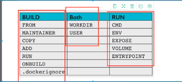

# Dockerfile

通过创建镜像时 进行挂载

编写Dockerfile 文件

```
FROM centos
VOLUME ["/宿主机路径：/容器内路径","可以挂载多个"]
CMD echo "----end----"
CMD /bin/bash
```

运行Dockerfile文件创建镜像

```shell
docker build -f dockerfile -t 镜像名称：版本号 .
```

通过Dockerfile也可以进行数据卷挂载


## DockerFile 命令




### 构建一个镜像

```
FROM centos
MAINTAINER hening
EVN MYPATH /usr/local
WORKDIR $MYPATH

RUN yum -y install vim
RUN yum -y install net-tools

EXPOSE 8080
CMD echo 输出信息
CMD /bin/bash

```

构建镜像

```
docker build -f dockerfilename -t 镜像名：版本号 .
```

### CMD 和 ENTRYPOINT 的区别

CMD ：指定容器启动时要执行的命令，只有最后一个生效，可被代替

ENTRYPOINT  ：指定容器启动时要执行的命令，可追加命令

