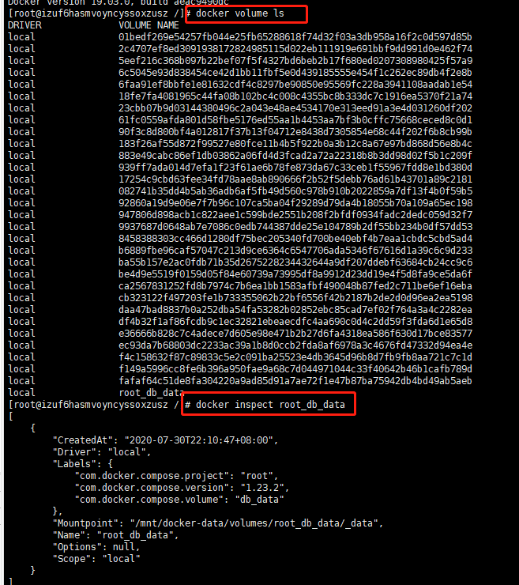

# 挂载

## 具名和匿名挂载

匿名挂载

即只指定容器内需要挂载的路径，不指定具体挂载到本机那个目录，会自动生成一个挂载路径和卷名称。

具名挂载

指定一个卷名称

docker  run -d -P -v mysqlconfig:/etc/mysql

指定卷的名称，不是指定的挂载路径

```
docker volume ls 查看所有卷
docker inspect 卷名   查看卷挂载的具体信息
```





## 如何区分

-v 容器内路径            匿名挂载

-v 卷名：容器内路径 具名挂载

-v /宿主机路径：/容器内路径  指定路径挂载

