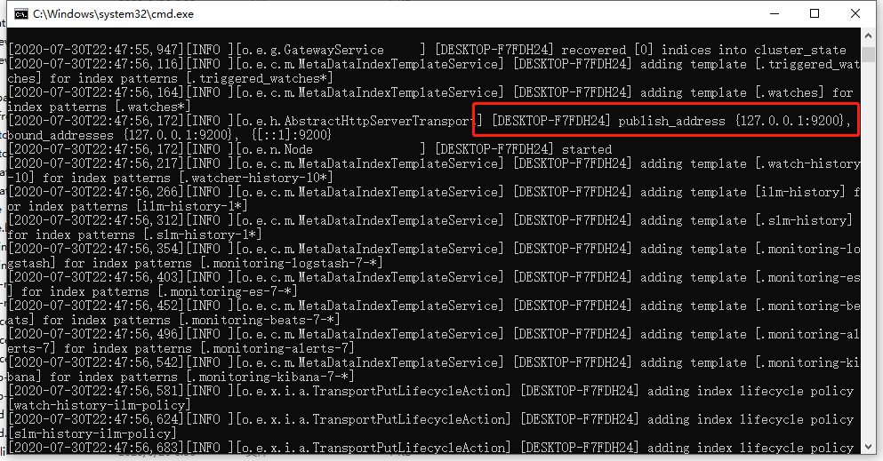
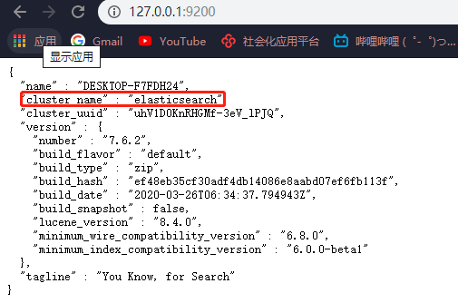
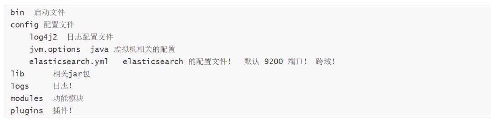
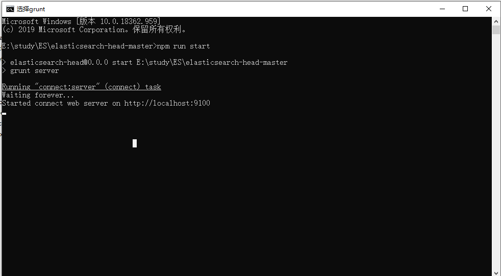
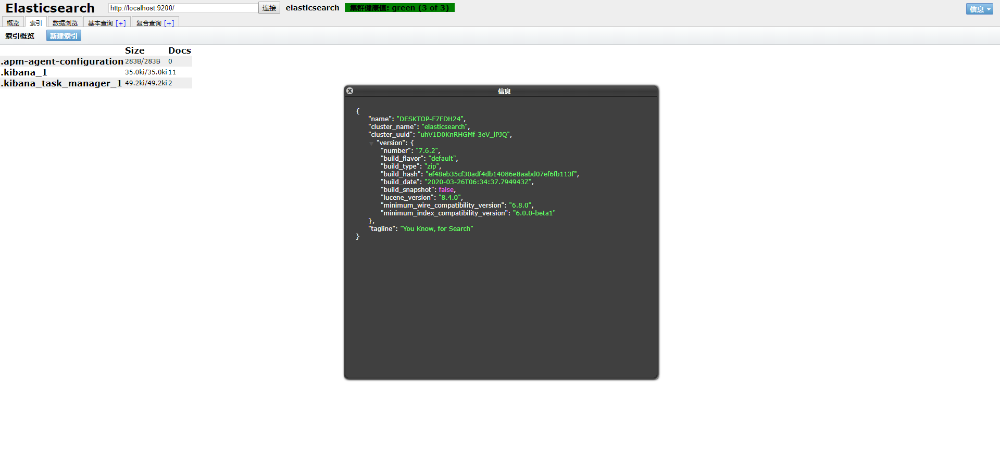
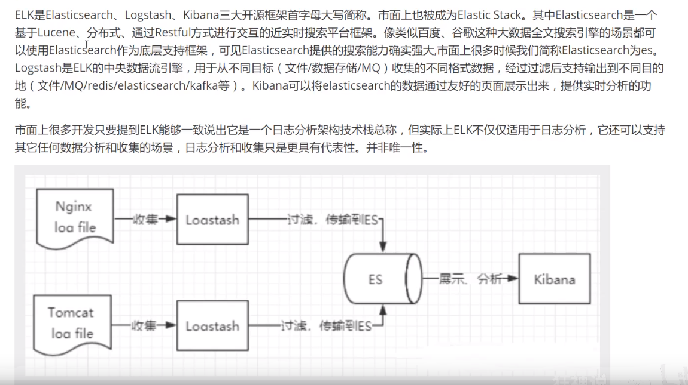
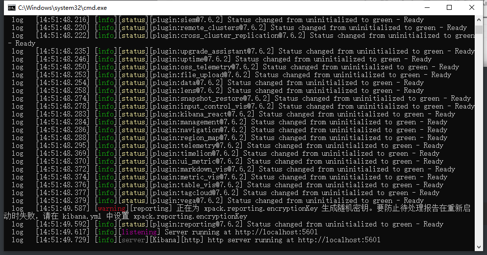
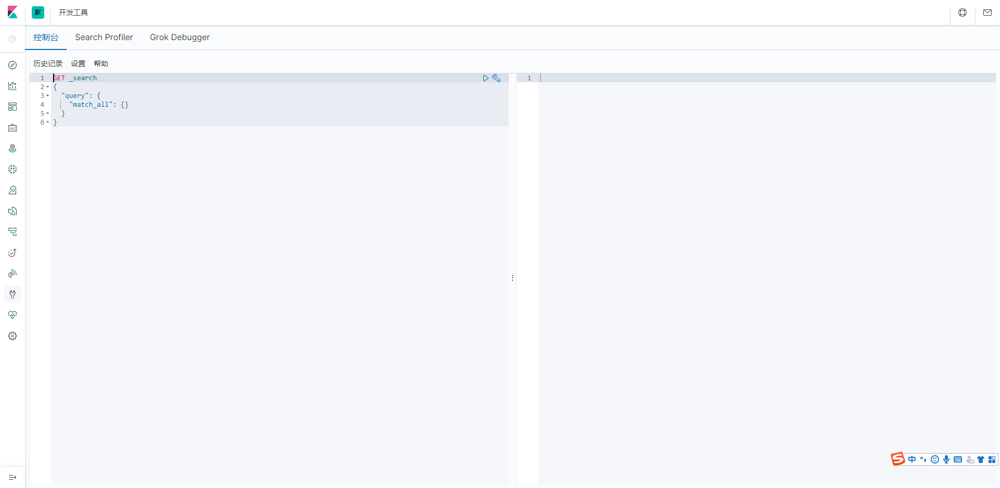

# 下载安装

## Windows(网速太垃圾了，先在Windows上跑，之后用Docker拉镜像)

修改config文件夹下 elasticsearch.yml加入跨域配置

```java
# 加入跨域配置
http.cors.enabled: true
http.cors.allow-origin: "*"
#默认端口
http.port: 9200
```

Jvm配置，根据内存大小进行更改

```java
-Xms1g
-Xmx1g
```

### 启动elasticseach

双肩bin目录下 elasticsearch.bat



浏览器访问 127.0.0.1:9200




## 目录



## 安装ElasticSearch-Head 插件

ElasticSearch-Head 基于node，所以需要有node环境

执行npm install 下载依赖

执行 npm run start 启动




启动elasticsearch 然后连接



### 备注

**一般ElasticSearch -Head 用于查看索引信息、集群状态**

**查询，插入的等操作一般通过kibana进行操作，界面好看，比较方便，功能强大。**


## 了解ElK




## 安装Kibanna

### Kibanna国际化修改

修改config文件下 kibana.yaml

```yaml
i18n.locale: "zh-CN"
```

### 启动

双击bin/kibana.bat



访问localhost:5601




## Docker 下安装

```
docker search elasticsearch
docker pull elastricsearch:7.6.1
```


拉取kibana

```
docker search kibana
docker pull kibana:7.6.1
```

拉取elasticsearch-head