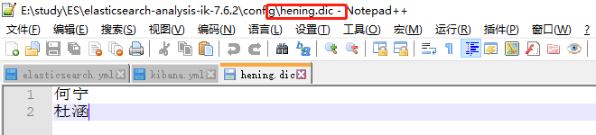

# IK分词器


## 安装

下载和es版本相对应的ik分词器

地址：https://github.com/medcl/elasticsearch-analysis-ik/releases

解压到elasticsearch plugin目录下


重启es


## 两种模式

ik_smart

最少切分模式

```
GET _analyze 
{
  "analyzer": "ik_smart",
  "text": ["中国共产党"]
}
```


ik_max_word

最细粒度划分

```
GET _analyze 
{
  "analyzer": "ik_max_word",
  "text": ["中国共产党"]
}
```


## 自定义字典

默认字典


在IKAnalyzer.cfg.xml进行配置 自定义字典

```xml
<?xml version="1.0" encoding="UTF-8"?>
<!DOCTYPE properties SYSTEM "http://java.sun.com/dtd/properties.dtd">
<properties>
	<comment>IK Analyzer 扩展配置</comment>
	<!--用户可以在这里配置自己的扩展字典 -->
	<entry key="ext_dict"></entry>
	 <!--用户可以在这里配置自己的扩展停止词字典-->
	<entry key="ext_stopwords"></entry>
	<!--用户可以在这里配置远程扩展字典 -->
	<!-- <entry key="remote_ext_dict">words_location</entry> -->
	<!--用户可以在这里配置远程扩展停止词字典-->
	<!-- <entry key="remote_ext_stopwords">words_location</entry> -->
</properties>
```

自定义 hening.dic



添加到配置文件中

重启es 和 kibana

测试后发现自定义的字典中的值不会被拆分了

