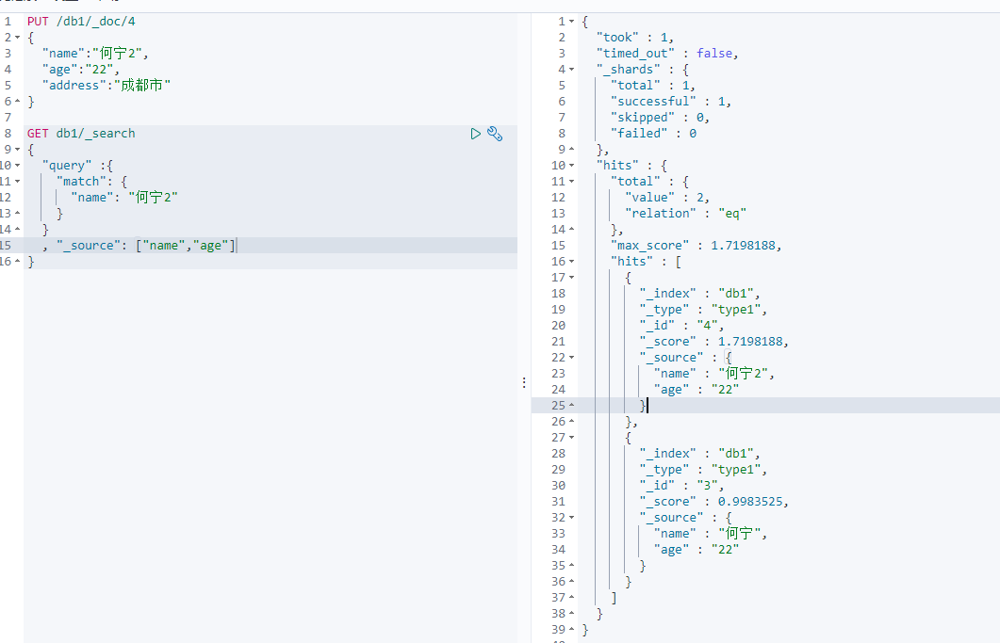
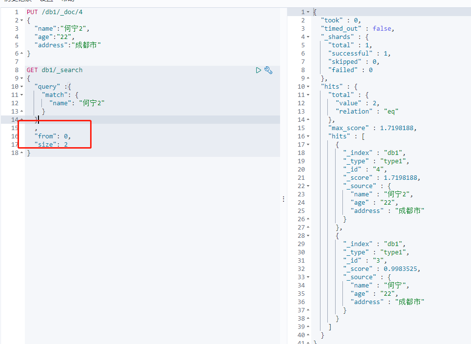
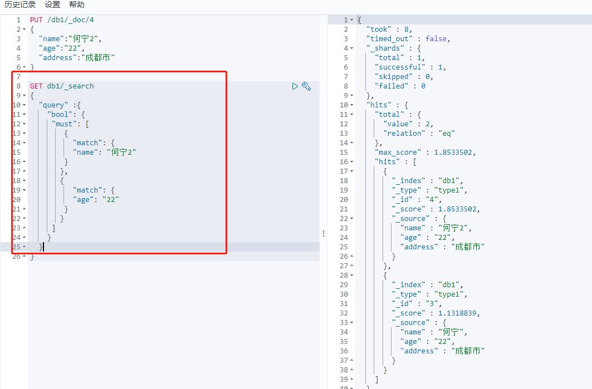
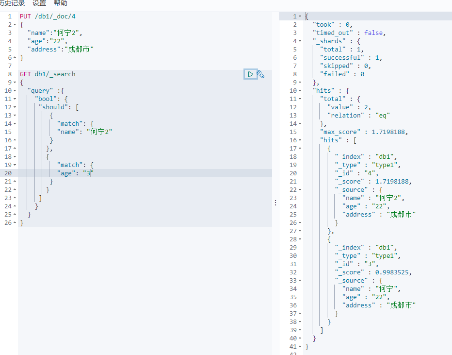
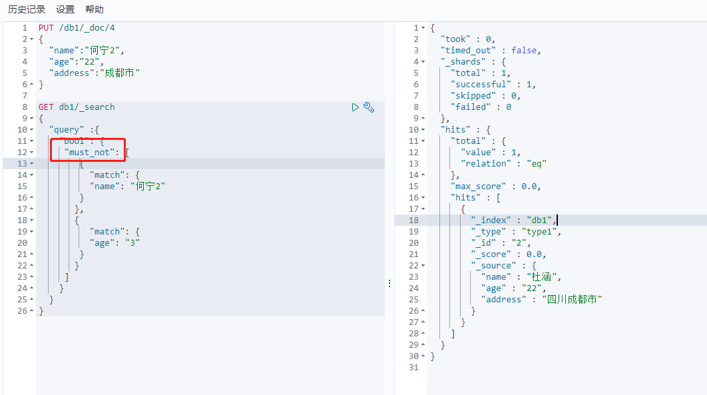
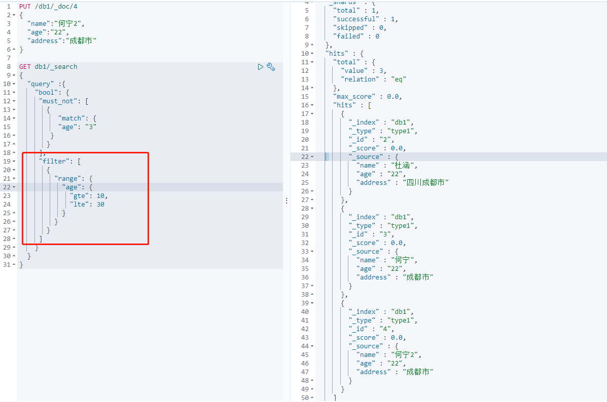
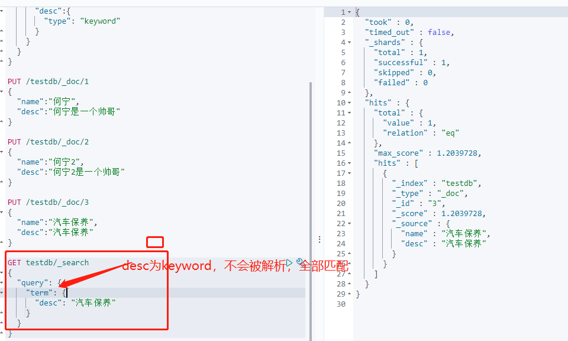
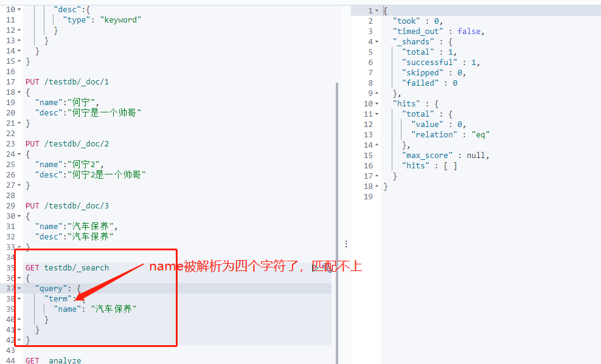

# RestFul风格操作

## 简介


### 增加数据

增加数据，指定三个字段，类似于 指定数据库、表名、数据id，然后一行数据的字段和对应的值

```
PUT /索引名/类型名称/文档id  {
	字段名：属性值
}
PUT /db1/type1/1
{
  "name":"何宁",
  "age":"23",
  "address":"四川成都市"
}

PUT /db1/_doc/2
{
  "name":"杜涵",
  "age":"22",
  "address":"四川成都市"
}
```


### 字段类型


### 指定字段类型

这里只创建索引，并指定有哪些属性，属性是什么类型。不插入数据，类似于MySql创建数据库。(如果不指定类型，那么es或自动帮我匹配类型，自动猜测是什么类型)

```
PUT /索引名
{
	
}
PUT /db2 
{
  "mappings": {
    "properties": {
      "name":{
        "type": "text"
      },
      "age":{
        "type": "long"
      },
      "address":{
        "type": "text"
      },
      "birthday":{
        "type": "date"
      }
    }
  }    
}
```


通过elasticsearch-head插件 直观的查看索引及字段类型信息


### GET 获取索引具体信息

```
GET /test
GET db1
```


### 查看默认信息

```
GET _cat/health  查看健康信息
```


```
GET _cat/indices?v  查看各个索引的信息
```


### 修改

还是使用PUT /索引/type/id 命令继续修改

这样是覆盖之前的数据 注意version更改了

如果不指定某个属性，那么这个属性就会变为空了。

```
PUT /db1/type1/1
{
  "name":"何宁2",
  "age":"23",
  "address":"四川成都市"
}
```


使用POST命令进行修改

POST /db1/_doc/1/_update

POST /{index}/_update/{id}  （最新语法）

POST 加上update后，可以指定修改某个字段（区别于PUT 全部覆盖）

```
POST /db1/_update/1
{
  "doc": {
    "name":"何宁3"
  }
}

POST /db1/_doc/1/_update
{
  "doc": {
    "name":"何宁4"
  }
}
```


### 删除索引

使用DELETE 删除数据、索引

DELETE /索引/type/id

DELETE /索引

```
DELETE /db1/_doc/1
```


```
DELETE /db2   删除索引
```


### 查询数据

```
GET db1/_doc/3   查询指定id的文档
```


### 简单地条件查询

```
GET db1/_search?q=name:杜
```


```
GET db1/_search?q=name:杜涵涵   这里将name进行分词匹配，最终涵涵、杜涵都查出来了
```


```
GET db1/_search?q=address:成都&q=name:杜    搜索address和 name同时满足条件的数据
```


### 复杂查询

根据字段值进行匹配 返回指定的字段

match 不支持多字段查询

```
GET db1/_search
{
  "query" :{
    "match": {
      "name": "何宁2"
    }
  }
  , "_source": ["name","age"]
}
```



排序和分页查询(注意 text类型不支持排序)

```
GET db1/_search
{
  "query" :{
    "match": {
      "name": "何宁2"
    }
  }
  ,"sort": [
    {
      "age": {
        "order": "desc"
      }
    }
  ]
}

GET db1/_search
{
  "query" :{
    "match": {
      "name": "何宁2"
    }
  }
  , 
  "from": 0,
  "size": 2
}
```



多字段查询（bool）  and条件，同时满足才能查出来

```
GET db1/_search
{
  "query" :{
    "bool": {
     "must": [
        {
          "match": {
          "name": "何宁2"
        }
       },
       {
          "match": {
          "age": "22"
        }
       }
     ]
    }
  }
}
```



or条件，满足一个就可以查出来

```
GET db1/_search
{
  "query" :{
    "bool": {
     "should": [
        {
          "match": {
          "name": "何宁2"
        }
       },
       {
          "match": {
          "age": "3"
        }
       }
     ]
    }
  }
}
```



must_not 必须不满足某条件 才查询出来

```
GET db1/_search
{
  "query" :{
    "bool": {
     "must_not": [
        {
          "match": {
          "name": "何宁2"
        }
       },
       {
          "match": {
          "age": "3"
        }
       }
     ]
    }
  }
}
```



filter 条件查询 附加过滤条件

```
GET db1/_search
{
  "query" :{
    "bool": {
     "must_not": [
       {
          "match": {
          "age": "3"
        }
       }
     ],
     "filter": [
       {
         "range": { 
           "age": { // 年龄 >= 10 <=30
             "gte": 10,
             "lte": 30
           }
         }
       }
     ]
    }
  }
}
```



多条件查询

match：会进行分词查询，根据查询出来的文档，分析文档后，进行查询

term：直接精确查询

两种类型的数据 text  和 keyword

text：会被分词器解析，分成多个词

比如录入一个 name  和 desc  name是车text会被分词器解析，desc是keyword不会被分词器解析

所以name被解析后存在索引中为['汽','车','保','养']

而desc 不会被解析 存在索引中为['汽车保养']

```
PUT /testdb/_doc/3
{
  "name":"汽车保养",
  "desc":"汽车保养"
}
```





keyword：不会被分词器解析

```
PUT /testdb
{
  "mappings": {
    "properties": {
      "name":{
        "type": "text"
      },
      "desc":{
        "type": "keyword"
      }
    }
  }  
}

PUT /testdb/_doc/1
{
  "name":"何宁",
  "desc":"何宁是一个帅哥"
}

PUT /testdb/_doc/2
{
  "name":"何宁2",
  "desc":"何宁2是一个帅哥"
}

PUT /testdb/_doc/2
{
  "name":"李志鹏",
  "desc":"李志鹏是一个傻逼"
}
```

### match 查询

#### match_phrase

完全匹配所有的分词（精确匹配）

比如：有一个字段为 “我的宝马多少马力”，那么分词器会分为 宝马 多少 马力

当使用match 搜索是，包含其中一个词的都会被搜索出来，使用match_phrase时，就会搜索出包含所有分词的结果

```
{
  "query": {
    "match_phrase": {
        "content" : {
            "query" : "我的宝马多少马力"
        }
    }
  }
}
```

如果使用完全匹配可能比较严格，可以设置调节因子，少匹配一个也是可以的(使用slop字段，执行可以少匹配几个)

```
{
  "query": {
    "match_phrase": {
        "content" : {
            "query" : "我的宝马多少马力",
            "slop" : 1
        }
    }
  }
}
```

#### multi_match

多字段匹配查询

如果我们希望两个字段进行匹配，其中一个字段有这个文档就满足的话，使用multi_match

```
{
  "query": {
    "multi_match": {
        "query" : "我的宝马多少马力",
        "fields" : ["title", "content"]
    }
  }
}
```

高亮查询

```

```

