# RestFul风格操作

## 简介

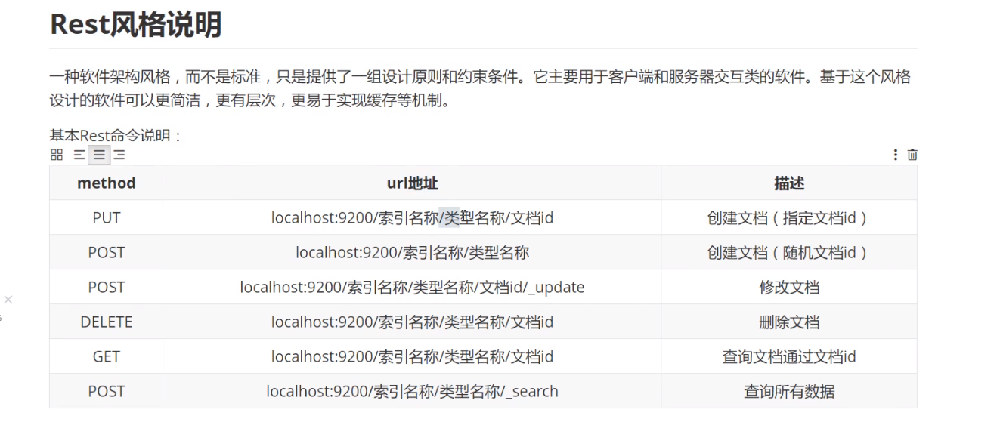


### 增加数据

增加数据，指定三个字段，类似于 指定数据库、表名、数据id，然后一行数据的字段和对应的值

```
PUT /索引名/类型名称/文档id  {
	字段名：属性值
}
PUT /db1/type1/1
{
  "name":"何宁",
  "age":"23",
  "address":"四川成都市"
}

PUT /db1/_doc/2
{
  "name":"杜涵",
  "age":"22",
  "address":"四川成都市"
}
```


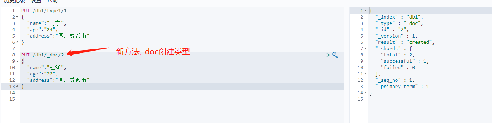

### 字段类型

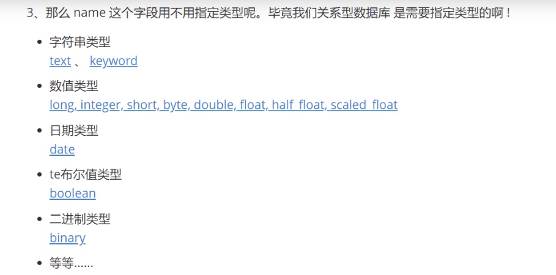


### 指定字段类型

这里只创建索引，并指定有哪些属性，属性是什么类型。不插入数据，类似于MySql创建数据库。(如果不指定类型，那么es或自动帮我匹配类型，自动猜测是什么类型)

```
PUT /索引名
{
	
}
PUT /db2 
{
  "mappings": {
    "properties": {
      "name":{
        "type": "text"
      },
      "age":{
        "type": "long"
      },
      "address":{
        "type": "text"
      },
      "birthday":{
        "type": "date"
      }
    }
  }    
}
```

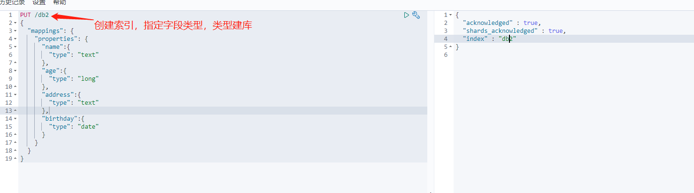

通过elasticsearch-head插件 直观的查看索引及字段类型信息

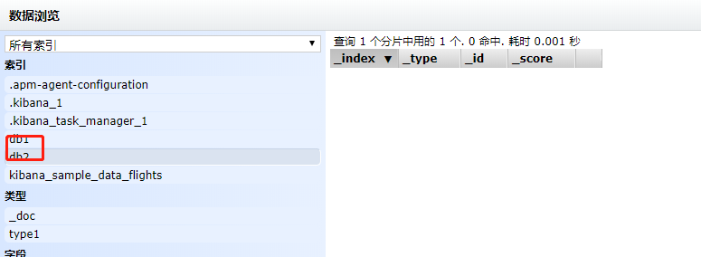

### GET 获取索引具体信息

```
GET /test
GET db1
```

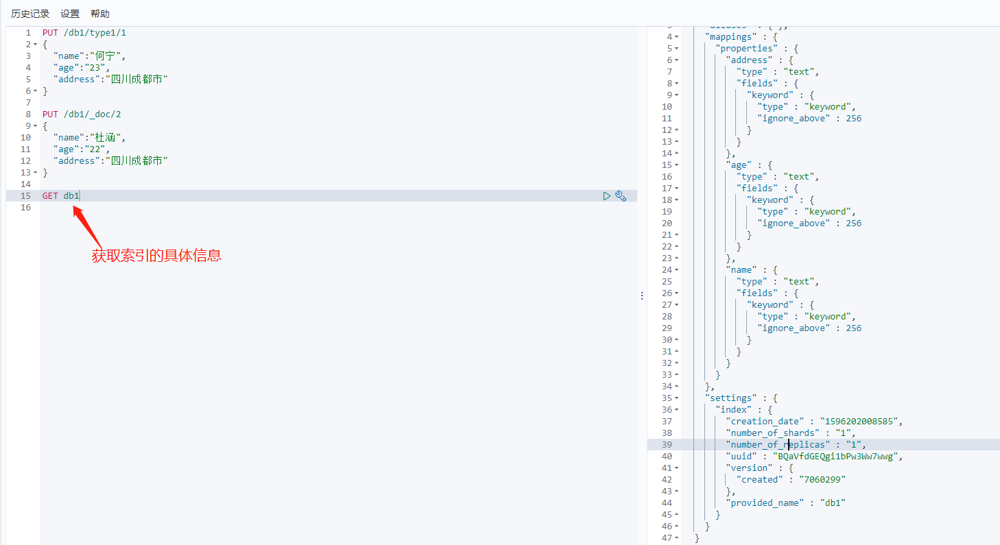

### 查看默认信息

```
GET _cat/health  查看健康信息
```

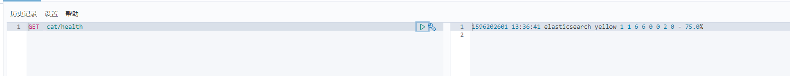

```
GET _cat/indices?v  查看各个索引的信息
```

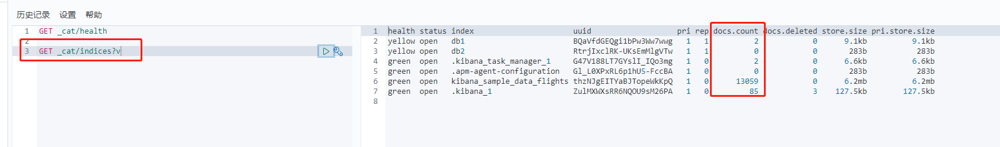


### 修改

还是使用PUT /索引/type/id 命令继续修改

这样是覆盖之前的数据 注意version更改了

如果不指定某个属性，那么这个属性就会变为空了。

```
PUT /db1/type1/1
{
  "name":"何宁2",
  "age":"23",
  "address":"四川成都市"
}
```

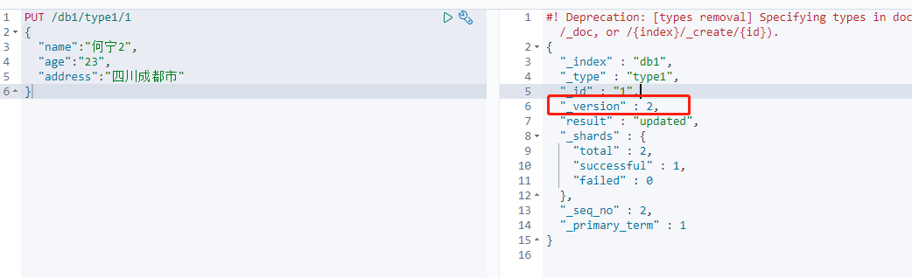

使用POST命令进行修改

POST /db1/_doc/1/_update

POST /{index}/_update/{id}  （最新语法）

POST 加上update后，可以指定修改某个字段（区别于PUT 全部覆盖）

```
POST /db1/_update/1
{
  "doc": {
    "name":"何宁3"
  }
}

POST /db1/_doc/1/_update
{
  "doc": {
    "name":"何宁4"
  }
}
```

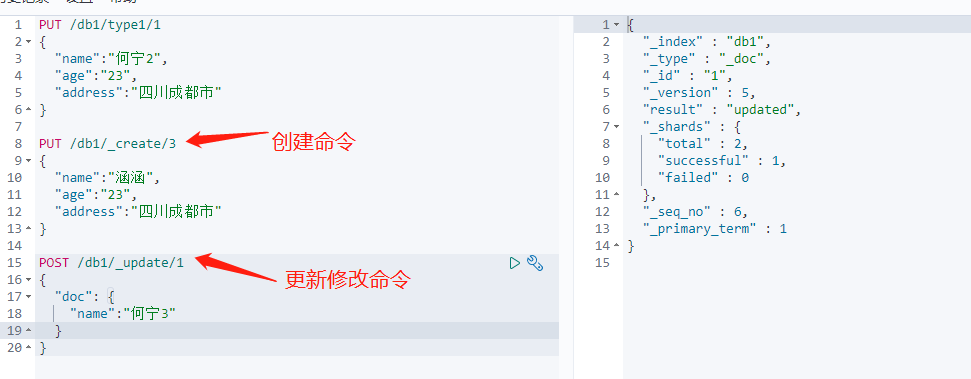


### 删除索引

使用DELETE 删除数据、索引

DELETE /索引/type/id

DELETE /索引

```
DELETE /db1/_doc/1
```

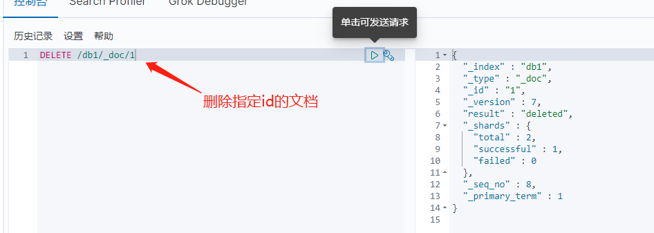

```
DELETE /db2   删除索引
```

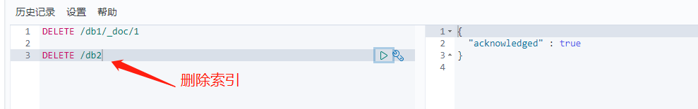


### 查询数据

```
GET db1/_doc/3   查询指定id的文档
```

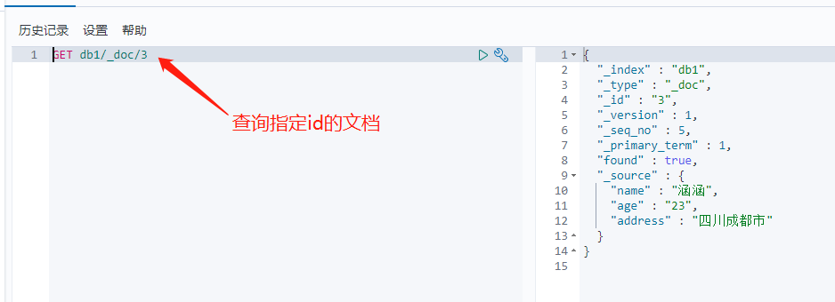


### 简单地条件查询

```
GET db1/_search?q=name:杜
```

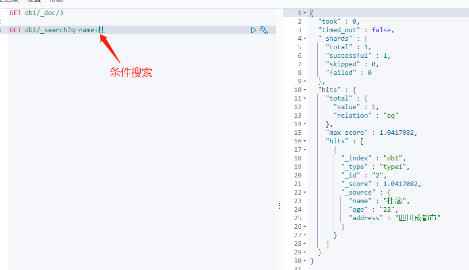

```
GET db1/_search?q=name:杜涵涵   这里将name进行分词匹配，最终涵涵、杜涵都查出来了
```

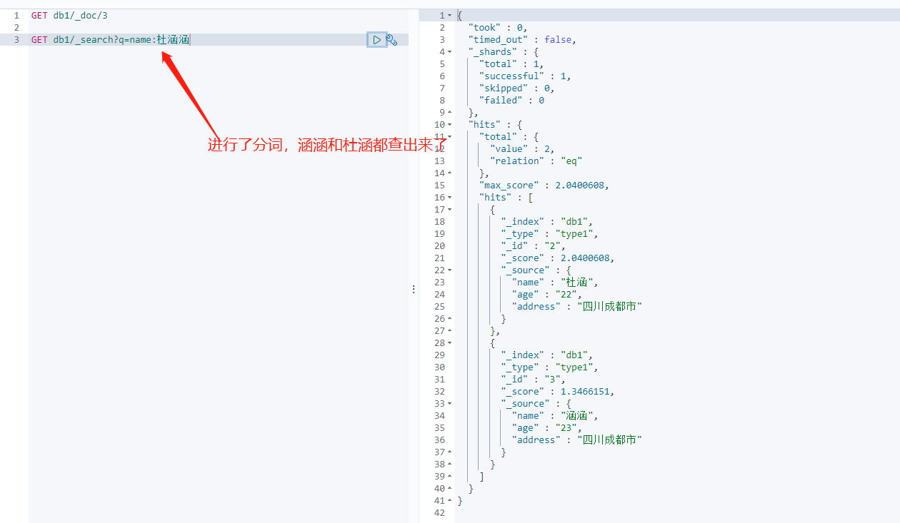

```
GET db1/_search?q=address:成都&q=name:杜    搜索address和 name同时满足条件的数据
```

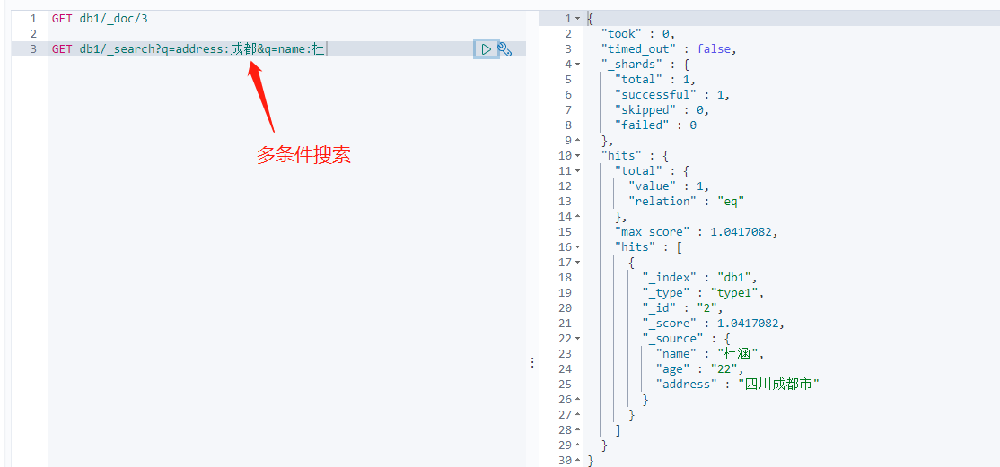

### 复杂查询


