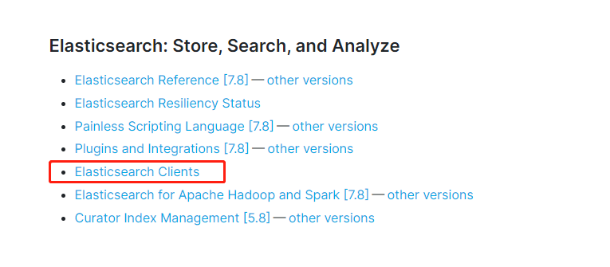
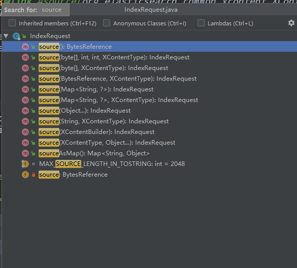

# SpringBoot集成

官方文档：https://www.elastic.co/guide/index.html




## Rest-High-Level-Clent

pom

```xml
<dependency>
      <groupId>org.elasticsearch</groupId>
      <artifactId>elasticsearch</artifactId>
      <version>7.6.2</version>
    </dependency>

    <!-- elasticsearch-rest-client -->
    <dependency>
      <groupId>org.elasticsearch.client</groupId>
      <artifactId>elasticsearch-rest-client</artifactId>
      <version>7.6.2</version>
    </dependency>

    <!-- elasticsearch-rest-high-level-client -->
    <dependency>
      <groupId>org.elasticsearch.client</groupId>
      <artifactId>elasticsearch-rest-high-level-client</artifactId>
      <version>7.6.2</version>
      <exclusions>
        <exclusion>
          <groupId>org.elasticsearch.client</groupId>
          <artifactId>elasticsearch-rest-client</artifactId>
        </exclusion>
        <exclusion>
          <groupId>org.elasticsearch</groupId>
          <artifactId>elasticsearch</artifactId>
        </exclusion>
      </exclusions>
    </dependency>
```

### 配置注入RestHighLevelClient

官方实例 通过配置类注入RestHighLevelClient 或者自己New 一个RestHighLevelClient

```java
RestHighLevelClient client = new RestHighLevelClient(
        RestClient.builder(
                new HttpHost("localhost", 9200, "http"),
                new HttpHost("localhost", 9201, "http")));
```

### 创建索引

核心：创建CreateIndexRequest，通过RestHighLevelClient 进行操作 resquest请求

```java
try {
            //索引名
            CreateIndexRequest request = new CreateIndexRequest(index);
            // Settings for this index
            request.settings(Settings.builder().put("index.number_of_shards", elasticsearchProperties.getIndex().getNumberOfShards()).put("index.number_of_replicas", elasticsearchProperties.getIndex().getNumberOfReplicas()));
            request.setTimeout(TimeValue.timeValueMinutes(2));
            CreateIndexResponse createIndexResponse = restHighLevelClient.indices().create(request, COMMON_OPTIONS);

            log.info(" whether all of the nodes have acknowledged the request : {}", createIndexResponse.isAcknowledged());
            log.info(" Indicates whether the requisite number of shard copies were started for each shard in the index before timing out :{}", createIndexResponse.isShardsAcknowledged());
        } catch (IOException e) {
            throw new ElasticsearchException("创建索引 {" + index + "} 失败");
        }
```

```java
@Test
    public void createIndexTest() throws IOException {
        CreateIndexRequest indexRequest = new CreateIndexRequest(ElasticsearchConstant.INDEX_NAME_TWO);
        indexRequest.setTimeout(TimeValue.timeValueSeconds(10));
        CreateIndexResponse createIndexResponse = restHighLevelClient.indices().create(indexRequest, RequestOptions.DEFAULT);
        log.info(createIndexResponse.remoteAddress().getAddress());
    }
```


### 删除索引

```java
try {
            restHighLevelClient.indices().delete(deleteIndexRequest, COMMON_OPTIONS);
        } catch (IOException e) {
            throw new ElasticsearchException("删除索引 {" + index + "} 失败");
        }
```


### 文档操作

#### 插入数据

IndexRequest.source()可以接受多个参数，可以传入jsonString，map等数据



```java
@Test
    public void insertCar() throws IOException {
        Car car =Car.builder().age(2).desc("我的第一台车").id(1L).name("宝马").price(new BigDecimal(300000)).build();
        //JSONString形式插入
        IndexRequest indexRequest = new IndexRequest().id(String.valueOf(car.getId())).index(ElasticsearchConstant.INDEX_NAME_TWO)
            .source(JSON.toJSONString(car), XContentType.JSON);
        IndexResponse indexResponse = restHighLevelClient.index(indexRequest, RequestOptions.DEFAULT);
        log.info(indexResponse.getId());
    }

@Test
    public void insertCarByMap() throws IOException {
        Car car =Car.builder().age(2).desc("我的第二台车").id(2L).name("奔驰").price(new BigDecimal(500000)).build();
        //Map形式形式插入
        IndexRequest indexRequest = new IndexRequest().id(String.valueOf(car.getId())).index(ElasticsearchConstant.INDEX_NAME_TWO)
            .source(BeanUtil.beanToMap(car), XContentType.JSON);
        IndexResponse indexResponse = restHighLevelClient.index(indexRequest, RequestOptions.DEFAULT);
        log.info(indexResponse.getId());
    }
```

 #### 更新操作


#### 删除


#### 查询文档


```java
@Test
    public void search() throws IOException {
        SearchRequest searchRequest = new SearchRequest(ElasticsearchConstant.INDEX_NAME_TWO);
        SearchSourceBuilder searchSourceBuilder = new SearchSourceBuilder();
        // 查询执行字段匹配的文档，会被分词
        //searchSourceBuilder.query(QueryBuilders.matchQuery("name","奔驰"));
        //searchSourceBuilder.query(QueryBuilders.matchQuery("name","马车"));
        searchSourceBuilder.query(QueryBuilders.matchQuery("desc","车"));
        // 查询所有文档 matchAllQuery
       //searchSourceBuilder.query(QueryBuilders.matchAllQuery());
        searchRequest.source(searchSourceBuilder);
        SearchResponse search = restHighLevelClient.search(searchRequest, RequestOptions.DEFAULT);
        SearchHit[] hits = search.getHits().getHits();
        List<Car> cars = new ArrayList<>();
        for (SearchHit hit : hits) {
            Car car = BeanUtil.mapToBean(hit.getSourceAsMap(), Car.class, false);
            cars.add(car);
        }
        log.info(cars.toString());
    }
```


## Spring Data ElasticSearch

