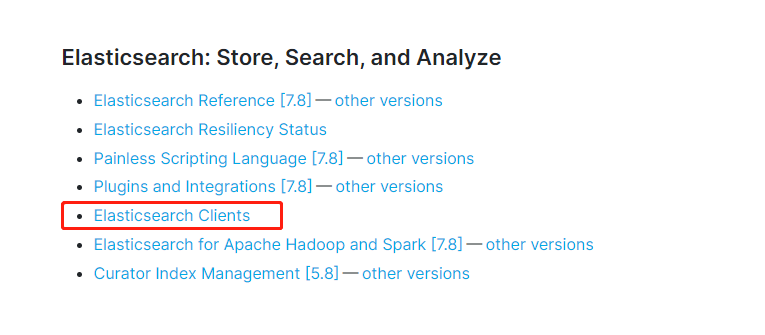

# SpringBoot集成

官方文档：https://www.elastic.co/guide/index.html




## Rest-High-Level-Clent

pom

```xml
<dependency>
      <groupId>org.elasticsearch</groupId>
      <artifactId>elasticsearch</artifactId>
      <version>7.6.2</version>
    </dependency>

    <!-- elasticsearch-rest-client -->
    <dependency>
      <groupId>org.elasticsearch.client</groupId>
      <artifactId>elasticsearch-rest-client</artifactId>
      <version>7.6.2</version>
    </dependency>

    <!-- elasticsearch-rest-high-level-client -->
    <dependency>
      <groupId>org.elasticsearch.client</groupId>
      <artifactId>elasticsearch-rest-high-level-client</artifactId>
      <version>7.6.2</version>
      <exclusions>
        <exclusion>
          <groupId>org.elasticsearch.client</groupId>
          <artifactId>elasticsearch-rest-client</artifactId>
        </exclusion>
        <exclusion>
          <groupId>org.elasticsearch</groupId>
          <artifactId>elasticsearch</artifactId>
        </exclusion>
      </exclusions>
    </dependency>
```

### 配置注入RestHighLevelClient

官方实例 通过配置类注入RestHighLevelClient 或者自己New 一个RestHighLevelClient

```java
RestHighLevelClient client = new RestHighLevelClient(
        RestClient.builder(
                new HttpHost("localhost", 9200, "http"),
                new HttpHost("localhost", 9201, "http")));
```

### 创建索引

核心：创建CreateIndexRequest，通过RestHighLevelClient 进行操作 resquest请求

```java
try {
            //索引名
            CreateIndexRequest request = new CreateIndexRequest(index);
            // Settings for this index
            request.settings(Settings.builder().put("index.number_of_shards", elasticsearchProperties.getIndex().getNumberOfShards()).put("index.number_of_replicas", elasticsearchProperties.getIndex().getNumberOfReplicas()));
            request.setTimeout(TimeValue.timeValueMinutes(2));
            CreateIndexResponse createIndexResponse = restHighLevelClient.indices().create(request, COMMON_OPTIONS);

            log.info(" whether all of the nodes have acknowledged the request : {}", createIndexResponse.isAcknowledged());
            log.info(" Indicates whether the requisite number of shard copies were started for each shard in the index before timing out :{}", createIndexResponse.isShardsAcknowledged());
        } catch (IOException e) {
            throw new ElasticsearchException("创建索引 {" + index + "} 失败");
        }
```

```java
@Test
    public void createIndexTest() throws IOException {
        CreateIndexRequest indexRequest = new CreateIndexRequest(ElasticsearchConstant.INDEX_NAME_TWO);
        indexRequest.setTimeout(TimeValue.timeValueSeconds(10));
        CreateIndexResponse createIndexResponse = restHighLevelClient.indices().create(indexRequest, RequestOptions.DEFAULT);
        log.info(createIndexResponse.remoteAddress().getAddress());
    }
```


### 删除索引

```java
try {
            restHighLevelClient.indices().delete(deleteIndexRequest, COMMON_OPTIONS);
        } catch (IOException e) {
            throw new ElasticsearchException("删除索引 {" + index + "} 失败");
        }
```


### 文档操作

#### 插入数据

IndexRequest.source()可以接受多个参数，可以传入jsonString，map等数据


```java
@Test
    public void insertCar() throws IOException {
        Car car =Car.builder().age(2).desc("我的第一台车").id(1L).name("宝马").price(new BigDecimal(300000)).build();
        //JSONString形式插入
        IndexRequest indexRequest = new IndexRequest().id(String.valueOf(car.getId())).index(ElasticsearchConstant.INDEX_NAME_TWO)
            .source(JSON.toJSONString(car), XContentType.JSON);
        IndexResponse indexResponse = restHighLevelClient.index(indexRequest, RequestOptions.DEFAULT);
        log.info(indexResponse.getId());
    }

@Test
    public void insertCarByMap() throws IOException {
        Car car =Car.builder().age(2).desc("我的第二台车").id(2L).name("奔驰").price(new BigDecimal(500000)).build();
        //Map形式形式插入
        IndexRequest indexRequest = new IndexRequest().id(String.valueOf(car.getId())).index(ElasticsearchConstant.INDEX_NAME_TWO)
            .source(BeanUtil.beanToMap(car), XContentType.JSON);
        IndexResponse indexResponse = restHighLevelClient.index(indexRequest, RequestOptions.DEFAULT);
        log.info(indexResponse.getId());
    }
```

 #### 更新操作

```java
public void update() throws IOException {
        Car car =Car.builder().age(3).desc("我的三台车").name("保时捷2").id(3L).price(new BigDecimal(1000000)).build();
        UpdateRequest updateRequest = new UpdateRequest().index(ElasticsearchConstant.INDEX_NAME_TWO).id("1").doc(BeanUtil.beanToMap(car));
        //UpdateRequest updateRequest = new UpdateRequest();
        UpdateResponse update = restHighLevelClient.update(updateRequest,RequestOptions.DEFAULT);
        log.info(update.getId());
    }
```

#### 删除

```java
 @Test
    public void delete() throws IOException {
        DeleteRequest deleteRequest = new DeleteRequest(ElasticsearchConstant.INDEX_NAME_TWO,"2");
        DeleteResponse deleteResponse = restHighLevelClient.delete(deleteRequest, RequestOptions.DEFAULT);
        log.info(deleteResponse.getId());
    }
```


#### 查询文档


```java
@Test
    public void search() throws IOException {
        SearchRequest searchRequest = new SearchRequest(ElasticsearchConstant.INDEX_NAME_TWO);
        SearchSourceBuilder searchSourceBuilder = new SearchSourceBuilder();
        // 查询执行字段匹配的文档，会被分词
        //searchSourceBuilder.query(QueryBuilders.matchQuery("name","奔驰"));
        //searchSourceBuilder.query(QueryBuilders.matchQuery("name","马车"));
        searchSourceBuilder.query(QueryBuilders.matchQuery("desc","车"));
        // 查询所有文档 matchAllQuery
       //searchSourceBuilder.query(QueryBuilders.matchAllQuery());
        searchRequest.source(searchSourceBuilder);
        SearchResponse search = restHighLevelClient.search(searchRequest, RequestOptions.DEFAULT);
        SearchHit[] hits = search.getHits().getHits();
        List<Car> cars = new ArrayList<>();
        for (SearchHit hit : hits) {
            Car car = BeanUtil.mapToBean(hit.getSourceAsMap(), Car.class, false);
            cars.add(car);
        }
        log.info(cars.toString());
    }
```


## Spring Data ElasticSearch

这是7.6.2的配置，和之前的配置有区别

```yaml
#配置es
spring:
  elasticsearch:
    rest:
      uris: localhost:9200 #配置节点地址数组
  application:
    name: search-service
```

#### 自定义接口

自定义接口继承ElasticsearchRepository<T,ID>,ElasticsearchRepository继承自PagingAndSortingRepository，PagingAndSortingRepository继承自CrudRepository

CrudRepository是最基础的接口，包含了常用的增删改查方法，自己定义的接口可以根据业务需要根据规则写方法名称，可以自动生成代理类，进行查询。

```java
public interface PersonRepository extends ElasticsearchRepository<Person, Long> {

    /**
     * 根据年龄区间查询
     *
     * @param min 最小值
     * @param max 最大值
     * @return 满足条件的用户列表
     */
    List<Person> findByAgeBetween(Integer min, Integer max);
}
```

#### 新增

repo.save 实际上调用的是CrudRepository的save方法

```java
 @Test
    public void save() {
        Person person = new Person(1L, "刘备", "蜀国", 18, DateUtil.parse("1990-01-02 03:04:05"), "刘备（161年－223年6月10日），即汉昭烈帝（221年－223年在位），又称先主，字玄德，东汉末年幽州涿郡涿县（今河北省涿州市）人，西汉中山靖王刘胜之后，三国时期蜀汉开国皇帝、政治家。\n刘备少年时拜卢植为师；早年颠沛流离，备尝艰辛，投靠过多个诸侯，曾参与镇压黄巾起义。先后率军救援北海相孔融、徐州牧陶谦等。陶谦病亡后，将徐州让与刘备。赤壁之战时，刘备与孙权联盟击败曹操，趁势夺取荆州。而后进取益州。于章武元年（221年）在成都称帝，国号汉，史称蜀或蜀汉。《三国志》评刘备的机权干略不及曹操，但其弘毅宽厚，知人待士，百折不挠，终成帝业。刘备也称自己做事“每与操反，事乃成尔”。\n章武三年（223年），刘备病逝于白帝城，终年六十三岁，谥号昭烈皇帝，庙号烈祖，葬惠陵。后世有众多文艺作品以其为主角，在成都武侯祠有昭烈庙为纪念。");
        Person save = repo.save(person);
        log.info("【save】= {}", save);
    }
```


#### 批量新增

```java
@Test
    public void saveList() {
        List<Person> personList = Lists.newArrayList();
        personList.add(new Person(2L, "曹操", "魏国", 20, DateUtil.parse("1988-01-02 03:04:05"), "曹操（155年－220年3月15日），字孟德，一名吉利，小字阿瞒，沛国谯县（今安徽亳州）人。东汉末年杰出的政治家、军事家、文学家、书法家，三国中曹魏政权的奠基人。\n曹操曾担任东汉丞相，后加封魏王，奠定了曹魏立国的基础。去世后谥号为武王。其子曹丕称帝后，追尊为武皇帝，庙号太祖。\n东汉末年，天下大乱，曹操以汉天子的名义征讨四方，对内消灭二袁、吕布、刘表、马超、韩遂等割据势力，对外降服南匈奴、乌桓、鲜卑等，统一了中国北方，并实行一系列政策恢复经济生产和社会秩序，扩大屯田、兴修水利、奖励农桑、重视手工业、安置流亡人口、实行“租调制”，从而使中原社会渐趋稳定、经济出现转机。黄河流域在曹操统治下，政治渐见清明，经济逐步恢复，阶级压迫稍有减轻，社会风气有所好转。曹操在汉朝的名义下所采取的一些措施具有积极作用。\n曹操军事上精通兵法，重贤爱才，为此不惜一切代价将看中的潜能分子收于麾下；生活上善诗歌，抒发自己的政治抱负，并反映汉末人民的苦难生活，气魄雄伟，慷慨悲凉；散文亦清峻整洁，开启并繁荣了建安文学，给后人留下了宝贵的精神财富，鲁迅评价其为“改造文章的祖师”。同时曹操也擅长书法，唐朝张怀瓘在《书断》将曹操的章草评为“妙品”。"));
        personList.add(new Person(3L, "孙权", "吴国", 19, DateUtil.parse("1989-01-02 03:04:05"), "孙权（182年－252年5月21日），字仲谋，吴郡富春（今浙江杭州富阳区）人。三国时代孙吴的建立者（229年－252年在位）。\n孙权的父亲孙坚和兄长孙策，在东汉末年群雄割据中打下了江东基业。建安五年（200年），孙策遇刺身亡，孙权继之掌事，成为一方诸侯。建安十三年（208年），与刘备建立孙刘联盟，并于赤壁之战中击败曹操，奠定三国鼎立的基础。建安二十四年（219年），孙权派吕蒙成功袭取刘备的荆州，使领土面积大大增加。\n黄武元年（222年），孙权被魏文帝曹丕册封为吴王，建立吴国。同年，在夷陵之战中大败刘备。黄龙元年（229年），在武昌正式称帝，国号吴，不久后迁都建业。孙权称帝后，设置农官，实行屯田，设置郡县，并继续剿抚山越，促进了江南经济的发展。在此基础上，他又多次派人出海。黄龙二年（230年），孙权派卫温、诸葛直抵达夷州。\n孙权晚年在继承人问题上反复无常，引致群下党争，朝局不稳。太元元年（252年）病逝，享年七十一岁，在位二十四年，谥号大皇帝，庙号太祖，葬于蒋陵。\n孙权亦善书，唐代张怀瓘在《书估》中将其书法列为第三等。"));
        personList.add(new Person(4L, "诸葛亮", "蜀国", 16, DateUtil.parse("1992-01-02 03:04:05"), "诸葛亮（181年-234年10月8日），字孔明，号卧龙，徐州琅琊阳都（今山东临沂市沂南县）人，三国时期蜀国丞相，杰出的政治家、军事家、外交家、文学家、书法家、发明家。\n早年随叔父诸葛玄到荆州，诸葛玄死后，诸葛亮就在襄阳隆中隐居。后刘备三顾茅庐请出诸葛亮，联孙抗曹，于赤壁之战大败曹军。形成三国鼎足之势，又夺占荆州。建安十六年（211年），攻取益州。继又击败曹军，夺得汉中。蜀章武元年（221年），刘备在成都建立蜀汉政权，诸葛亮被任命为丞相，主持朝政。蜀后主刘禅继位，诸葛亮被封为武乡侯，领益州牧。勤勉谨慎，大小政事必亲自处理，赏罚严明；与东吴联盟，改善和西南各族的关系；实行屯田政策，加强战备。前后六次北伐中原，多以粮尽无功。终因积劳成疾，于蜀建兴十二年（234年）病逝于五丈原（今陕西宝鸡岐山境内），享年54岁。刘禅追封其为忠武侯，后世常以武侯尊称诸葛亮。东晋政权因其军事才能特追封他为武兴王。\n诸葛亮散文代表作有《出师表》《诫子书》等。曾发明木牛流马、孔明灯等，并改造连弩，叫做诸葛连弩，可一弩十矢俱发。诸葛亮一生“鞠躬尽瘁、死而后已”，是中国传统文化中忠臣与智者的代表人物。"));
        Iterable<Person> people = repo.saveAll(personList);
        log.info("【people】= {}", people);
    }
```


#### 更新

```java
@Test
    public void update() {
        //如果存在，则覆盖更新
        repo.findById(1L).ifPresent(person -> {
            person.setRemark(person.getRemark() + "\n更新更新更新更新更新");
            Person save = repo.save(person);
            log.info("【save】= {}", save);
        });
    }
```


#### 删除

```java
@Test
    public void delete() {
        // 主键删除
        repo.deleteById(1L);

        // 对象删除
        repo.findById(2L).ifPresent(person -> repo.delete(person));

        // 批量删除
        repo.deleteAll(repo.findAll());
        
        repo.deleteAll();
    }
```


#### 查询

根据findAllById  findAll	findById 可以根据id进行查询，不给示例了


#### 条件查询

同样支持 MatchQueryBuilder

```java
@Test
public void advanceSelect() {
    // QueryBuilders 提供了很多静态方法，可以实现大部分查询条件的封装
    MatchQueryBuilder queryBuilder = QueryBuilders.matchQuery("name", "孙权");
    log.info("【queryBuilder】= {}", queryBuilder.toString());

    repo.search(queryBuilder).forEach(person -> log.info("【person】= {}", person));
}
```

```java
@Test
    public void customAdvanceSelect() {
        // 构造查询条件
        NativeSearchQueryBuilder queryBuilder = new NativeSearchQueryBuilder();
        // 添加基本的分词条件
        queryBuilder.withQuery(QueryBuilders.matchQuery("remark", "东汉"));
        // 排序条件
        queryBuilder.withSort(SortBuilders.fieldSort("age").order(SortOrder.DESC));
        // 分页条件
        queryBuilder.withPageable(PageRequest.of(0, 2));
        Page<Person> people = repo.search(queryBuilder.build());
        log.info("【people】总条数 = {}", people.getTotalElements());
        log.info("【people】总页数 = {}", people.getTotalPages());
        people.forEach(person -> log.info("【person】= {}，年龄 = {}", person.getName(), person.getAge()));
    }
```


