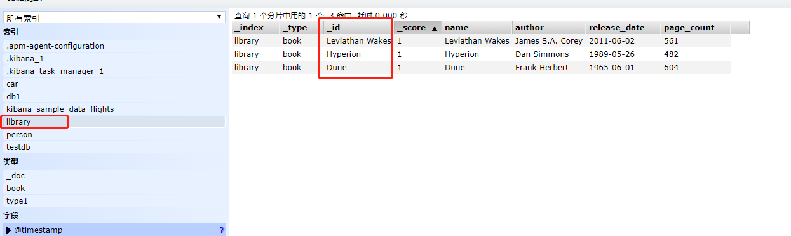
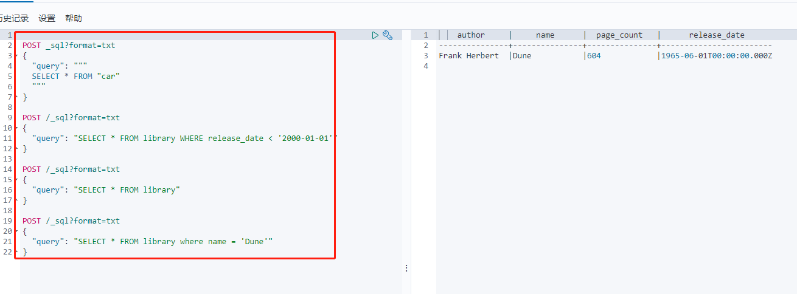
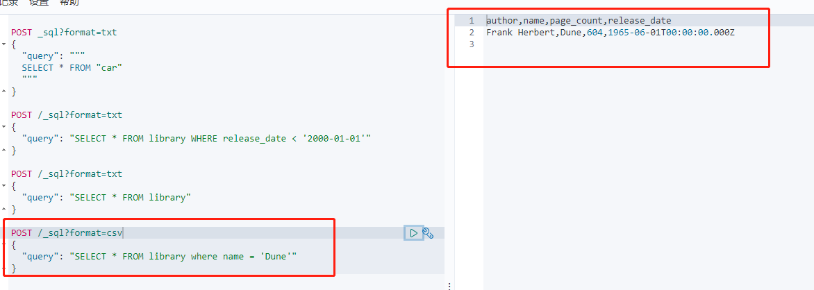
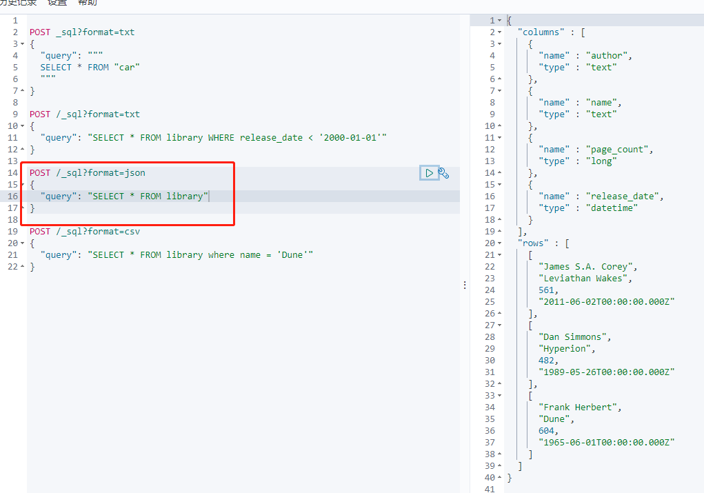
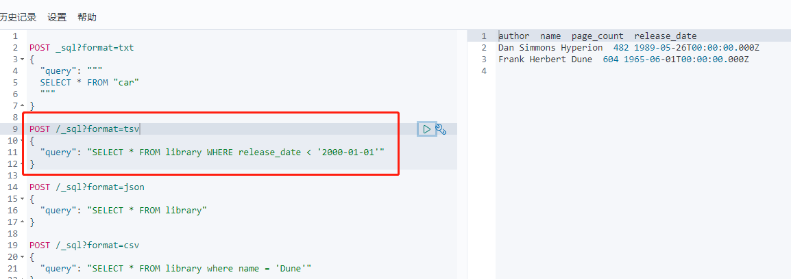

# ElasticSeach Sql

通过sql语句驾驭 ElasticSearch

## 开始

创建索引

"index":{"_id": "Leviathan Wakes"} 指定文档id

```
PUT /library/book/_bulk?refresh
{"index":{"_id": "Leviathan Wakes"}}
{"name": "Leviathan Wakes", "author": "James S.A. Corey", "release_date": "2011-06-02", "page_count": 561}
{"index":{"_id": "Hyperion"}}
{"name": "Hyperion", "author": "Dan Simmons", "release_date": "1989-05-26", "page_count": 482}
{"index":{"_id": "Dune"}}
{"name": "Dune", "author": "Frank Herbert", "release_date": "1965-06-01", "page_count": 604}
```




### sql 查询

```
POST _sql?format=txt
{
  "query": """
  SELECT * FROM "car"
  """
}

POST /_sql?format=txt
{
  "query": "SELECT * FROM library WHERE release_date < '2000-01-01'"
}

POST /_sql?format=txt
{
  "query": "SELECT * FROM library"
}

POST /_sql?format=txt
{
  "query": "SELECT * FROM library where name = 'Dune'"
}
```





## 查询返回格式

人类可读的格式包括 csv、json、tsv、txt、yaml

二进制格式 cbor、smile

### CSV




### JSON 默认



### TSV

