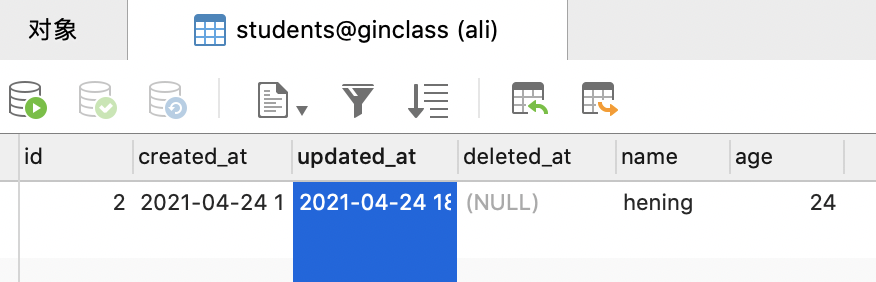
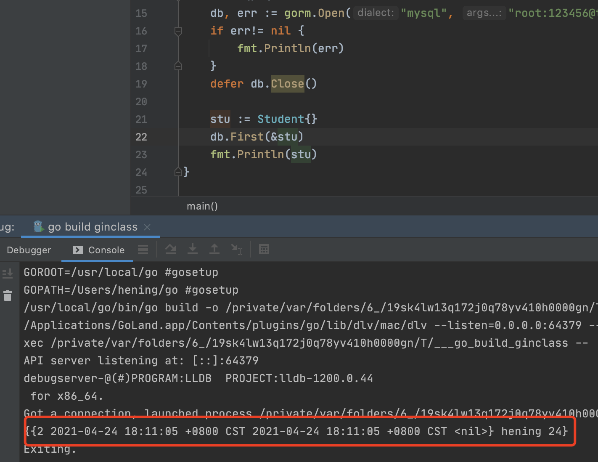
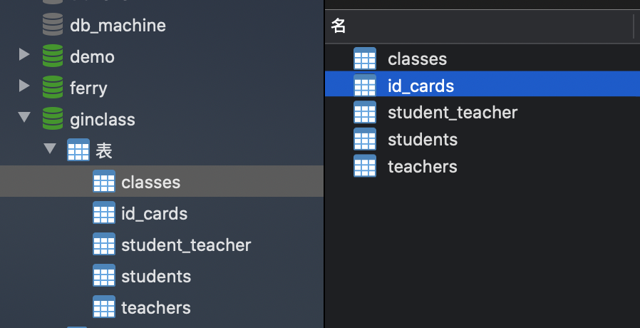
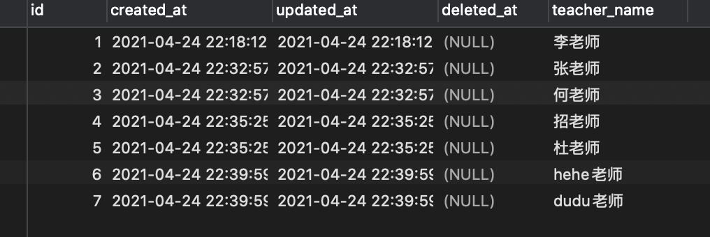
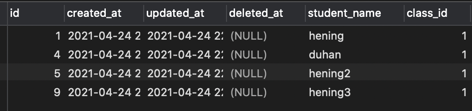
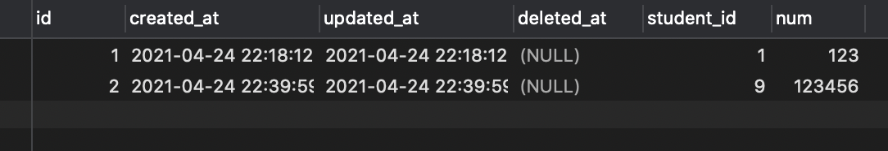
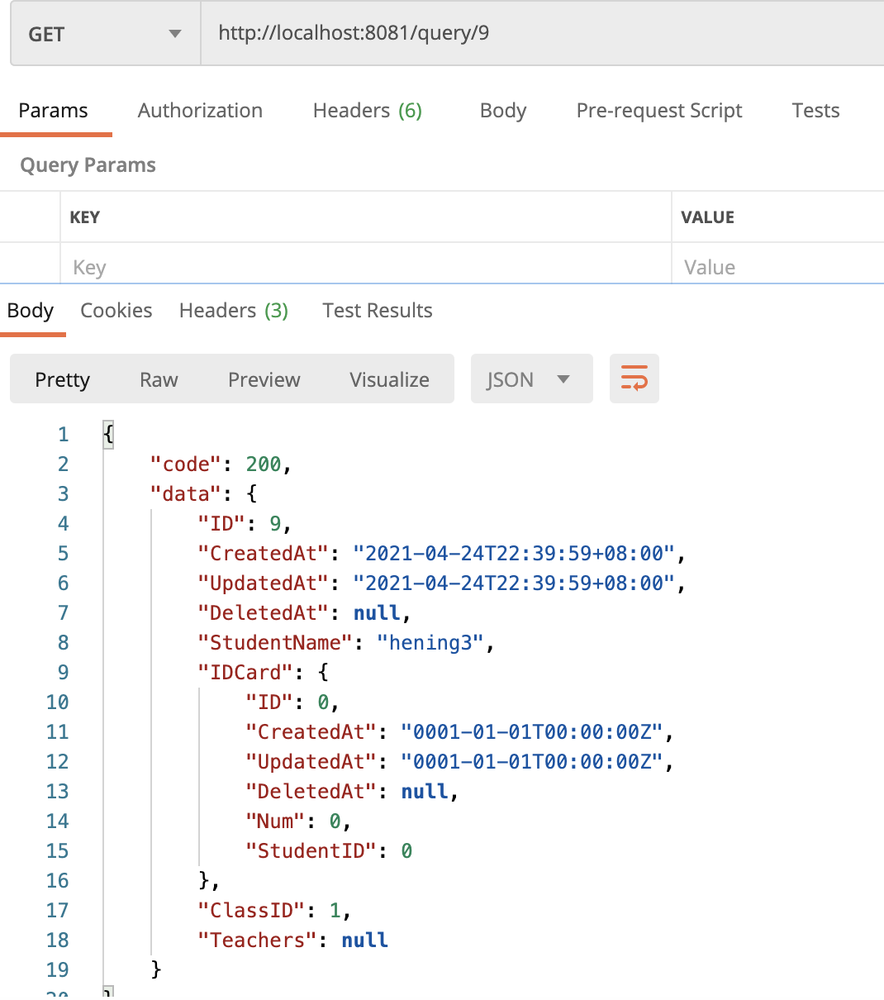
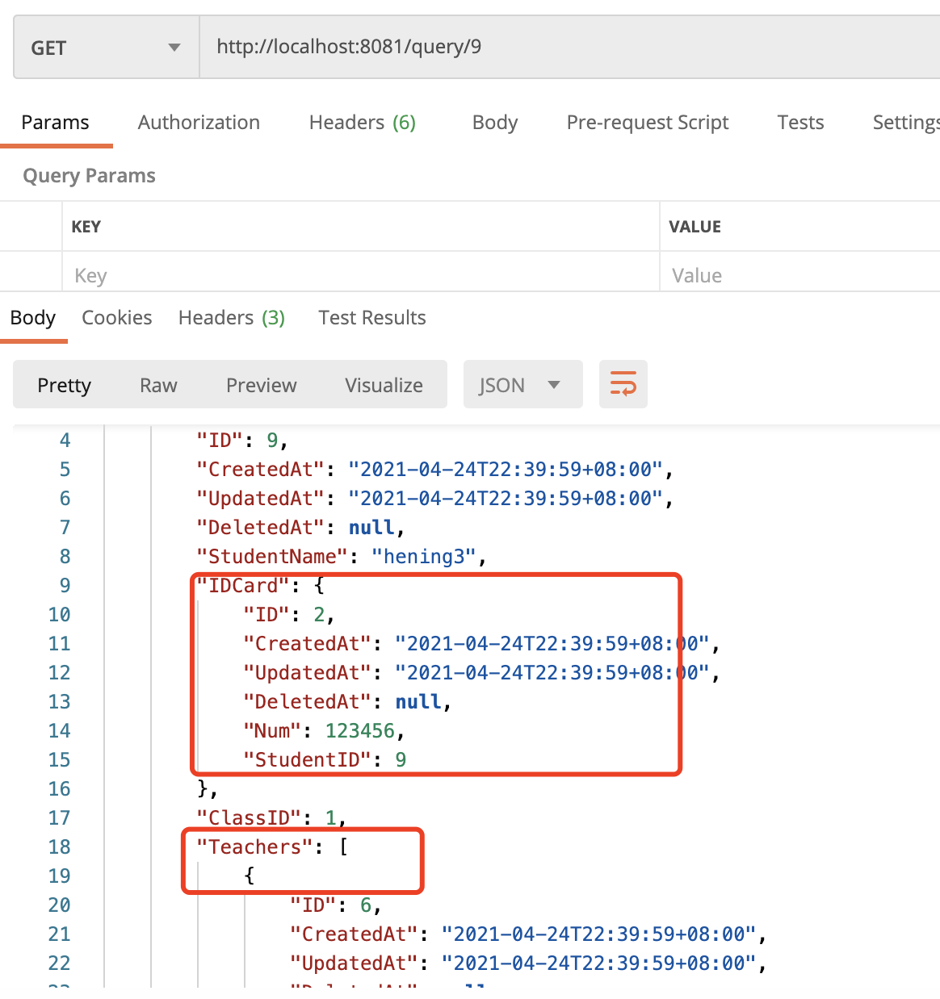

# GORM入门

Go 语言写的一个ORM框架

## 连接数据库

```go
package main
import (
	"fmt"
	"github.com/jinzhu/gorm"
_ "github.com/jinzhu/gorm/dialects/mysql"
)

type Student struct {
  // gorm提供的通用字段，包含主键、创建时间等
	gorm.Model
	Name string
	Age int
}
func main() {
  // 连接数据库，注意
	db, err := gorm.Open("mysql", "name:pass@tcp(xx.xx.xx.xx:3306)/ginclass?charset=utf8&parseTime=True&loc=Local")
	if err!= nil {
		fmt.Println(err)
	}
  // 开启自动迁移
	db.AutoMigrate(&Student{})

	exist := db.HasTable(&Student{})
	fmt.Println(exist)
	defer db.Close()
}
```

## 自动迁移

自动迁移**仅仅**会创建表，缺少列和索引，并且不会改变现有列的类型或删除未使用的列以保护数据。

```go
db.AutoMigrate(&Student{})
```

## 常用初始化语句

文档地址：https://jasperxu.com/gorm-zh/database.html#m

```go
// 为模型`User`创建表
db.CreateTable(&User{})

// 创建表`users'时将“ENGINE = InnoDB”附加到SQL语句
db.Set("gorm:table_options", "ENGINE=InnoDB").CreateTable(&User{})
```

## 结构体模型与数据库表构建

文档：https://jasperxu.com/gorm-zh/models.html#c

表名模式是结构体名称的复述形式： student -> 表名 students

禁用：

```go
db.SingularTable(true) // 如果设置为true,`User`的默认表名为`user`,使用`TableName`设置的表名不受影响
```

### 字段名称默认蛇形小写，驼峰

```go
type User struct {
  ID uint             // 列名为 `id`
  Name string         // 列名为 `name`
  Birthday time.Time  // 列名为 `birthday`
  CreatedAt time.Time // 列名为 `created_at`
}

// 重设列名
type Animal struct {
    AnimalId    int64     `gorm:"column:beast_id"`         // 设置列名为`beast_id`
    Birthday    time.Time `gorm:"column:day_of_the_beast"` // 设置列名为`day_of_the_beast`
    Age         int64     `gorm:"column:age_of_the_beast"` // 设置列名为`age_of_the_beast`
}
```

### 设置主键、设置字段长度、名称等

见文档


## CRUD 

### 新增

```go
db.Create(&Student{
		Name: "hening",
		Age:  24,
	})
```




### 查询

```go
stu := Student{}
// 注意传入一个指针地址
	db.First(&stu)
	fmt.Println(stu)

// 条件查询
// 注意使用 var声明，如果使用：=  那么声明的是一个有值得空对象
var stu Student
	// 注意加一个？ 占位符
	db.Where("name = ?","hening").First(&stu)
	fmt.Println(stu)
```



#### 指定要查询的字段

默认查询所有字段，select  * from 

```go
db.Select("name, age").Find(&users)
//// SELECT name, age FROM users;

db.Select([]string{"name", "age"}).Find(&users)
//// SELECT name, age FROM users;

db.Table("users").Select("COALESCE(age,?)", 42).Rows()
//// SELECT COALESCE(age,'42') FROM users;
```

#### 排序

```go
db.Order("age desc, name").Find(&users)
//// SELECT * FROM users ORDER BY age desc, name;

// Multiple orders
db.Order("age desc").Order("name").Find(&users)
//// SELECT * FROM users ORDER BY age desc, name;

// ReOrder
db.Order("age desc").Find(&users1).Order("age", true).Find(&users2)
//// SELECT * FROM users ORDER BY age desc; (users1)
//// SELECT * FROM users ORDER BY age; (users2)
```

#### 指定表名查询

可能结构体的表名，不是自动生成的。


### 更新

```go
db.Save()
```

### 删除

```
db.Delete()
```


## 实体关联

**包括一对一、一对多、多对多的关系**



```go
package main

import (
	"fmt"
	"github.com/jinzhu/gorm"
	_ "github.com/jinzhu/gorm/dialects/mysql"
)

type Class struct {
	gorm.Model
	ClassName string
	Students []Student
}
type Student struct {
	gorm.Model
	StudentName string
	IDCard IDCard
	ClassID uint
	Teachers []Teacher `gorm:"many2many:student_teacher;"`
}
type IDCard struct {
	gorm.Model
	num int
	StudentID uint
}
type Teacher struct {
	gorm.Model
	TeacherName string
	Students []Student `gorm:"many2many:student_teacher;"`
}
func main() {
	db, err := gorm.Open("mysql", "xxx:xxxx@tcp(xx.xxx.xx.xxx:3306)/ginclass?charset=utf8&parseTime=True&loc=Local")
	if err!= nil {
		fmt.Println(err)
	}
	db.AutoMigrate(&Student{},&Class{},&IDCard{},&Teacher{})
	// 插入数据 建立关联关系
	idcard := IDCard{
		num: 123,
	}
	class := Class{
		Model:     gorm.Model{
			ID: 1,
		},
		ClassName: "高三一班",
	}
	stu := Student{
		StudentName: "hening",
		IDCard:      idcard,
		ClassID: class.ID,
	}
	teacher := Teacher{
		TeacherName: "李老师",
		Students:   []Student{stu},
	}
	db.Create(&class)
	db.Create(&teacher)
	defer db.Close()
}
```

**备注：**

这里和视屏讲的不一样，我直接设置的classid，然后关联到stu上，项目中可以使用id生成器随机生成一个

### Gin结合，实现插入

c.BindJSON(&stu) : 将json参数绑定到结构体上，包括嵌套的结构体

```go
r.POST("/student", func(c *gin.Context) {
		var stu Student
		_ = c.BindJSON(&stu)
		db.Create(&stu)
		 c.JSON(200,gin.H{
		 	"message":"success",
		 	"data":stu,
		 })
	})
```

成功保存到数据库中







### Gin 查询

```go
r.GET("/query/:id", func(c *gin.Context) {
		id := c.Param("id")
		var stu Student
		db.First(&stu,"id = ?",id)
		c.JSON(200,gin.H{
			"code":200,
			"data":stu,
		})
	})
```

**能查出student的信息，但是没有嵌套结构体的信息**



### 预加载

Preload(属性名) : 预加载出其他属性（从其他表中查询信息，**通过关系表及外键**）

```go
r.GET("/query/:id", func(c *gin.Context) {
		id := c.Param("id")
		var stu Student
		db.Preload("IDCard").Preload("Teachers").First(&stu,"id = ?",id)
		c.JSON(200,gin.H{
			"code":200,
			"data":stu,
		})
	})
```



### 嵌套预加载

```go
r.GET("/class/:id", func(c *gin.Context) {
		id := c.Param("id")
		var class Class
  	// 先预加载Students，然后再预加载Students的其它属性
		db.Preload("Students").Preload"Students.IDCard").Preload("Students.Teachers").Find(&class,"id = ?",id)
		c.JSON(200,gin.H{
			"code":200,
			"data":class,
		})
	})
```

结果

```json
{
    "code": 200,
    "data": {
        "ID": 1,
        "CreatedAt": "2021-04-24T22:18:12+08:00",
        "UpdatedAt": "2021-04-24T22:18:12+08:00",
        "DeletedAt": null,
        "ClassName": "高三一班",
        "Students": [
            {
                "ID": 1,
                "CreatedAt": "2021-04-24T22:18:12+08:00",
                "UpdatedAt": "2021-04-24T22:18:12+08:00",
                "DeletedAt": null,
                "StudentName": "hening",
                "IDCard": {
                    "ID": 1,
                    "CreatedAt": "2021-04-24T22:18:12+08:00",
                    "UpdatedAt": "2021-04-24T22:18:12+08:00",
                    "DeletedAt": null,
                    "Num": 123,
                    "StudentID": 1
                },
                "ClassID": 1,
                "Teachers": [
                    {
                        "ID": 1,
                        "CreatedAt": "2021-04-24T22:18:12+08:00",
                        "UpdatedAt": "2021-04-24T22:18:12+08:00",
                        "DeletedAt": null,
                        "TeacherName": "李老师",
                        "Students": null
                    }
                ]
            },
            {
                "ID": 4,
                "CreatedAt": "2021-04-24T22:32:57+08:00",
                "UpdatedAt": "2021-04-24T22:32:57+08:00",
                "DeletedAt": null,
                "StudentName": "duhan",
                "IDCard": {
                    "ID": 0,
                    "CreatedAt": "0001-01-01T00:00:00Z",
                    "UpdatedAt": "0001-01-01T00:00:00Z",
                    "DeletedAt": null,
                    "Num": 0,
                    "StudentID": 0
                },
                "ClassID": 1,
                "Teachers": [
                    {
                        "ID": 2,
                        "CreatedAt": "2021-04-24T22:32:57+08:00",
                        "UpdatedAt": "2021-04-24T22:32:57+08:00",
                        "DeletedAt": null,
                        "TeacherName": "张老师",
                        "Students": null
                    },
                    {
                        "ID": 3,
                        "CreatedAt": "2021-04-24T22:32:57+08:00",
                        "UpdatedAt": "2021-04-24T22:32:57+08:00",
                        "DeletedAt": null,
                        "TeacherName": "何老师",
                        "Students": null
                    }
                ]
            },
            {
                "ID": 5,
                "CreatedAt": "2021-04-24T22:35:25+08:00",
                "UpdatedAt": "2021-04-24T22:35:25+08:00",
                "DeletedAt": null,
                "StudentName": "hening2",
                "IDCard": {
                    "ID": 0,
                    "CreatedAt": "0001-01-01T00:00:00Z",
                    "UpdatedAt": "0001-01-01T00:00:00Z",
                    "DeletedAt": null,
                    "Num": 0,
                    "StudentID": 0
                },
                "ClassID": 1,
                "Teachers": [
                    {
                        "ID": 4,
                        "CreatedAt": "2021-04-24T22:35:25+08:00",
                        "UpdatedAt": "2021-04-24T22:35:25+08:00",
                        "DeletedAt": null,
                        "TeacherName": "招老师",
                        "Students": null
                    },
                    {
                        "ID": 5,
                        "CreatedAt": "2021-04-24T22:35:25+08:00",
                        "UpdatedAt": "2021-04-24T22:35:25+08:00",
                        "DeletedAt": null,
                        "TeacherName": "杜老师",
                        "Students": null
                    }
                ]
            },
            {
                "ID": 9,
                "CreatedAt": "2021-04-24T22:39:59+08:00",
                "UpdatedAt": "2021-04-24T22:39:59+08:00",
                "DeletedAt": null,
                "StudentName": "hening3",
                "IDCard": {
                    "ID": 2,
                    "CreatedAt": "2021-04-24T22:39:59+08:00",
                    "UpdatedAt": "2021-04-24T22:39:59+08:00",
                    "DeletedAt": null,
                    "Num": 123456,
                    "StudentID": 9
                },
                "ClassID": 1,
                "Teachers": [
                    {
                        "ID": 6,
                        "CreatedAt": "2021-04-24T22:39:59+08:00",
                        "UpdatedAt": "2021-04-24T22:39:59+08:00",
                        "DeletedAt": null,
                        "TeacherName": "hehe老师",
                        "Students": null
                    },
                    {
                        "ID": 7,
                        "CreatedAt": "2021-04-24T22:39:59+08:00",
                        "UpdatedAt": "2021-04-24T22:39:59+08:00",
                        "DeletedAt": null,
                        "TeacherName": "dudu老师",
                        "Students": null
                    }
                ]
            }
        ]
    }
}
```

