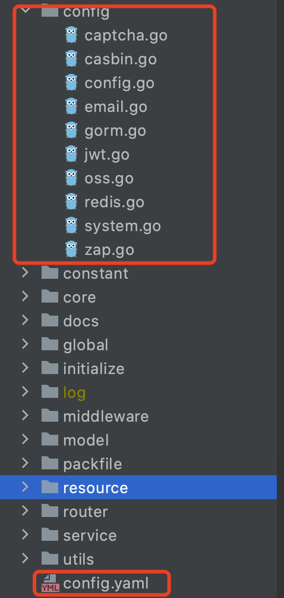
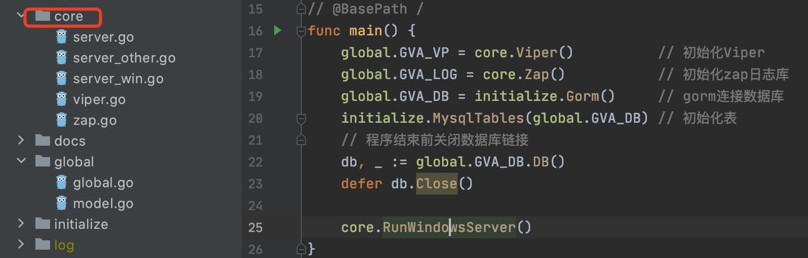

# Gin-Vue-Admin 学习

官网：https://www.gin-vue-admin.com/docs/

GIN-VUE-ADMIN 是一款基于GIN+VUE+ElementUI开发的后台管理系统快速开发脚手架

用来快速搭建直接的系统

## 配置文件

config.yaml 对应config文件夹下的结构体（数据库连接不用配，项目启动第一次会有一个接口校验是否初始化数据库，然后跳向数据库初始化页面）



## 项目初始化

初始化都几种在core包中。在执行main.go 后，会调用core包执行Viper、Zap、gorm、redis 然后启动Gin服务

初始化返回的对象都会保存到全局对象中**global**，方便后续代码中使用。



### 初始化Viper

viper 是一个配置解决方案，支持多种文件格式的配置文件，可以方便的进行配置文件读取，获取。

### 初始化Zap 日志库


### 初始化数据库并返回DB常量

通过viper读取的配置（保存到了全局变量中），读取数据库连接、用户名、密码等信息，打开数据库连接，并返回**gorm.DB**保存到全局变量中

```go
// GormMysql 初始化Mysql数据库
func GormMysql() *gorm.DB {
	m := global.GVA_CONFIG.Mysql
	dsn := m.Username + ":" + m.Password + "@tcp(" + m.Path + ")/" + m.Dbname + "?" + m.Config
	mysqlConfig := mysql.Config{
		DSN:                       dsn,   // DSN data source name
		DefaultStringSize:         191,   // string 类型字段的默认长度
		DisableDatetimePrecision:  true,  // 禁用 datetime 精度，MySQL 5.6 之前的数据库不支持
		DontSupportRenameIndex:    true,  // 重命名索引时采用删除并新建的方式，MySQL 5.7 之前的数据库和 MariaDB 不支持重命名索引
		DontSupportRenameColumn:   true,  // 用 `change` 重命名列，MySQL 8 之前的数据库和 MariaDB 不支持重命名列
		SkipInitializeWithVersion: false, // 根据版本自动配置
	}
	if db, err := gorm.Open(mysql.New(mysqlConfig), gormConfig(m.LogMode)); err != nil {
		global.GVA_LOG.Error("MySQL启动异常", zap.Any("err", err))
		os.Exit(0)
		return nil
	} else {
		sqlDB, _ := db.DB()
		sqlDB.SetMaxIdleConns(m.MaxIdleConns)
		sqlDB.SetMaxOpenConns(m.MaxOpenConns)
		return db
	}
}
```

### 初始化表

使用gorm的自动迁移，实现通过结构体自动创建表，传入上一步创建的DB对象，调用**AutoMigrate**进行初始化

**model包下存的是所有的结构体，包括数据库对应的结构体、请求入参和出参等**

```go
// MysqlTables 注册数据库表专用
func MysqlTables(db *gorm.DB) {
	err := db.AutoMigrate(
		model.SysUser{},
		model.SysAuthority{},
		model.SysApi{},
		model.SysBaseMenu{},
		model.SysBaseMenuParameter{},
		model.JwtBlacklist{},
		model.SysDictionary{},
		model.SysDictionaryDetail{},
		model.ExaFileUploadAndDownload{},
		model.ExaFile{},
		model.ExaFileChunk{},
		model.ExaSimpleUploader{},
		model.ExaCustomer{},
		model.SysOperationRecord{},
		model.WorkflowProcess{},
		model.WorkflowNode{},
		model.WorkflowEdge{},
		model.WorkflowStartPoint{},
		model.WorkflowEndPoint{},
		model.WorkflowMove{},
		model.ExaWfLeave{},
	)
	if err != nil {
		global.GVA_LOG.Error("register table failed", zap.Any("err", err))
		os.Exit(0)
	}
	global.GVA_LOG.Info("register table success")
}
```

### 启动Web服务

#### 如果开启单点登录，则初始化redis

```go
if global.GVA_CONFIG.System.UseMultipoint {
		// 初始化redis服务
		initialize.Redis()
	}
```

#### 初始化总路由

项目中所有的路由都在router文件夹下，并且采用路由分组+中间件的方式。

所以的请求对应了一个单独的方法比如**v1.CreateApi：是v1/api 包下的一个方法**

```go
func InitApiRouter(Router *gin.RouterGroup) {
	ApiRouter := Router.Group("api").Use(middleware.OperationRecord())
	{
		ApiRouter.POST("createApi", v1.CreateApi)   // 创建Api
		ApiRouter.POST("deleteApi", v1.DeleteApi)   // 删除Api
		ApiRouter.POST("getApiList", v1.GetApiList) // 获取Api列表
		ApiRouter.POST("getApiById", v1.GetApiById) // 获取单条Api消息
		ApiRouter.POST("updateApi", v1.UpdateApi)   // 更新api
		ApiRouter.POST("getAllApis", v1.GetAllApis) // 获取所有api
	}
}
```

#### 启动服务


### 关闭数据库

获取db对象，使用 defer 关键字，最后关闭数据库资源