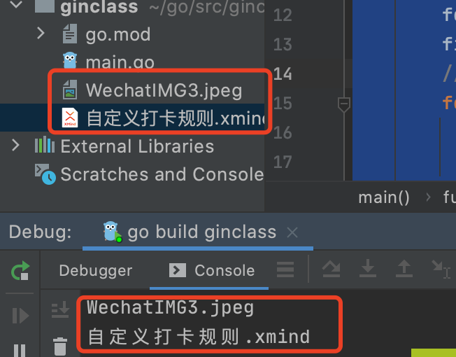
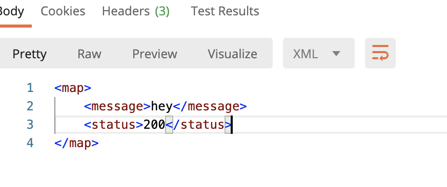

# Gin

## 简介

Go 语言的Web框架

## 安装Gin

创建项目文件夹ginclass

```shell
mkdir ginclass
```

初始化项目

```go
go mod init ginclass
```

打开项目修改GOPROXY地址

新建main.go文件

```go
package main

import "github.com/gin-gonic/gin"

func main() {
	r := gin.Default()
	r.GET("/ping", func(c *gin.Context) {
		c.JSON(200, gin.H{
			"message": "Hello  Gin",
		})
	})
	r.Run() // 监听并在 0.0.0.0:8080 上启动服务
}
```

运行main.go 启动服务


浏览器访问 http://localhost:8080/ping

成功返回如下


## 修改端口

```go
// 修改端口为8081
r.Run("8081")
```

## Gin  Get Post Delete Put请求

### Get

支持uri传参及url传参

```go
r.GET("/query", func(c *gin.Context) {
  // 支持uri 和 url传参
		name := c.Query("name")
		c.JSON(200, gin.H{
			"message": name,
		})
	})
```


### Post

支持body传参 和 Query传参

**可以同时在url中传参数 和 body中传参**

可以通过以下方式获取参数

```go
id := c.Query("id")
page := c.DefaultQuery("page", "0")
name := c.PostForm("name")
message := c.PostForm("message")
```

```go
r.POST("/query", func(c *gin.Context) {
		// Body 传参数
		name := c.PostForm("name")
		c.JSON(200, gin.H{
			"message": name,
		})
	})
```


### Delete

```go
// 注意地址后的参数接收，支持二级参数
r.DELETE("/query/:name/:age", func(c *gin.Context) {
		// 可以uri传参，也可以body传参
		name := c.Param("name")
		age := c.Param("age")
		c.JSON(200, gin.H{
			"name": name,
			"age":age,
		})
	})
```


### Put

和post请求差不多

```go
r.PUT("/query", func(c *gin.Context) {
		// Body 传参数 和POST 差别不大
		name := c.PostForm("name")
		c.JSON(200, gin.H{
			"message": name,
		})
	})
```

## bind 绑定参数&参数校验

通过bind将参数绑定到结构体中

JSON格式绑定

```go
type PostParam struct {
	Name string `json:"name"`
	Age int `json:"age"`
	Sex bool `json:"sex"`
}

func main() {
	r := gin.Default()
	r.POST("/query", func(c *gin.Context) {
		var p PostParam
    // 这里返回一个错误，可以进行接收并判断是否为空
		c.ShouldBind(&p)
		c.JSON(200, gin.H{
			"message": "成功了",
			"data":p,
		})
	})
	r.Run() // 监听并在 0.0.0.0:8080 上启动服务
}
```


URI绑定参数

```go
type PostParam struct {
	Name string `json:"name" uri:"name"`
	Age int `json:"age" uri:"age"`
	Sex bool `json:"sex" uri:"sex"`
}
func main() {
	r := gin.Default()
	r.POST("/query/:name/:age/:sex", func(c *gin.Context) {
		var p PostParam
		c.ShouldBindUri(&p)
		c.JSON(200, gin.H{
			"message": "成功了",
			"data":p,
		})
	})
	r.Run() // 监听并在 0.0.0.0:8080 上启动服务
}
```


通过Query 参数绑定

```go
//结构体
type PostParam struct {
	Name string `json:"name" uri:"name" form:"name"`
	Age int `json:"age" uri:"age" form:"age"`
	Sex bool `json:"sex" uri:"sex" form:"sex"`
}

c.ShouldBindQuery(&p)
```

**验证**

在结构体后加上必填校验，那么如果没有传参数，就会报错

 binding:"required"  ：必填

```go
type PostParam struct {
	Name string `json:"name" uri:"name" form:"name" binding:"required"`
	Age int `json:"age" uri:"age" form:"age" binding:"required"`
	Sex bool `json:"sex" uri:"sex" form:"sex"  binding:"required"`
}

func main() {
	r := gin.Default()
	r.POST("/query", func(c *gin.Context) {
		var p PostParam
		err := c.ShouldBindQuery(&p)
		if err!=nil {
			c.JSON(400,gin.H{
				"message":"错误",
				"error":err.Error(),
			})
		}else {
			c.JSON(200, gin.H{
				"message": "成功了",
				"data":p,
			})
		}

	})
	r.Run() // 监听并在 0.0.0.0:8080 上启动服务
}
```


###  绑定Get 或者 Post 参数

ShoudBind ：Get请求或者Post请求都能进行绑定到结构体中

```
var person Person
	// If `GET`, only `Form` binding engine (`query`) used.
	// 如果是Get，那么接收不到请求中的Post的数据？？
	// 如果是Post, 首先判断 `content-type` 的类型 `JSON` or `XML`, 然后使用对应的绑定器获取数据.
	// See more at https://github.com/gin-gonic/gin/blob/master/binding/binding.go#L48
	if c.ShouldBind(&person) == nil {
		log.Println(person.Name)
		log.Println(person.Address)
		log.Println(person.Birthday)
	}
```

### 自定义验证器

在**binding**中增加自定义验证标签

编写同名方法，然后在方法中将得到的断言为原始类型，然后进行自定义校验

```go
type PostParam struct {
	Name string `json:"name" uri:"name" form:"name" binding:"required"`
	Age int `json:"age" uri:"age" form:"age" binding:"required,mustBig"`
	Sex bool `json:"sex" uri:"sex" form:"sex"  binding:"required"`
}

func mustBig(f1 validator.FieldLevel)bool{
  // 断言为原始类型int 
	if f1.Field().Interface().(int) <=18 {
		return false
	}
	return true
}
func main() {
	r := gin.Default()

	if v, ok := binding.Validator.Engine().(*validator.Validate); ok {
		v.RegisterValidation("mustBig", mustBig)
	}
	r.POST("/query", func(c *gin.Context) {
		var p PostParam
		err := c.ShouldBind(&p)
		if err!=nil {
			c.JSON(400,gin.H{
				"message":"错误",
				"error":err.Error(),
			})
		}else {
			c.JSON(200, gin.H{
				"message": "成功了",
				"data":p,
			})
		}

	})
	r.Run() // 监听并在 0.0.0.0:8080 上启动服务
}
```


**源码**

```go
// 校验自定义标签时会调用对应的方法
if v, ok := binding.Validator.Engine().(*validator.Validate); ok {
		v.RegisterValidation("mustBig", mustBig)
	}

// mustBig 对应第二个参数是一个func
func (v *Validate) RegisterValidation(tag string, fn Func, callValidationEvenIfNull ...bool) error {
	return v.RegisterValidationCtx(tag, wrapFunc(fn), callValidationEvenIfNull...)
}
// 看一看这个func的定义
// 定义接受一个FieldLevel参数，返回一个bool类型
type Func func(fl FieldLevel) bool
```

## 文件上传和返回

c.FormFile("file")：读取文件

c.SaveUploadedFile(file, "./"+file.Filename) ：保存文件到指定位置

file.Filename：获取上传的文件名称

```go
package main

import (
	"fmt"
	"github.com/gin-gonic/gin"
)

func main() {
	r := gin.Default()
	r.POST("/upload", func(c *gin.Context) {
		file,_ := c.FormFile("file")
		fmt.Println(file.Filename)
		// 保存文件到指定位置
		c.SaveUploadedFile(file, "./"+file.Filename)
		c.JSON(200,gin.H{
			"message":file.Filename,
		})
	})
	r.Run(":8081") // 监听并在 0.0.0.0:8080 上启动服务
}
```

### 多文件上传

form,_ := c.MultipartForm() ：读取多个文件到 **Form** 结构体中

form.File["file"] ： 拿到为file参数的值，拿到的是一个map结构

```go
package main

import (
	"fmt"
	"github.com/gin-gonic/gin"
)

func main() {
	r := gin.Default()
	r.POST("/upload", func(c *gin.Context) {

		form,_ := c.MultipartForm()
    // files 是一个map
		files := form.File["file"]
		// 保存文件到指定位置
    // 采用range遍历map,忽略掉key，只拿到file
    // key是文件的下标，分别为 0，1，2
		for _,file := range files{
			fmt.Println(file.Filename)
			c.SaveUploadedFile(file, "./"+file.Filename)
		}
		c.JSON(200,gin.H{
			"message":files,
		})
	})
	r.Run(":8081") // 监听并在 0.0.0.0:8080 上启动服务
}
```



## 中间件和路由分组

### 创建分组

对相同前缀的请求进行统一的管理和规范

```go
// 该组的请求必须都加上v1前缀
r.Group("/v1") 
```

```go
func main() {
	router := gin.Default()

	// Simple group: v1
	v1 := router.Group("/v1")
	{
		v1.POST("/login", loginEndpoint)
		v1.POST("/submit", submitEndpoint)
		v1.POST("/read", readEndpoint)
	}

	// Simple group: v2
	v2 := router.Group("/v2")
	{
		v2.POST("/login", loginEndpoint)
		v2.POST("/submit", submitEndpoint)
		v2.POST("/read", readEndpoint)
	}

	router.Run(":8080")
}
```

### 创建中间件

在进入方法前，方法执行完后执行一系列操作。（有点类型java的切面？）

t := time.Now():当前时间

latency := time.Since(t) ：获取消耗时间，传入一个时间t

```go
package main

import (
	"fmt"
	"github.com/gin-gonic/gin"
	"log"
	"time"
)
// 自定义中间件
func Logger() gin.HandlerFunc {
	return func(c *gin.Context) {
		t := time.Now()

		// Set example variable
		c.Set("example", "12345")
		fmt.Println("before request")
		// before request
		// 执行请求的逻辑
		c.Next()
		fmt.Println("after request")
		// after request
		// 消耗时间
		latency := time.Since(t)
		log.Print("latency",latency)

		// access the status we are sending
		status := c.Writer.Status()
		log.Println("status",status)
	}
}
func main() {
	r := gin.Default()
	vg := r.Group("/log").Use(Logger())
	{
		vg.POST("/text", func(c *gin.Context) {
			example := c.MustGet("example").(string)
			fmt.Println(example)
			c.JSON(200, gin.H{
				"message": "success",
				"data":    example,
			})
		})
	}
	r.Run(":8081") // 监听并在 0.0.0.0:8080 上启动服务
}
```

## 使用分组及中间件（项目常用）

AuthRequired()：自定义中间件

loginEndpoint、submitEndpoint：**请求对应执行的方法（方法中封装统一的返回信息）**

```go
authorized := r.Group("/")
	// per group middleware! in this case we use the custom created
	// AuthRequired() middleware just in the "authorized" group.
	authorized.Use(AuthRequired())
	{
		authorized.POST("/login", loginEndpoint)
		authorized.POST("/submit", submitEndpoint)
		authorized.POST("/read", readEndpoint)

		// nested group
		testing := authorized.Group("testing")
		testing.GET("/analytics", analyticsEndpoint)
	}

// 请求对应执行的方法，接受参数*gin.Context
func loginEndpoint(c *gin.Context) {
	var person Person
	if c.ShouldBindQuery(&person) == nil {
		log.Println("====== Only Bind By Query String ======")
		log.Println(person.Name)
		log.Println(person.Address)
	}
  // 返回结果，也可以使用c.Json 自定义返回信息
	c.String(200, "Success")
}
```

## Gin 日志

一般Gin日志用来做控制台显示即可

可以结合其他开源go log框架做日志持久化、格式化等操作包括：[logrus](https://github.com/Sirupsen/logrus)

可以对日志对象进行封装为一个全局的，项目中可以调用同一个logger对象

```go
func main() {
    // 禁用控制台颜色
    gin.DisableConsoleColor()

    // 创建记录日志的文件
    f, _ := os.Create("gin.log")
    gin.DefaultWriter = io.MultiWriter(f)

    // 如果需要将日志同时写入文件和控制台，请使用以下代码
    // gin.DefaultWriter = io.MultiWriter(f, os.Stdout)

    router := gin.Default()
    router.GET("/ping", func(c *gin.Context) {
        c.String(200, "pong")
    })

    router.Run(":8080")
}
```

### 日志配置

```go
log.SetPrefix()://设置前缀
```

## 接口返回格式

支持XML、JSON、YAML和ProtoBuf 渲染

### JSON

```go
c.JSON(http.StatusOK, gin.H{"message": "hey", "status": http.StatusOK})
```

支持返回结构体

```go
r.GET("/moreJSON", func(c *gin.Context) {
		// You also can use a struct
		var msg struct {
			Name    string `json:"user"`
			Message string
			Number  int
		}
		msg.Name = "Lena"
		msg.Message = "hey"
		msg.Number = 123
		// Note that msg.Name becomes "user" in the JSON
		// Will output  :   {"user": "Lena", "Message": "hey", "Number": 123}
		c.JSON(http.StatusOK, msg)
	}
```

### XML

```go
r.GET("/someXML", func(c *gin.Context) {
		c.XML(http.StatusOK, gin.H{"message": "hey", "status": http.StatusOK})
	})
```



### YAML

```go
r.GET("/someYAML", func(c *gin.Context) {
	c.YAML(http.StatusOK, gin.H{"message": "hey", "status": http.StatusOK})
})
```
### **SecureJSON**

使用SecureJSON可以防止json劫持，如果返回的数据是数组，则会默认在返回值前加上`"while(1)"`

### **JSONP**

使用JSONP可以跨域传输，如果参数中存在回调参数，那么返回的参数将是回调函数的形式

### AsciiJSON

使用AsciiJSON将使特殊字符编码


## Gin 重定向

```go
r.GET("/test", func(c *gin.Context) {
	c.Redirect(http.StatusMovedPermanently, "http://www.baidu.com/")
})
```

### 路由重定向

```go
r.GET("/test", func(c *gin.Context) {
  	// 路由到项目的地址
    c.Request.URL.Path = "/test2"
    r.HandleContext(c)
})
r.GET("/test2", func(c *gin.Context) {
    c.JSON(200, gin.H{"hello": "world"})
})
```

