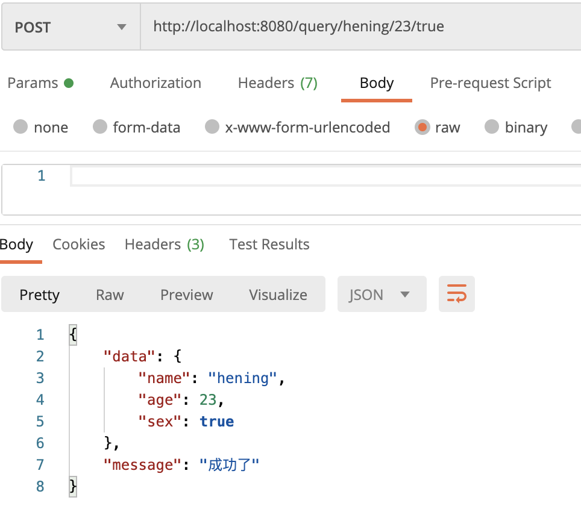

# Gin

## 简介

Go 语言的Web框架

## 安装Gin

创建项目文件夹ginclass

```shell
mkdir ginclass
```

初始化项目

```go
go mod init ginclass
```

打开项目修改GOPROXY地址

新建main.go文件

```go
package main

import "github.com/gin-gonic/gin"

func main() {
	r := gin.Default()
	r.GET("/ping", func(c *gin.Context) {
		c.JSON(200, gin.H{
			"message": "Hello  Gin",
		})
	})
	r.Run() // 监听并在 0.0.0.0:8080 上启动服务
}
```

运行main.go 启动服务


浏览器访问 http://localhost:8080/ping

成功返回如下


## 修改端口

```go
// 修改端口为8081
r.Run("8081")
```

## Gin  Get Post Delete Put请求

### Get

支持uri传参及url传参

```go
r.GET("/query", func(c *gin.Context) {
  // 支持uri 和 url传参
		name := c.Query("name")
		c.JSON(200, gin.H{
			"message": name,
		})
	})
```


### Post

支持body传参

```go
r.POST("/query", func(c *gin.Context) {
		// Body 传参数
		name := c.PostForm("name")
		c.JSON(200, gin.H{
			"message": name,
		})
	})
```


### Delete

```go
// 注意地址后的参数接收，支持二级参数
r.DELETE("/query/:name/:age", func(c *gin.Context) {
		// 可以uri传参，也可以body传参
		name := c.Param("name")
		age := c.Param("age")
		c.JSON(200, gin.H{
			"name": name,
			"age":age,
		})
	})
```


### Put

和post请求差不多

```go
r.PUT("/query", func(c *gin.Context) {
		// Body 传参数 和POST 差别不大
		name := c.PostForm("name")
		c.JSON(200, gin.H{
			"message": name,
		})
	})
```

## bind 绑定参数&参数校验

通过bind将参数绑定到结构体中

JSON格式绑定

```go
type PostParam struct {
	Name string `json:"name"`
	Age int `json:"age"`
	Sex bool `json:"sex"`
}

func main() {
	r := gin.Default()
	r.POST("/query", func(c *gin.Context) {
		var p PostParam
    // 这里返回一个错误，可以进行接收并判断是否为空
		c.ShouldBind(&p)
		c.JSON(200, gin.H{
			"message": "成功了",
			"data":p,
		})
	})
	r.Run() // 监听并在 0.0.0.0:8080 上启动服务
}
```


URI绑定参数

```go
type PostParam struct {
	Name string `json:"name" uri:"name"`
	Age int `json:"age" uri:"age"`
	Sex bool `json:"sex" uri:"sex"`
}
func main() {
	r := gin.Default()
	r.POST("/query/:name/:age/:sex", func(c *gin.Context) {
		var p PostParam
		c.ShouldBindUri(&p)
		c.JSON(200, gin.H{
			"message": "成功了",
			"data":p,
		})
	})
	r.Run() // 监听并在 0.0.0.0:8080 上启动服务
}
```



通过Query 参数绑定

```go
//结构体
type PostParam struct {
	Name string `json:"name" uri:"name" form:"name"`
	Age int `json:"age" uri:"age" form:"age"`
	Sex bool `json:"sex" uri:"sex" form:"sex"`
}

c.ShouldBindQuery(&p)
```

**验证**

在结构体后加上必填校验，那么如果没有传参数，就会报错

 binding:"required"  ：必填

```go
type PostParam struct {
	Name string `json:"name" uri:"name" form:"name" binding:"required"`
	Age int `json:"age" uri:"age" form:"age" binding:"required"`
	Sex bool `json:"sex" uri:"sex" form:"sex"  binding:"required"`
}

func main() {
	r := gin.Default()
	r.POST("/query", func(c *gin.Context) {
		var p PostParam
		err := c.ShouldBindQuery(&p)
		if err!=nil {
			c.JSON(400,gin.H{
				"message":"错误",
				"error":err.Error(),
			})
		}else {
			c.JSON(200, gin.H{
				"message": "成功了",
				"data":p,
			})
		}

	})
	r.Run() // 监听并在 0.0.0.0:8080 上启动服务
}
```


**自定义校验**

在**binding**中增加自定义验证标签

编写同名方法，然后在方法中将得到的断言为原始类型，然后进行自定义校验

```go
type PostParam struct {
	Name string `json:"name" uri:"name" form:"name" binding:"required"`
	Age int `json:"age" uri:"age" form:"age" binding:"required,mustBig"`
	Sex bool `json:"sex" uri:"sex" form:"sex"  binding:"required"`
}

func mustBig(f1 validator.FieldLevel)bool{
  // 断言为原始类型int 
	if f1.Field().Interface().(int) <=18 {
		return false
	}
	return true
}
func main() {
	r := gin.Default()

	if v, ok := binding.Validator.Engine().(*validator.Validate); ok {
		v.RegisterValidation("mustBig", mustBig)
	}
	r.POST("/query", func(c *gin.Context) {
		var p PostParam
		err := c.ShouldBind(&p)
		if err!=nil {
			c.JSON(400,gin.H{
				"message":"错误",
				"error":err.Error(),
			})
		}else {
			c.JSON(200, gin.H{
				"message": "成功了",
				"data":p,
			})
		}

	})
	r.Run() // 监听并在 0.0.0.0:8080 上启动服务
}
```


**源码**

```go
// 校验自定义标签时会调用对应的方法
if v, ok := binding.Validator.Engine().(*validator.Validate); ok {
		v.RegisterValidation("mustBig", mustBig)
	}

// mustBig 对应第二个参数是一个func
func (v *Validate) RegisterValidation(tag string, fn Func, callValidationEvenIfNull ...bool) error {
	return v.RegisterValidationCtx(tag, wrapFunc(fn), callValidationEvenIfNull...)
}
// 看一看这个func的定义
// 定义接受一个FieldLevel参数，返回一个bool类型
type Func func(fl FieldLevel) bool
```

## 文件上传和返回


## 中间件和路由分组

### 创建分组

对相同前缀的请求进行统一的管理和规范


### 创建中间件

在进入方法前，方法执行完后执行一系列操作。（有点类型java的切面？）


