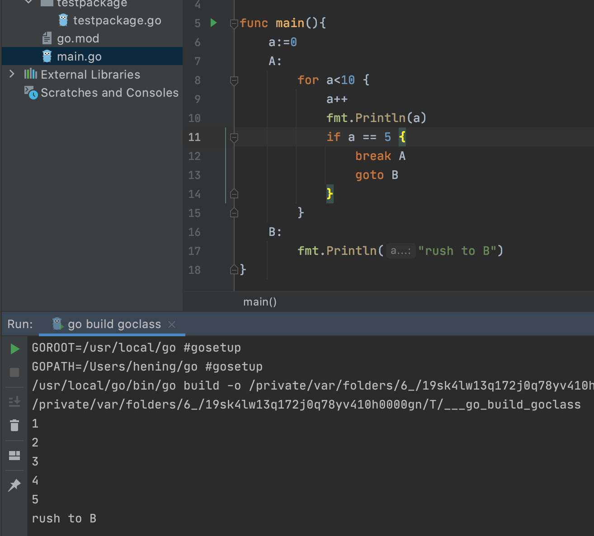

# Go入门

## 安装

直接下载go 安装


## 安装Goland

直接安装Goland  IDE

## 创建项目

创建项目被设置GOPROXY


## 创建GO文件

**每一个项目必须有一个main.go 文件 以及main方法 pageage 必须为main**


## 声明变量

### 显示声明

```go
var a string = ""
```

### 隐式声明

```go
b:="" // 常用
```


## 注释

```go
// 单行注释
/*范围注释*/
```

## 包

**一个文件夹下不能出现多个包，比如一个文件夹下有了main包，那么不能在创建其他名字的包，必须在其他文件夹下创建**

但是一个包中可以有多个文件


### 包别名

如果引入的包名过长，可以在import中重新起一个别用，使用时通过 **别名.变量名** 的方式调用


### 直接引入

在导入的包前使用 .  就直接引入当前的文件中


## 外部引用

如果包中的变量名和方法名开头是小写，说明是私有的，不能被其他包引用。

**如果需要其他包引用，那么必须为大写**


## 基本类型

### string

```go
var name string = "hening"
```

### 整形

Int:所有的整数( 分为 int8、int16、int32、int64 取值范围不同)

uint：正整数(如果给一个负数，会报错) 同样分为uint8、uint16、uint32、uint64 取值范围不同

```go
var num1 int = 123
var num2 uint = 123
```

### 浮点数

float64

Float32

```go
var num2 float64 = 3.14
```

### 布尔

```go
var bool1 bool = true
```


### 获取参数类型

```go
fmt.Printf("%T",a)
```


### 参数类型转换

使用strconv 包进行转换，可以返回多个值并接受（java是单值返回），可以接受错误err

```go
// string - int
int1,_:=strconv.Atoi(name)
// string - int64
strconv.ParseInt()
// string - bool
strconv.ParseBool()
```


## 跳转语句

break 跳出循环

continue：跳出本次循环

goto  调往另一个结构体

```go
package main
import "fmt"
func main(){
	a:=0
	A:
		for a<10 {
			a++
			fmt.Println(a)
			if a == 5 {
				break A // 跳出结构体A
				goto B  // 转到B结构体
			}
		}
	B:
		fmt.Println("rush to B")
}
```




## 数组

格式：a:= [5]int{1,2,3,4,5} //直接赋值

​			var c = new([5]int)  // 不赋值

```go
package main

import "fmt"

func main(){
	// [元素个数]元素类型{元素值}
	a:= [5]int{1,2,3,4,5}
	b:=[...]int{6,7,8,9,10,11,12,13}
	var c = new([5]int)
	c[2] = 2
	fmt.Println(a,b,c)
}
```

### 循环数组

两种循环方式

使用for循环

使用range 获取每个元素的下标和值 

Len() ：获取数组长度

cap(): 获取数组容量

```go
package main

import "fmt"

func main(){
	zoom := [...]string{"猴子","大象","猩猩"}
	for i:=0;i<len(zoom);i++ {
		fmt.Println(zoom[i])
	}

	for i,v := range zoom {
		fmt.Println(i,v)
	}
}
```


### 二维数组

```go
// 二维数组
	er := [3][3]int {
		{1,2,3},
		{4,5,6},
		{7,8,9},
	}
	fmt.Println(er)
```

## 切片

切片是数组的一部分，切片内的值被改变，那么数组中的值也会被改变

使用： 对数组进行切片，获取到的切片打印出来跟数组一样

```go
package main

import "fmt"

func main() {
	a := [3]int{1, 2, 3}
	c := a[:]
	fmt.Println(a, c)
	// 获取切片，前闭后开原则
	d := a[0:2]
	fmt.Println(d)
  // 从1 开始取到最后
	e := a[1:]
	fmt.Println(e)s
}
```


### 切片扩容

append(切片，元素值) 方法

**使用append 后，切片与原数组没有关系，不会修改原数组的值**

```go
package main

import "fmt"

func main() {
   a := [3]int{1, 2, 3}
   c := a[:]
   fmt.Println(a, c)
   c = append(c, 4)
   fmt.Println(a,c)
   // 使用append 后，切片与原数组没有关系，不会修改原数组的值
   c[0] = 0
   fmt.Println(a,c)
}
```

### 切片长度、容量

len() : 获取长度

cap() : 获取容量

**当切片的长度等于容量后，再次append后，容量会扩容为原来的两倍**


### 切片复制 copy 

当后一个切片的值，覆盖到前一个切片中，可以指定

```go
package main
import "fmt"
func main() {
	a := [3]int{1, 2, 3}
	c := a[:]
	d := a[2:]
	fmt.Println(a,c,d)
	c = append(c, 4)
  // 可以指定从c的那个位置开始覆盖 c[1:2],默认从首位开始覆盖 
	copy(c,d)
	fmt.Println(a,c,d)
}
```


### 创建切片的方式

1、 从数组中获取切片

2、直接声明一个切片

3、make方法

```go
package main
import "fmt"
func main() {
	// 创建切片
	var a []int
	a = append(a, 1)
	fmt.Println(a)
	// 初始化切片，指定长度和容量
	var b = make([]int,3,10)
	fmt.Println(b)
	fmt.Println(len(b),cap(b))
}
```


## map

### 创建map

三种方式

var m map[string]string

m1 := map[string]string{}

m2 := make(map[string]string)

```go
package main

import "fmt"

func main() {
	// 创建map
	var m map[string]string
	m = map[string]string{}
	m["name"] = "hening"
	m["sex"] = "man"
	fmt.Println(m)

	m1 := map[string]string{}
	m1["name"] = "duhan"
	m1["sex"] = "woman"
	fmt.Println(m1)

	m2 := make(map[string]string)
	m2["name"] = "hening2"
	m2["sex"] = "man"
	fmt.Println(m2)
}
```

### 存储不同类型value

m := map[string]interface{}{}  : **interface{} 表示value接受不同类型**

```go
package main

import "fmt"

func main() {
	// 不同类型value
	m := map[string]interface{}{}
	m["hening"] = "my name is hening"
	m["work"] = true
	m["age"] = 22
	fmt.Println(m)
}
```

### map删除

```go
delete(m,"work")
fmt.Println(m,len(m))
```

### map循环

使用range 循环，获取k，v

```go
// 不同类型value
	m := map[string]interface{}{}
	m["hening"] = "my name is hening"
	m["work"] = true
	m["age"] = 22
	for k,v := range m {
		fmt.Println(k,v)
	}
```


## func 函数方法

func声明方法

func 方法名(参数名1 参数类型1，参数名2 参数类型2)(出参1 出参类型1，....) {

​	// 处理代码逻辑

}

```go
package main

import "fmt"

func main() {
	// func 函数
	r1,r2 := test(22,"年龄")
	fmt.Println("main",r1)
	fmt.Println("main",r2)
}

func test(data1 int,data2 string)(res1 int,res2 string){
	fmt.Println(data1)
	fmt.Println(data2)
	return data1,data2
}
```

### 匿名函数

实际上相当于在main函数外新建一个函数，**然后将这个函数赋值给了b，然后通过b来调用

```go
b := func(data string) {
		fmt.Println(data)
	}
	b("我是一个匿名函数")
```

### 不定项函数

指入参、出参数量补丁的参数

```go
func main() {
	more(9527,"1","2","3","4")
}

func more(num int,data ...string)  {
	fmt.Println(num)
	fmt.Println(data)
	for k,v := range data {
		fmt.Println(k,v)
	}
}
```


### 参数不定项参数

如果希望将数组传递为不定项参数，那么传入数组时，在后面加三个点

**arr...** 

```go
func main() {
	more(9527,"1","2","3","4")
	arr := []string{"5","6","7","8"}
  // 传入数组
	more(9528,arr...)
}

func more(num int,data ...string)  {
	fmt.Println(num)
	fmt.Println(data)
	for k,v := range data {
		fmt.Println(k,v)
	}
}
```

### 自执行函数

在函数内定义的函数，不需要调用，再声明的时候就被调用

```go
func main() {
	(func() {
		fmt.Println("我是自执行函数")
	})()
}
```

### 闭包函数

指函数返回的类型还是一个函数，同样可以指定入参和出参

**注意函数的出参要和返回值得函数一致，不一致会报错**

```go
func main() {
	more()(24)
}
// more 函数出参也是一个函数
func more()func(num int)  {
	return func(num int) {
		fmt.Println("我是一个闭包函数",num)
	}
}
```


## 延迟执行

defer 关键字

```go
func main() {
	// 最先声明defer的最后执行
	defer more()(24)
	defer more()(25)
	fmt.Println(1)
	fmt.Println(2)
	fmt.Println(3)
}

func more()func(num int)  {
	return func(num int) {
		fmt.Println("我是一个闭包函数",num)
	}
}
```


## 指针和地址

