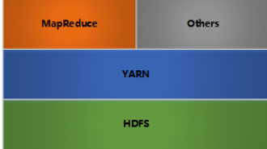

# Hadoop简介

## 大数据特点

### 概念

不能使用一台机器进行处理的数据

大数据的核心是样本=总体

### 特性

- **大量性(volume):** 一般在大数据里，单个文件的级别至少为几十，几百GB以上
- **快速性(velocity):** 反映在数据的快速产生及数据变更的频率上
- **多样性(variety):** 泛指数据类型及其来源的多样化，进一步可以把数据结构归纳为结构化(structured)，半结构化(semi-structured)，和非结构化(unstructured)
- **易变性:** 伴随数据快速性的特征，数据流还呈现一种波动的特征。不稳定的数据流会随着日，季节，特定事件的触发出现周期性峰值
- **准确性:** 又称为数据保证(data assurance)。不同方式，渠道收集到的数据在质量上会有很大差异。数据分析和输出结果的错误程度和可信度在很大程度上取决于收集到的数据质量的高低
- **复杂性:** 体现在数据的管理和操作上。如何抽取，转换，加载，连接，关联以把握数据内蕴的有用信息已经变得越来越有挑战性

## 简介

Hadoop可运行于一般的商用服务器上，具有高容错、高可靠性、高扩展性等特点

特别适合写一次，读多次的场景

### 适合

- 大规模数据
- 流式数据（写一次，读多次）
- 商用硬件（一般硬件）

### 不适合

- 低延时的数据访问
- 大量的小文件
- 频繁修改文件（基本就是写1次）

## 架构

- **HDFS:** 分布式文件存储
- **YARN:** 分布式资源管理
- **MapReduce:** 分布式计算
- **Others:** 利用YARN的资源管理功能实现其他的数据处理方式

内部各个节点基本都是采用Master-Woker架构