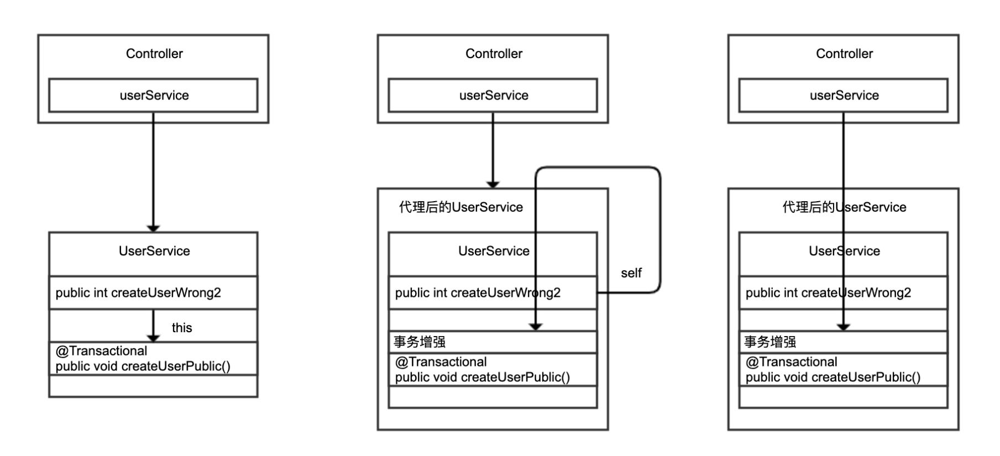

# Spring声明式事务

​	

## 事务不生效的场景

1，除非特殊配置（比如使用 AspectJ 静态织入实现 AOP），否则只有定义在 public 方法上的 @Transactional 才能生效

原因是，Spring 默认通过动态代理的方式实现 AOP，对目标方法进行增强，private 方法无法代理到，Spring 自然也无法动态增强事务处理逻辑。

```java

@Service
@Slf4j
public class UserService {
    @Autowired
    private UserRepository userRepository;

    //一个公共方法供Controller调用，内部调用事务性的私有方法
    public int createUserWrong1(String name) {
        try {
            this.createUserPrivate(new UserEntity(name));
        } catch (Exception ex) {
            log.error("create user failed because {}", ex.getMessage());
        }
        return userRepository.findByName(name).size();
    }

    //标记了@Transactional的private方法
    @Transactional
    private void createUserPrivate(UserEntity entity) {
        userRepository.save(entity);
        if (entity.getName().contains("test"))
            throw new RuntimeException("invalid username!");
    }

    //根据用户名查询用户数
    public int getUserCount(String name) {
        return userRepository.findByName(name).size();
    }
}
```

2，必须通过代理过的类从外部调用目标方法才能生效

Spring 通过 AOP 技术对方法进行增强，要调用增强过的方法必然是调用代理后的对象

正确的方法是在Controller层直接调用@Transactional 标记的Service方法

或者Service注入另一个Service 通过外部调用Service

```java

@GetMapping("right2")
public int right2(@RequestParam("name") String name) {
    try {
        userService.createUserPublic(new UserEntity(name));
    } catch (Exception ex) {
        log.error("create user failed because {}", ex.getMessage());
    }
    return userService.getUserCount(name);
}
```



​										自调用，注入自己调用，外部调用的区别

通过 this 自调用，没有机会走到 Spring 的代理类；后两种改进方案调用的是 Spring 注入的 UserService，通过代理调用才有机会对 createUserPublic 方法进行动态增强。

### 小技巧

通过开启Debug级别的日志可以在开发环境，清楚的看见事务的开启过程

```java

//在UserService中通过this调用public的createUserPublic
[10:10:19.913] [http-nio-45678-exec-1] [DEBUG] [o.s.orm.jpa.JpaTransactionManager       :370 ] - Creating new transaction with name [org.springframework.data.jpa.repository.support.SimpleJpaRepository.save]: PROPAGATION_REQUIRED,ISOLATION_DEFAULT
//在Controller中通过注入的UserService Bean调用createUserPublic
[10:10:47.750] [http-nio-45678-exec-6] [DEBUG] [o.s.orm.jpa.JpaTransactionManager       :370 ] - Creating new transaction with name [org.geekbang.time.commonmistakes.transaction.demo1.UserService.createUserPublic]: PROPAGATION_REQUIRED,ISOLATION_DEFAULT
```


## 事务即便生效也不一定能回滚场景

1、在 createUserWrong1 方法中会抛出一个 RuntimeException，但由于方法内 catch 了所有异常，异常无法从方法传播出去，事务自然无法回滚

```java
try {
            userRepository.save(new User(name));
            throw new RuntimeException("error");
        } catch (Exception ex) {
            log.error("create user failed", ex);
        }
```

将异常吃掉，不将RuntimeException抛出去，就不会回滚。

**如果我将异常从一个方法传播到另一个方法，但是在另一个方法中catch住吃点，不向上抛出会发生什么呢？事务嵌套？？**

```java

```


2、在 createUserWrong2 方法中，注册用户的同时会有一次 otherTask 文件读取操作，如果文件读取失败，我们希望用户注册的数据库操作回滚。虽然这里没有捕获异常，但因为 otherTask 方法抛出的是受检异常，createUserWrong2 传播出去的也是受检异常，事务同样不会回滚

```java
//即使出了受检异常也无法让事务回滚
    @Transactional(rollbackOn = Exception.class)
    public void createUserWrong2(String name) throws IOException {
        userRepository.save(new User(name));
        otherTask();
    }

    //因为文件不存在，一定会抛出一个IOException
    private void otherTask() throws IOException {
        Files.readAllLines(Paths.get("file-that-not-exist"));
    }
```

IOException属于受监测异常，Extend Exception 默认情况不会进行回滚


## 请确认事务传播配置是否符合自己的业务逻辑

在主流程中调用另一个类中的方法，如果另一个类中的方法出现异常，不希望影响主流程，只回滚自己的业务，不回滚主流程的业务。

那么需要确认自己的事务传播机制

在UserService createUserWrong1方法中创建主用户 createMainUser(name);

调用**subUserService.subCreateUser();**创建子用户。

**如果subUserService.subCreateUser(); 抛出异常，被createUserWrong1捕获会发生org.springframework.transaction.UnexpectedRollbackException: Transaction silently rolled back because it has been marked as rollback-only...异常。**

**表示当前事务已经被标记为回滚了，无法进行正常提交了。**

方案1：

修改事务传播机制，不要使用同一个事务

**@Transactional(propagation = Propagation.REQUIRES_NEW)**

方案2：

在SubUserService subCreateUser 捕获异常，不要让异常在方法间传播，但是子用户的创建也不会被回滚了，根据业务需要来。

```java
@Transactional
    public void createUserWrong1(String name) {
        createMainUser(name);
        try {
            subUserService.subCreateUser();
        } catch (Exception e) {
            log.error("### SubCreate Error {}",e.getMessage());
        }
    }

    private void createMainUser(String name){
        userRepository.save(new User(name));
    }
```

```java
package com.he.business.Service.Impl;


import com.he.business.Service.UserRepository;
import com.he.business.domain.User;
import lombok.extern.slf4j.Slf4j;
import org.springframework.beans.factory.annotation.Autowired;
import org.springframework.stereotype.Service;

import javax.transaction.Transactional;

@Service
@Slf4j
public class SubUserService {

    @Autowired
    private UserRepository userRepository;
    @Transactional
    public void subCreateUser(){
        log.error("### 创建子用户");
        userRepository.save(new User("hening sub"));
        throw new RuntimeException("invalid status");
    }
}
```

