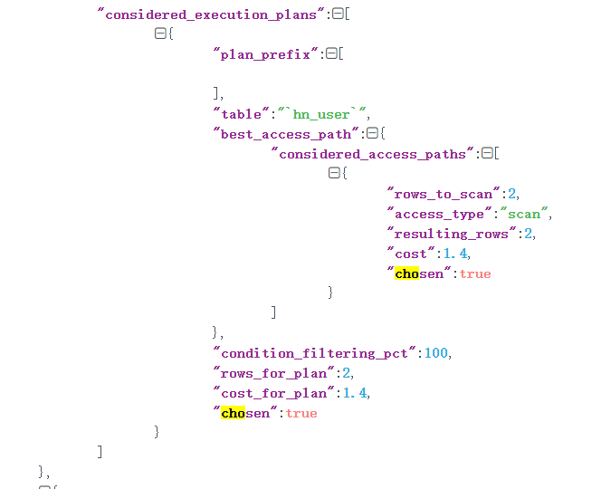

# 数据库索引：索引并不是万能药

 https://time.geekbang.org/column/article/213342?utm_term=pc_interstitial_563

## Innodb 如何存储数据

然数据保存在磁盘中，但其处理是在内存中进行的。为了减少磁盘随机读取次数，InnoDB 采用页而不是行的粒度来保存数据，即数据被分成若干页，以页为单位保存在磁盘中。InnoDB 的页大小，一般是 16KB。

各个数据页组成一个双向链表，每个数据页中的记录按照主键顺序组成单向链表；每一个数据页中有一个页目录，方便按照主键查询记录


页目录通过槽把记录分成不同的小组，每个小组有若干条记录。如图所示，记录中最前面的小方块中的数字，代表的是当前分组的记录条数，最小和最大的槽指向 2 个特殊的伪记录。有了槽之后，我们按照主键搜索页中记录时，就可以采用二分法快速搜索，无需从最小记录开始遍历整个页中的记录链表。

## 聚簇索引 二级索引


​																				B+树

B+ 树的特点包括：

最底层的节点叫作叶子节点，用来存放数据；

其他上层节点叫作非叶子节点，仅用来存放目录项，作为索引；

非叶子节点分为不同层次，通过分层来降低每一层的搜索量；

所有节点按照索引键大小排序，构成一个双向链表，加速范围查找。

InnoDB 会自动使用主键（唯一定义一条记录的单个或多个字段）作为聚簇索引的索引键（如果没有主键，就选择第一个不包含 NULL 值的唯一列）。上图方框中的数字代表了索引键的值，对聚簇索引而言一般就是主键


为了实现非主键字段的快速搜索，就引出了二级索引，也叫作非聚簇索引、辅助索引。二级索引，也是利用的 B+ 树的数据结构，如下图所示


这次二级索引的叶子节点中保存的不是实际数据，而是主键，获得主键值后去聚簇索引中获得数据行。这个过程就叫作回表。

## 创建索引的代价

### 首先是维护代价

建 N 个二级索引，就需要再创建 N 棵 B+ 树，新增数据时不仅要修改聚簇索引，还需要修改这 N 个二级索引。

### 其次是空间代价

虽然二级索引不保存原始数据，但要保存索引列的数据，所以会占用更多的空间

查询数据和索引占用的空间大小

```sql
SELECT DATA_LENGTH, INDEX_LENGTH FROM information_schema.TABLES WHERE TABLE_NAME='hn_user'
```

### 最后是回表的代价

二级索引不保存原始数据，通过索引找到主键后需要再查询聚簇索引，才能得到我们要的数据

**联合索引中其实保存了多个索引列的值，对于页中的记录先按照字段 1 排序，如果相同再按照字段 2 排序，如图所示**


叶子节点每一条记录的第一和第二个方块是索引列的数据，第三个方块是记录的主键。如果我们需要查询的是索引列索引或联合索引能覆盖的数据，那么查询索引本身已经“覆盖”了需要的数据，不再需要回表查询。因此，这种情况也叫作索引覆盖。

### 最佳实践

第一，无需一开始就建立索引，可以等到业务场景明确后，或者是数据量超过 1 万、查询变慢后，再针对需要查询、排序或分组的字段创建索引。创建索引后可以使用 EXPLAIN 命令，确认查询是否可以使用索引

第二，尽量索引轻量级的字段，比如能索引 int 字段就不要索引 varchar 字段。索引字段也可以是部分前缀，在创建的时候指定字段索引长度。针对长文本的搜索，可以考虑使用 Elasticsearch 等专门用于文本搜索的索引数据库

尽量不要在 SQL 语句中 SELECT *，而是 SELECT 必要的字段，甚至可以考虑使用联合索引来包含我们要搜索的字段，既能实现索引加速，又可以避免回表的开销

## 数据库基于成本决定是否走索引

MySQL 在查询数据之前，会先对可能的方案做执行计划，然后依据成本决定走哪个执行计划

这里的成本，包括 IO 成本和 CPU 成本

- IO 成本，是从磁盘把数据加载到内存的成本。默认情况下，读取数据页的 IO 成本常数是 1（也就是读取 1 个页成本是 1）。
- CPU 成本，是检测数据是否满足条件和排序等 CPU 操作的成本。默认情况下，检测记录的成本是 0.2。

查询Mysql 统计信息，这只是Mysql估算的结果，并不是精确的结果

```sql
SHOW TABLE STATUS LIKE 'person'
```

### 优化器生成执行计划的过程

在 MySQL 5.6 及之后的版本中，我们可以使用 optimizer trace 功能查看优化器生成执行计划的整个过程。有了这个功能，我们不仅可以了解优化器的选择过程，更可以了解每一个执行环节的成本，然后依靠这些信息进一步优化查询

打开 optimizer_trace 后，再执行 SQL 就可以查询 information_schema.OPTIMIZER_TRACE 表查看执行计划了，最后可以关闭 optimizer_trace 功能。

```sql
SET optimizer_trace="enabled=on";
SELECT * FROM person WHERE NAME >'name84059' AND create_time>'2020-01-24 05:00:00';
SELECT * FROM information_schema.OPTIMIZER_TRACE;
SET optimizer_trace="enabled=off";
```

Mysql 优化器会生成多个执行计划，然后根据成本去选择哪一个执行计划。

```json

{
  "index": "name_score",
  "ranges": [
    "name84059 < name"
  ],
  "rows": 25362,
  "cost": 30435,
  "chosen": false,
  "cause": "cost"
},
```

```json

{
  "index": "create_time",
  "ranges": [
    "0x5e2a79d0 < create_time"
  ],
  "rows": 23758,
  "cost": 28511,
  "chosen": false,
  "cause": "cost"
}
```

```json

{
  "considered_execution_plans": [{
    "table": "`person`",
    "best_access_path": {
      "considered_access_paths": [{
        "rows_to_scan": 100086,
        "access_type": "scan",
        "resulting_rows": 100086,
        "cost": 20306,
        "chosen": true
      }]
    },
    "rows_for_plan": 100086,
    "cost_for_plan": 20306,
    "chosen": true
  }]
},
```


considered_execution_plans ：考虑使用的执行计划。



## 备注

- 尽量不要提前优化，根据业务需要进行优化。
- 考虑索引的创建成本
- 考虑索引的维护代价
- 考虑索引是否生效