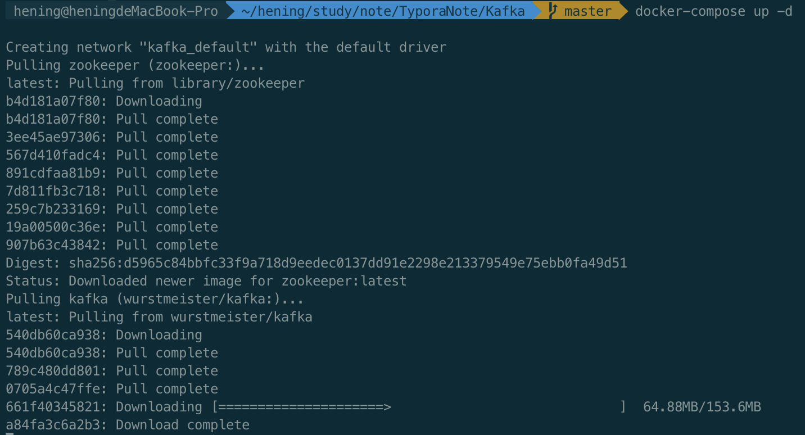
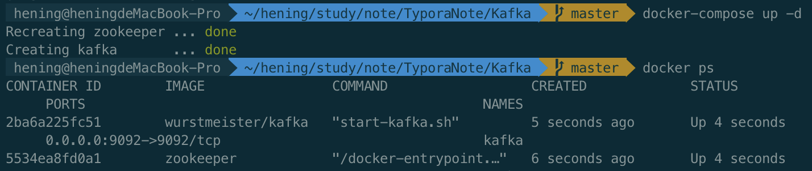
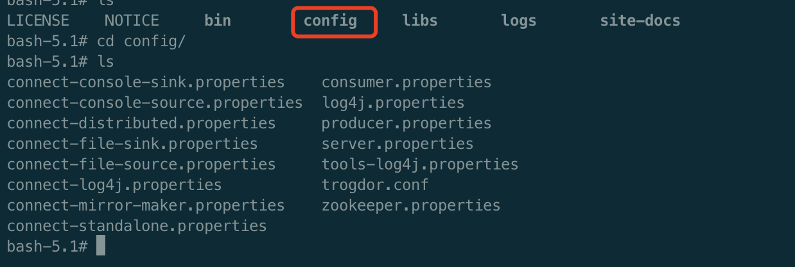
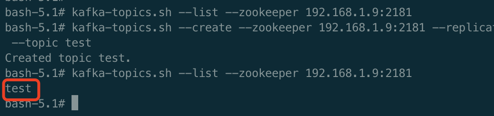
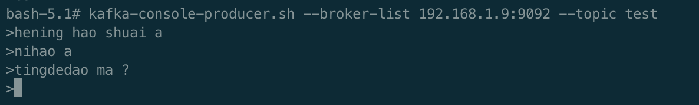
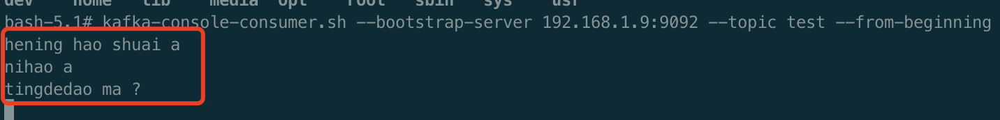
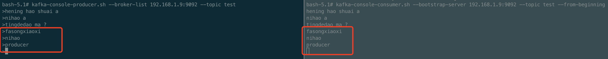

# Kafka安装

## Docker安装

### docker-compose 安装

```yml
version: '3'

services:
  zookeeper:
    image: zookeeper
    restart: unless-stopped
    ports:
      - "2181:2181"
    volumes:
      - /usr/local/zookeeper/data:/data
      - /usr/local/zookeeper/log:/datalog
    container_name: zookeeper

  kafka:
    image: wurstmeister/kafka
    ports:
      - "9092:9092"
    environment:
      KAFKA_ADVERTISED_HOST_NAME: "127.0.0.1"
      KAFKA_ZOOKEEPER_CONNECT: "zookeeper:2181"
      KAFKA_LOG_DIRS: "/kafka/kafka-logs-1"
    volumes:
      - /usr/local/kafka/logs:/kafka/kafka-logs-1
    depends_on:
      - zookeeper
    container_name: kafka
```



docker-compose 启动

```
docker-compose up -d
```



## 进入Zookeeper

```
docker exec -it 容器id /bin/bash
```

客户端连接zookeeper

```
zkCli.sh -server 127.0.0.1:2181
```

常用命令

```shell
ls /
ls /目录名称
create /目录名称 value
delete /目录名称
```


## 进入Kafka

```
docker exec -it kafka /bin/bash
```

然后进入/opt/kafka 目录中，执行相关操作命令（**/opt/kafka 中存放的是一系列操作命令**）

也可以直接在外面，通过docker操作容器

## Kafka 配置文件



**server.properties(重要配置)**

**#broker 的全局唯一编号，不能重复** 

**broker.id=0**
#删除 topic 功能使能
delete.topic.enable=true
#处理网络请求的线程数量 

num.network.threads=3
#用来处理磁盘 IO 的现成数量 

num.io.threads=8 

#发送套接字的缓冲区大小 

socket.send.buffer.bytes=102400 

#接收套接字的缓冲区大小 

socket.receive.buffer.bytes=102400

 #请求套接字的缓冲区大小 

socket.request.max.bytes=104857600 

**#kafka 运行日志存放的路径** 

**log.dirs=/opt/module/kafka/logs** 

**#topic 在当前 broker 上的分区个数** 

**num.partitions=1**
#用来恢复和清理 data 下数据的线程数量 

num.recovery.threads.per.data.dir=1

 #segment 文件保留的最长时间，超时将被删除

 log.retention.hours=168
**#配置连接 Zookeeper 集群地址** 

**zookeeper.connect=hadoop102:2181,hadoop103:2181,hadoop104:2181**

## 重启kafka

进入 /opt/kafka 

```shell
bin/kafka-server-start config/server.peroperties
```

### 创建Topic

**在指定的zookeeper 节点创建 topic，指定分区数和副本数**

```
docker exec kafka kafka-topics.sh --create --zookeeper 192.168.1.9:2181 --replication-factor 1 --partitions 1 --topic test

```



### 查看Topic

Kafka-topics.sh --list --zookeeper 127.0.0.1:2181

```
docker exec kafka kafka-topics.sh --list --zookeeper 192.168.1.9:2181
```


### 创建消息

首先创建消息生产者。执行如下命令启动 **Kafka** 基于命令行的消息生产客户端，启动后可以直接在控制台中输入消息来发送，控制台中的每一行数据都会被视为一条消息来发送

**启动消息生产者**

```
docker exec -it kafka kafka-console-producer.sh --broker-list 192.168.1.9:9092 --topic test
```

然后在控制台中输入发送消息，那么消息就会进入到topic test中等待消费



**启动消息消费者**

我们打开另一个命令窗口执行如下执行命令启动 **Kafka** 基于命令行的消息消费客户端，启动之后，马上可以在控制台中看到输出了之前我们在消息生产客户端中发送的消息

```
docker exec -it kafka kafka-console-consumer.sh --bootstrap-server 192.168.1.9:9092 --topic test --from-beginning
```



**启动消费者后，收到了生产者发送的消息。**

### 发送消息、消费消息对比

在生产者窗口发送消息，在消费者界面可以看见消息

