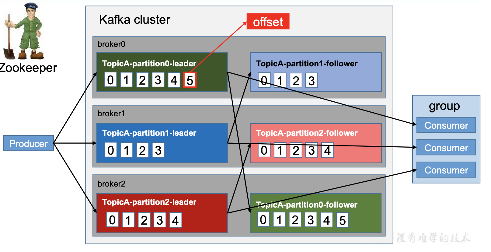
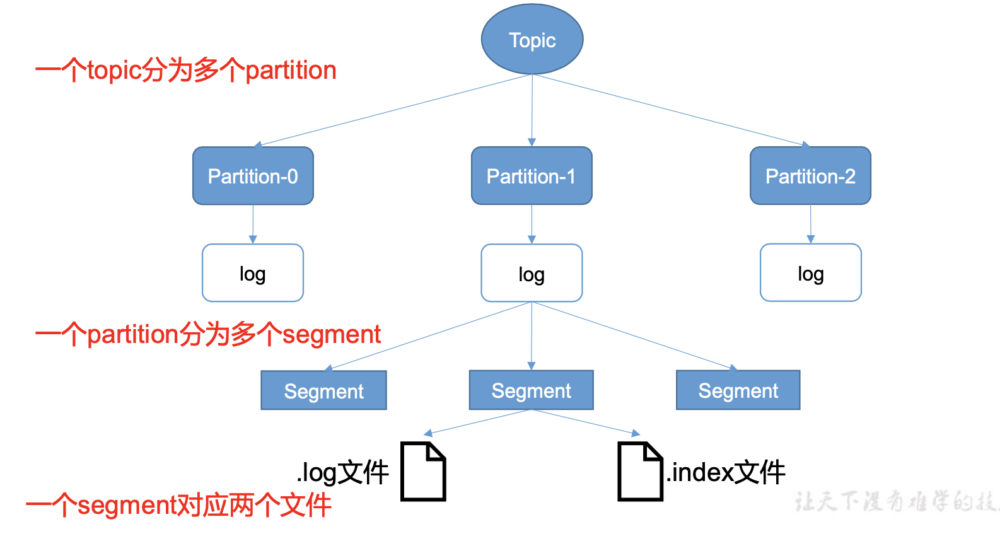
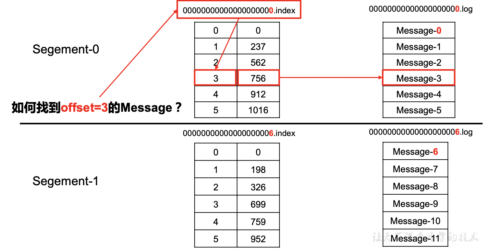
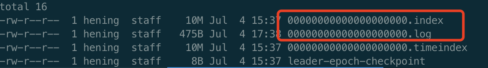

# Kafka文件存储

## Kafka工作流程图



kafka集群有多个broker组成

一个Topic 分为多个partition

一个partition 有多个副本，分为leader 和 follower，存在于不同的broker


Kafka 中消息是以 topic 进行分类的，生产者生产消息，消费者消费消息，都是面向 topic 的。

topic 是逻辑上的概念，而 partition 是物理上的概念，每个 partition 对应于一个 log 文 件，该 log 文件中存储的就是 producer 生产的数据。Producer 生产的数据会被不断追加到该 log 文件末端，且每条数据都有自己的 offset。消费者组中的每个消费者，都会实时记录自己 消费到了哪个 offset，以便出错恢复时，从上次的位置继续消费。

## 文件存储机制



由于生产者生产的消息会不断追加到 log 文件末尾，为防止 log 文件过大导致数据定位 效率低下，Kafka 采取了分片和索引机制，将每个 partition 分为多个 segment。每个 segment 对应两个文件——“.index”文件和“.log”文件。这些文件位于一个文件夹下，该文件夹的命名 规则为:topic 名称+分区序号。例如，first 这个 topic 有三个分区，则其对应的文件夹为 first- 0,first-1,first-2。

```
00000000000000000000.index 
00000000000000000000.log 
00000000000000170410.index 
00000000000000170410.log 
00000000000000239430.index 
00000000000000239430.log
```

**index 和 log 文件以当前 segment 的第一条消息的 offset 命名**。下图为 index 文件和 log 文件的结构示意图






**“.index”文件存储大量的索引信息，“.log”文件存储大量的数据**，索引文件中的元 数据指向对应数据文件中 message 的物理偏移地址。

