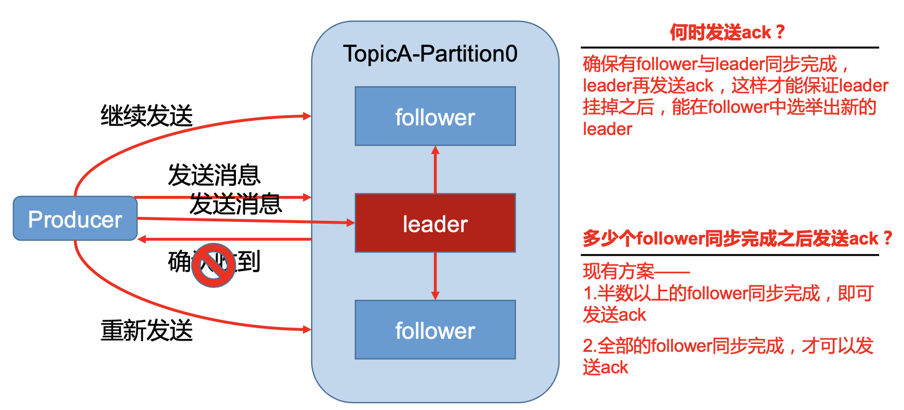
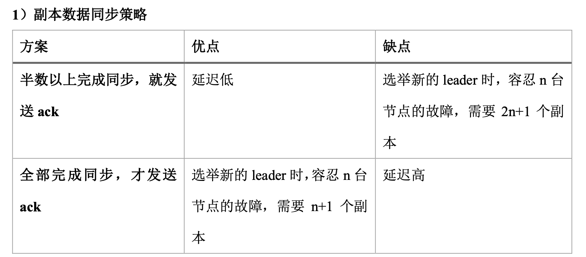
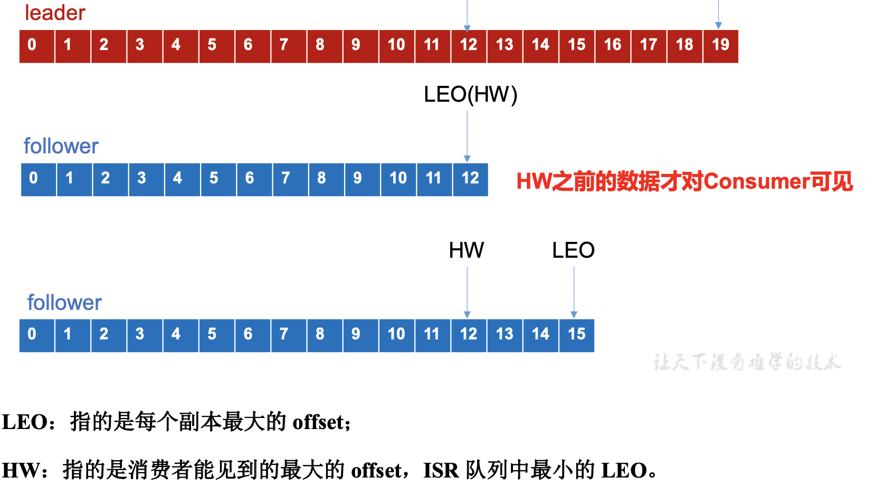

# Kafka 生产者

## 分区策略

- 方便扩展：如果数据量大，那么增加分区即可，扩展broker即可
- 提高并发度：每个消费者，生产者，可以面向分区进行读写

## 分区原则

(1)指明 partition 的情况下，直接将指明的值直接作为 partiton 值;

(2)没有指明 partition 值但有 key 的情况下，将 key 的 hash 值与 topic 的 partition 数进行取余得到 partition 值;

(3)既没有 partition 值又没有 key 值的情况下，第一次调用时随机生成一个整数(后 面每次调用在这个整数上自增)，将这个值与 topic 可用的 partition 总数取余得到 partition 值，也就是常说的 round-robin 算法。

## Kafka数据可靠性

ack 机制：

为保证 producer 发送的数据，能可靠的发送到指定的 topic，topic 的每个 partition 收到 producer 发送的数据后，都需要向 producer 发送 ack(acknowledgement 确认收到)，如果 producer 收到 ack，就会进行下一轮的发送，否则重新发送数据。

### 副本同步策略

### ISR

采用全量同步后ack后，出现的问题：有一个 follower，因为某种故障，迟迟不能与 leader 进行同步，那 leader 就要一直等下去， 直到它完成同步，才能发送 ack。会导致延迟很长。

ISR：Leader 维护了一个动态的 in-sync replica set (ISR)，意为和 leader 保持同步的 follower 集 合。当 ISR 中的 follower 完成数据的同步之后，leader 就会给 follower 发送 ack。如果 follower 长时间未向 leader 同步数据，则该 follower 将被踢出 ISR，该时间阈值由**replica.lag.time.max.ms** 参数设定。Leader 发生故障之后，就会从 ISR 中选举新的 leader。

### ACK 参数配置

Kafka 为用户提供了**三种可靠性级别**，用户根据对可靠性和延迟的要求进行权衡， 选择以下的配置。**三个配置值**

0:producer 不等待 broker 的 ack，这一操作提供了一个最低的延迟，broker 一接收到还 没有写入磁盘就已经返回，当 broker 故障时有可能丢失数据;

1:producer 等待 broker 的 ack，partition 的 leader 落盘成功后返回 ack，如果在 follower 同步成功之前 leader 故障，那么将会丢失数据;

-1(all):producer 等待 broker 的 ack，partition 的 leader 和 follower 全部落盘成功后才 返回 ack。但是如果在 follower 同步完成后，broker 发送 ack 之前，leader 发生故障，那么会 造成数据重复。

### Kafka故障处理细节

**LEO**：每个副本中的最后一个offset（leader中的leo就是最新的offset，follwer中的leo就是同步的最新的offset）

**HW**：所有副本中的最小LEO（每个follower同步速度可能不一致，有的快有的慢，记录最小的LEO）

**只有HW之前的数据才对Consumer可见。**

（1）：follower 故障

follower 发生故障后会被临时踢出 ISR，待该 follower 恢复后，follower 会读取本地磁盘 记录的上次的 HW，并将 log 文件高于 HW 的部分截取掉，从 HW 开始向 leader 进行同步。 等该 follower 的 LEO 大于等于该 Partition 的 HW，即 follower 追上 leader 之后，就可以重 新加入 ISR 了。

（2）：leader 故障
 leader 发生故障之后，会从 ISR 中选出一个新的 leader，之后，为保证多个副本之间的数据一致性，其余的 follower 会先将各自的 log 文件高于 HW 的部分截掉，然后从新的 leader 同步数据。

**为什么将高于HW的部分截掉？**

**由于选取leader并不一定从同步最多的fllower中选取出来，如果选出一个并没有同步最多的fllower，那么同步更多的follwer也需要向新的leader同步数据，所以为了保持选举新leader后，集群中数据的一致性，所以需要截取掉高于HW的部分**

所以：

注意:这只能保证副本之间的数据一致性，并不能保证数据不丢失或者不重复。

### Exactly Once 语义

At Least Once 语义 :保证数据不丢失

At Most Once 语义: 只会发送一次数据

At Least Once + **幂等性 =** Exactly Once

Kafka 要启用幂等性，只需要将 Producer 的参数中 enable.idompotence 设置为 true 即可。Kafka

的幂等性实现其实就是将原来下游需要做的去重放在了数据上游。开启幂等性的 Producer 在 初始化的时候会被分配一个 PID，发往同一 Partition 的消息会附带 Sequence Number。而 Broker 端会对<PID, Partition, SeqNumber>做缓存，当具有相同主键的消息提交时，Broker 只 会持久化一条。

**但是 PID 重启就会变化，同时不同的 Partition 也具有不同主键，所以幂等性无法保证跨 分区跨会话的 Exactly Once。**

**只能保证同一分区的幂等性**

