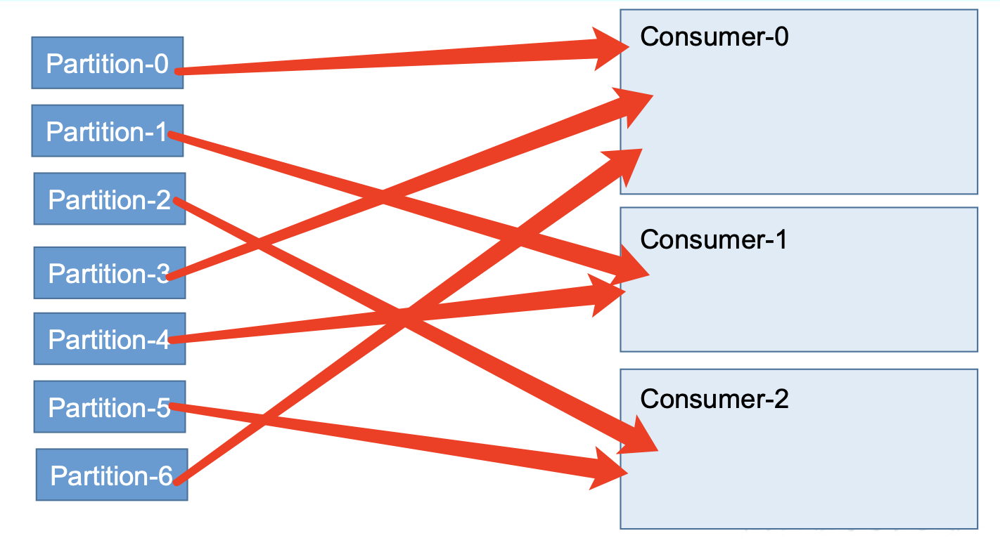
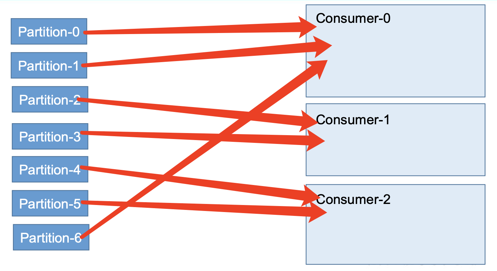

# Kafka 消费者

## 消费模式

消费者采用pull方式消费数据，指的是消费者主动去kafka partition 中拉取数据。

pull 模式不足之处是，如果 kafka 没有数据，消费者可能会陷入循环中，一直返回空数 据。针对这一点，Kafka 的消费者在消费数据时会传入一个时长参数 timeout，如果当前没有 数据可供消费，consumer 会等待一段时间之后再返回，这段时长即为 timeout。

## 分区分配策略

### RoundRobin 轮训策略

同一个消费者，消费一个Topic，一个topic分为7个分区，那么进行分区 轮训分给每个消费者。

**备注**：

轮训策略，会将订阅的topic当做一个整体，每个topic 的 partition 都会进行轮训分配，**适用于消费者组中每个消费者订阅相同的topic**。

所有消费者中，**最多出现 比其他消费者多一个partition的情况**。

### Range 随机策略（默认策略）

随机策略，将所有分区 partition个数，除以消费者个数，来进行分配分区给消费者。

**备注：**

随机策略，会将每个topic当做一个整体进行分配。**（如果一个消费者组，消费者同时订阅了多个topic，那么每个topic都会进行随机分配，导致分配不均匀）**

## 重新分配

当消费者组中的消费者（Consumer）个数发生变化时，增加 或者 减少后，都会触发partition的重新分配，保证分区的均匀分配。

**备注：**

一个partition只能被一个consumer消费，如果出现consumer 多于 partition的情况，那么会出现某些consumer 没有partition消费的情况。