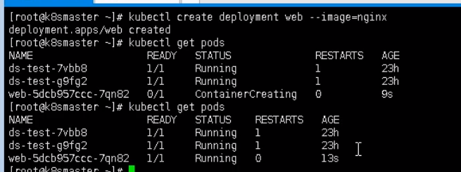
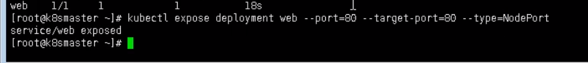

# Ingress

1、把端口对外暴露，通过ip+端口进行访问

使用Service里面的NodePort实现


2、NodePort缺陷

在每个节点都会起到端口，再访问时通过任何一个节点，通过ip+端口实现访问

意味着每个端口只能使用一次，一个端口对应一个应用

实际访问中实际是使用域名访问，根据不同域名跳转到不同端口服务中


3、Ingress 和Pod关系

- pod和ingress通过service关联
- ingress 作为统一入口，由service关联一组pod


4、ingress工作流程

 

ingress关联多个域名

访问不同的域名ingress会去找不同service，由service去找相关的pod

一般一个service关联一组功能相同（或者一个项目？一个功能的？）的一组pod


5、使用Ingress

- 部署ingress controller
- 创建ingress规则


6、使用ingress对外暴露应用

- 创建nginx  对外暴露端口使用NodePort

```
kubectl create deployment web --image=nginx
```



```
// 暴露端口
kubecel expose deployment web --port --target-port=80 --type=NodePort
```



```
// 查看服务
kubectl get svc
```


- 部署Ingress Controller

使用ingress-controller.yaml(需要自己找)

```yaml

```


