# Helm

## Heml 引入

### 部署应用的基本过程

1、编写yaml文件 使用deployment

```
kubectl create deployment nginx --image=nginx -o yaml
```

2、对外暴露端口，创建Service

```
kubectl expose deployment nginx --port 80 --target-port=80 --type=NodePort
kubectl get pods
kubectl get srv
```

3、使用Ingress统一对外暴露端口访问


如果只有单个应用，那么这样比较合适

 但是如果部署微服务，可能有几十个服务，那么一个服务有一套yaml文件，非常复杂


## Helm解决什么问题

1、使用Helm可以把大量yaml文件作为一个整体管理

2、实现yaml高效复用

3、使用Heml可以实现应用级别的版本管理


## Helm 介绍

Helm 是一个kubernetes 的包管理工具，就像Liunx下的包管理器，如yum apt 等，可以很方便的将打包好的yaml文件部署到kubernetes上。


### helm

命令行客户端工具

### Chart

把yaml打包，yaml集合

### Release

基于Chart部署实体，应用级别的版本管理


### Helm安装和配置

### 下载

helm 官网  helm.sh


下载liunx下的安装包，拷贝到liunx服务器，进行解压，然后复制或移动到/usr/bin 目录下即可

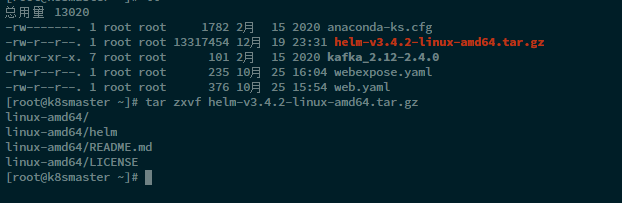

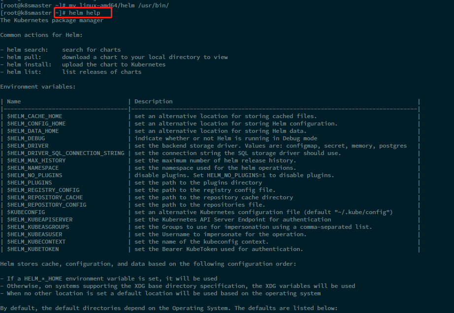

### 添加仓库

可以添加微软和阿里的仓库

```
//添加仓库
helm repo add name 地址
// 查看仓库源
helm repo list
// 更新仓库
helm repo update
```

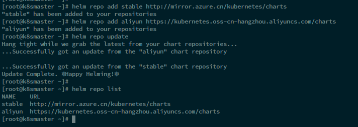


## Helm 基本使用

### 基本命令

使用命令搜索应用

```
helm search repo 名称
```

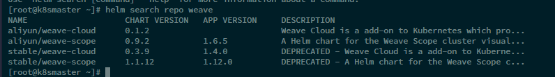

根据搜索到的内容选择进行安装

```
helm install 安装之后的名称 搜索的应用名称
```


查看安装之后的状态

```
helm list
helm status 名称
```

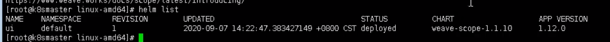

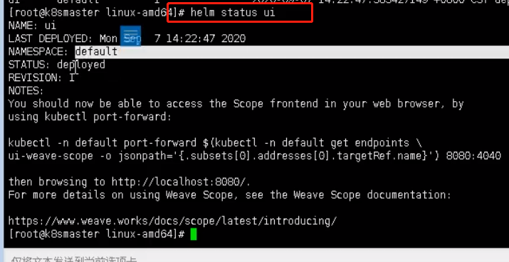

**发现使用helm创建的service 没有向外暴露服务端口**

修改service配置

```
kubectl edit svc name
```

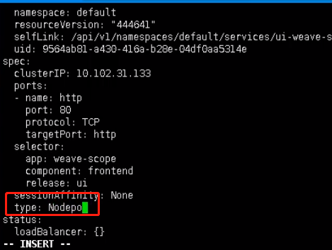


## 自定义Chart部署

1、使用命令创建chart

```h
// 创建chart 创建一个模板
helm create name
```

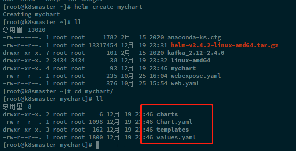

- charts 
- Chart.yaml ：当前chart属性的配置信息等
- templates ： 编写的yaml文件放在这个目录中
- values.yaml ： 定义yaml文件中可以使用的全局变量

2、在templates文件夹中 创建两个yaml文件

- deployment.yaml

  ```
  kubectl create deployment web1 --image=nginx --dry-run -o yaml > deployment.yaml
  ```

  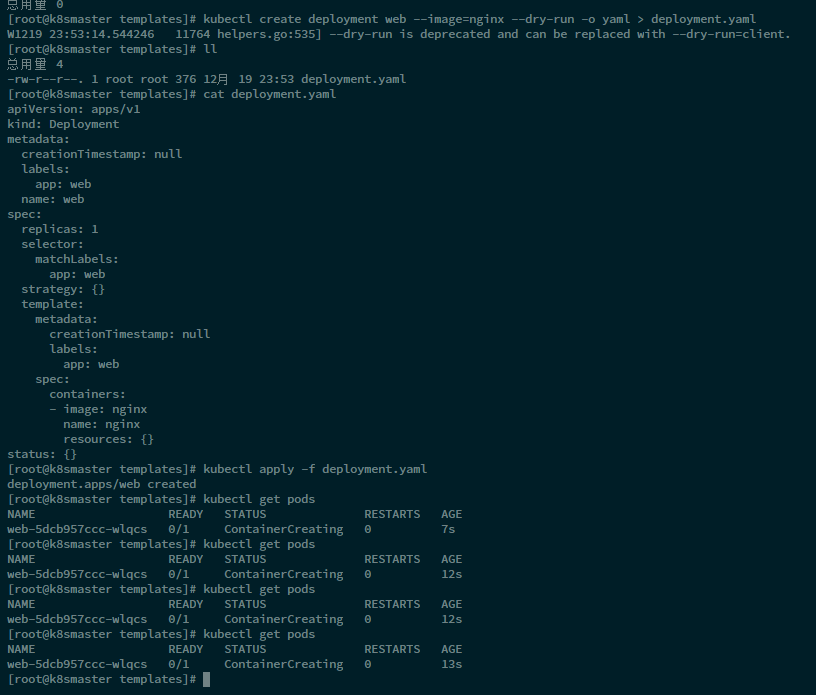

- service.yaml

  ```
  kubectl expose deployment web1 --port=80 --target-port=80 --type=NodePort --dry-run -o yaml > service.yaml
  ```

  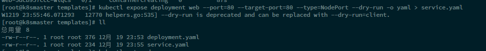
  
  如果没有创建Pod那么执行这句会报错，需要先执行
  
  ```
  kubectl apply -f deployment.yaml 
  ```
  
  创建Pod 才能暴露端口，之后再删除Pod

3、安装mychart

回到根目录

```
// 安装自定义chart
helm install web1 mychart/
```

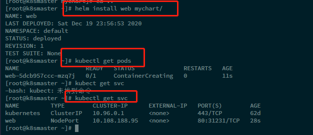

4、应用的升级

```
helm upgrade chartname chart目录/
```

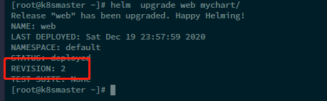


## Chart模板使用

实现yaml文件高效复用

通过动态参数传递，动态渲染模板


通过chart中的values.yaml文件，定义全局变量

一般通过替换yaml文件中不同的地方（大部分地方都是相同的）

不同地方主要包括 image、tag、label、port、replicas

**1、在value.yaml 设置变量**

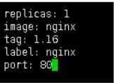

**2、在具体yaml文件中使用动态变量**

通过一种表达式进行使用

```
{{ .Values.变量名称}}
{{ .Release.Name}}
```

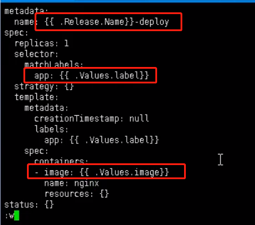