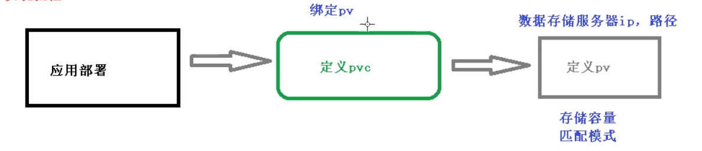
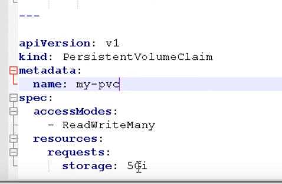

# 持久化存储


## nfs 网络存储

1、找一台服务器安装nfs服务端

```
yum install -y nfs-utils
```


2、设置挂载路径


3、挂载路径需要手动创建出来

```
mkdir data
cd data
mkdir nfs
```

4、在k8s集群上的WorkNode中安装nfs

```
yum install -y nfs-utils
```

5、在nfs服务器启动nfs服务

```
systemctl start nfs
```

6、k8s部署应用使用nfs服务

创建yaml文件


进入pods

```
kubectl exec -it name bash
```

进入到挂载目录（这个时候是没有文件的）

``` 
cd /usr/share/nginx/html
```

**在nfs服务器对外挂载的文件夹下新增一个文件，然后就会自动挂载到pods的相应目录中**


## PV PVC

### PV

持久化存储，对存储资源进行抽象，对外提供可以调用的地方


### PVC

用于调用，不关心内部实现细节


### 实现流程



创建pvc.yaml





创建pv.yaml

用于定义存储服务器的地址等信息


查看pv pvc

```
kubectl get pv,pvc
```


