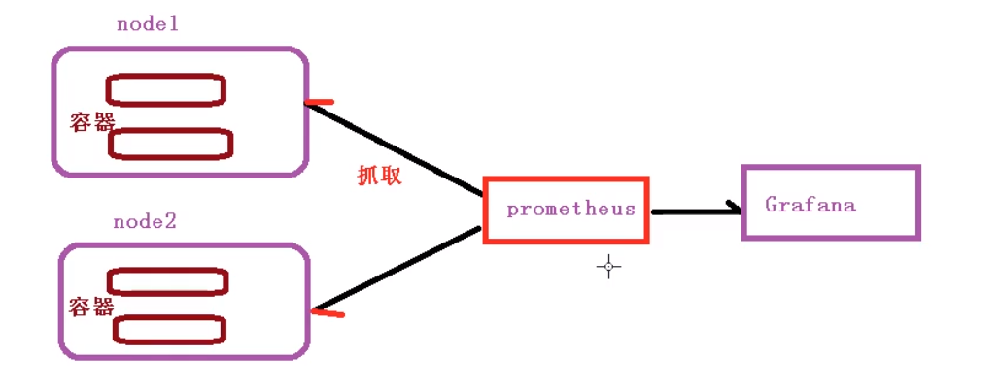

# 集群资源监控

## 监控指标

- 集群监控
  - 节点资源利用率
  - 节点数
  - 运行pod
- Pod疾控
  - 容器指标
  - 应用程序

## 监控平台

### prometheus + Grafana

#### prometheus

一套开源的软件

可以做到监控、报警、数据库

用Http协议实现的，周期性的抓取被监控组件状态

不需要复杂的集成过程，使用http接口接入就可以了

#### Grafana

开源的数据分析和可视化工具

支持多种数据源

### 工作流程

## 搭建监控平台

