# 部署Javay应用

## 打包Java应用

随便找了一个SpringBoot项目进行打包

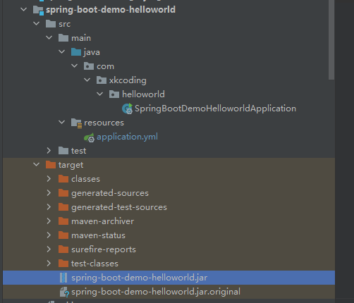


## 编写Dockerfile

以Jdk8 为基础镜像

挂载到tmp目录下

将jar包拷贝到基础镜像中

执行 java-jar命令

```
FROM openjdk:8-jdk-alpine
VOLUME /tmp
ADD spring-boot-demo-helloworld.jar spring-demo.jar 
ENTRYPOINT ["java","-jar","/spring-demo.jar", "&"]
```

## 构建镜像

```
docker build -t spring-demo:lastest .
```

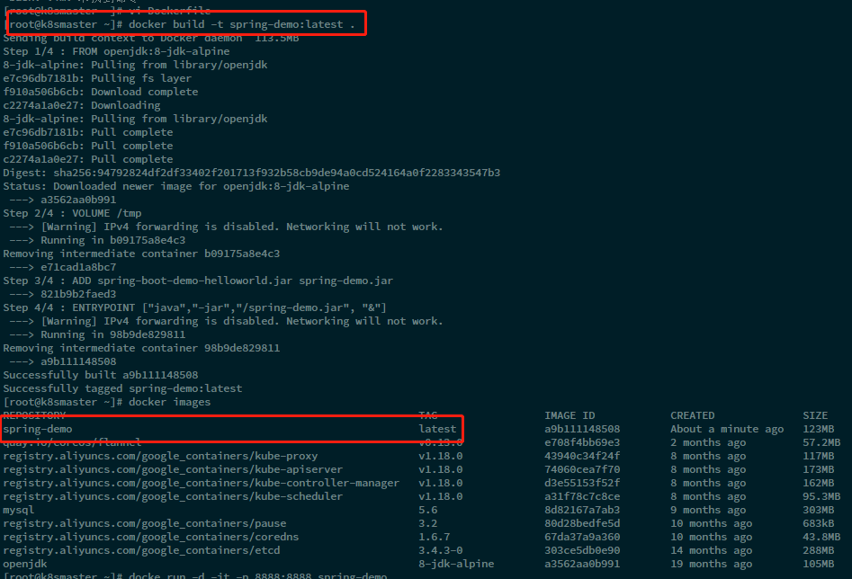

启动镜像查看是否能够访问

```
docker run -d -t -p 8888:8888 spring-demo 
```

查看容器启动日志

```
// -f 滚动查看
docker logs 容器id  -f
```

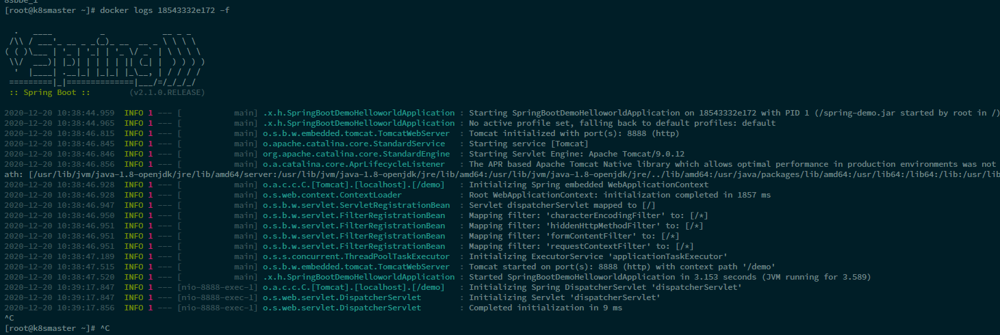


## 推送镜像

使用阿里云的容器镜像服务

首先创建命名空间，然后创建对应的镜像即可，跟随下面的指令进行登录、tag、推送即可

```shell
$ sudo docker login --username=ahhhnnn registry.cn-qingdao.aliyuncs.com
$ sudo docker tag [ImageId] registry.cn-qingdao.aliyuncs.com/hhnn/springboot-helloworld:[镜像版本号]
$ sudo docker push registry.cn-qingdao.aliyuncs.com/hhnn/springboot-helloworld:[镜像版本号]
```

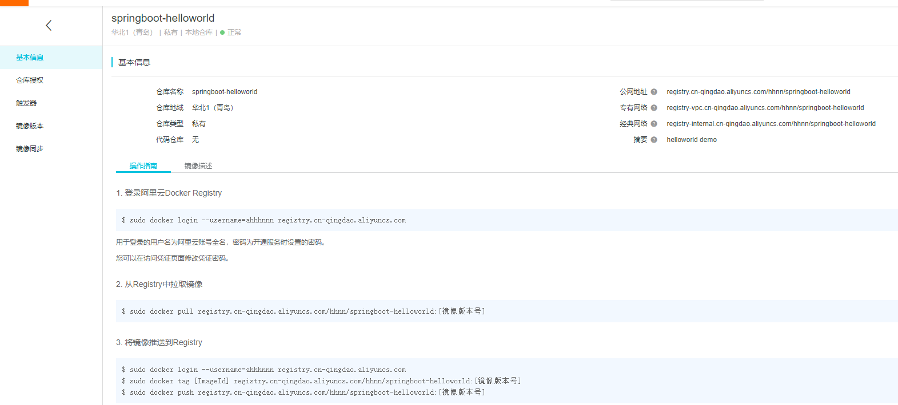

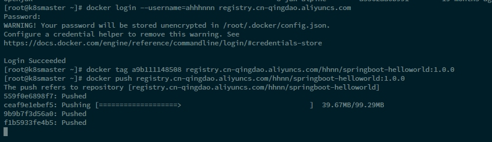


## 部署java应用

创建yaml

```
kubectl create deployment spring-helloworld --image=registry.cn-qingdao.aliyuncs.com/hhnn/springboot-helloworld:1.0.0 --dry-run -o yaml > spring-helloworld.yaml
```


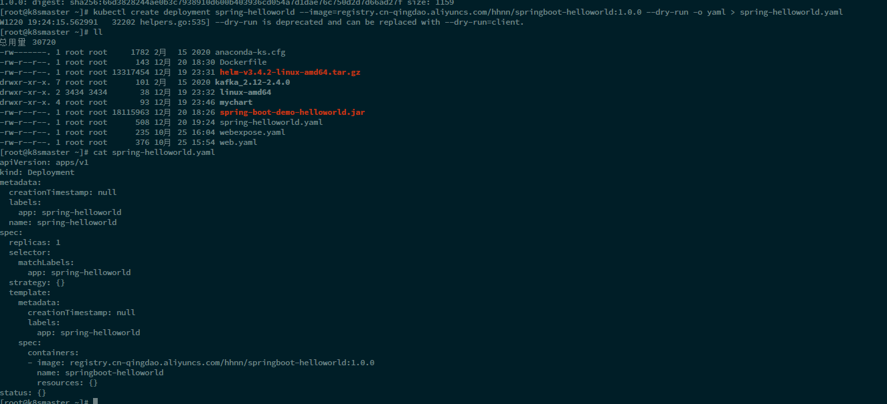

运行yaml 

```
kubectl apply -f spring-helloworld.yaml
```

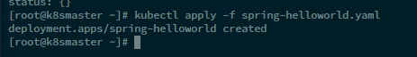

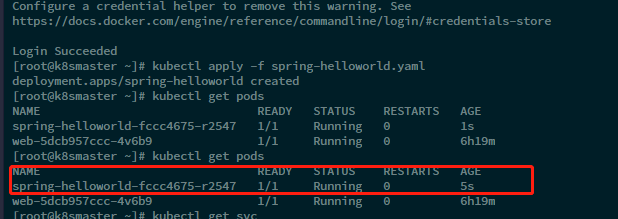

**备注**

如果报错，可能是没有登录阿里云容器镜像服务，记得进行login

```
docker login --username=ahhhnnn registry.cn-qingdao.aliyuncs.com
```

### 暴露端口

```
kubectl expose deployment spring-helloworld --port=8888 --target-port=8888 --type=NodePort
```


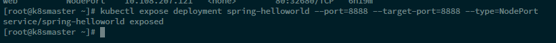

在workNode1 节点的ip上进行访问

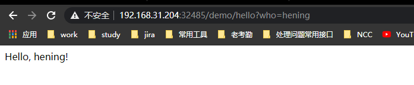

在主节点的ip上进行访问

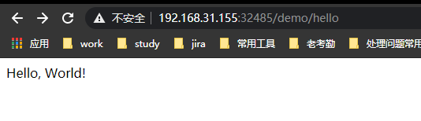

### 扩展服务实例

```
kubectl scale deployment spring-hellworld --replicas=3
```

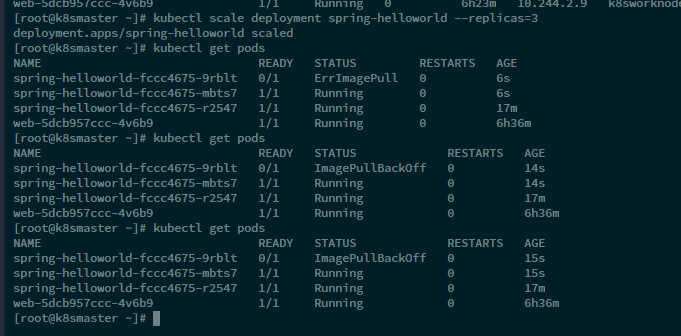

