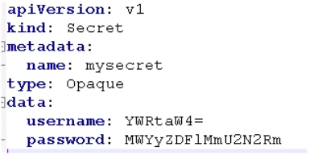
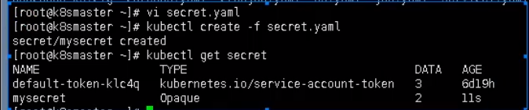
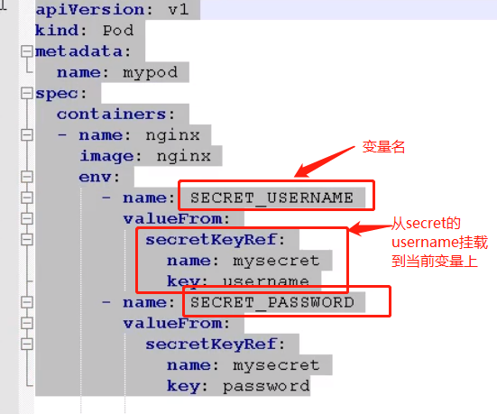
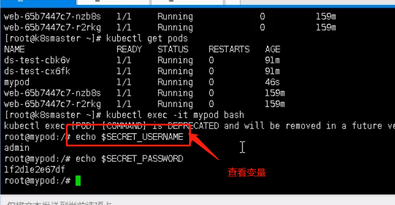
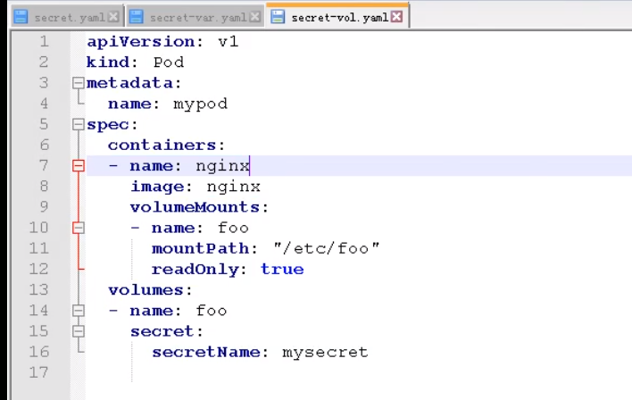
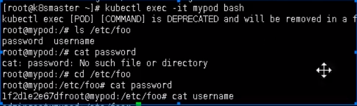

# Kubenetes Secret.

## Secret

作用：加密数据放到etcd中，Pod通过Volume数据卷挂载进行访问


## 创建Secret

yaml文件



username & password都为加密后的数据




## 变量形式挂载



进入容器查看挂载的变量名

```shell
kubectl exec -it mypod bash
```




## Volume数据卷挂载




使用该yaml启动pod

```
kubectl apply -f secret-vol.yaml
```


查看pods

```
kubectl get pods
```

进入pod

```
kubectl exec -it mypod bash
```

查看挂载的数据卷

