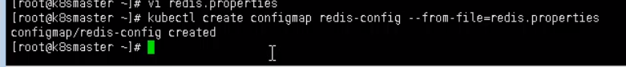
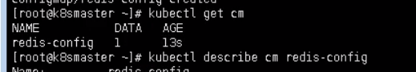
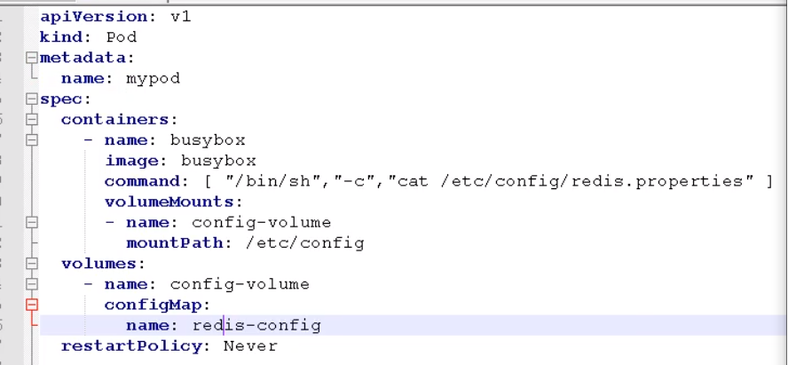
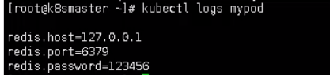
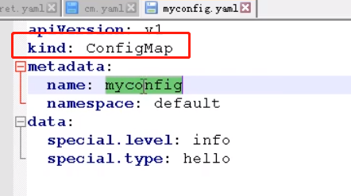
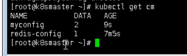
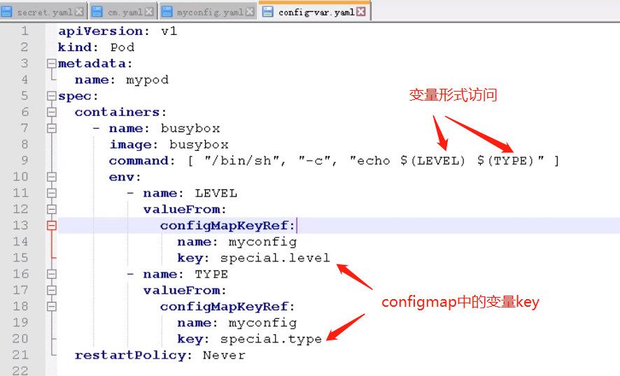
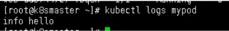

# 配置管理- ConfigMap

同Secret差不多，但是存储的是不加密数据

作用：

存储不加密数据到etcd中，让Pod以变量或者挂载到容器中进行访问


## 创建ConfigMap

### 创建配置文件

创建 redis.properties 文件

redis.host = 

redis.username=

redis.password=


### 创建ConfigMap

```shell
kubectl create configmap redis-config --from file=redis.properties
```




查看configmap

```shell
kubectl get cm
// 查看详细信息
kubectl describe cm redis-config
```




## Volume 挂载容器



创建一个pod 名为mypod

将创建的configmap挂载到  /etc/config文件夹下

查看pod创建后的日志

```shell
kubectl logs mypod
```



## 变量形式进行挂载

### 创建yaml文件，声明变量信息

创建myconfig.yaml



创建configmap

```shell
kubectl apply -f myconfig.yaml
```

查看cm

```shell
kubectl get cm
```




### 变量挂载

创建pod，挂载刚才创建的configmap

config-var.yaml



