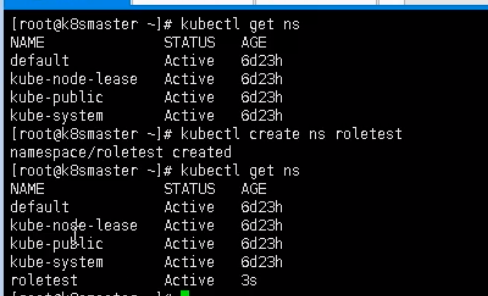

# k8s集群安全机制

## 概述

访问k8s集群时，需要经过三个步骤完整具体操作

- 认证 
  - 传输安全 对外不暴露8080端口，只能内部访问，对外使用6443
  - 客户端身份认证常用方式：https证书认证，基于ca证书、http token认证、http基本认证，用户名+密码
- 鉴权 
  - 基于RBAC方式，进行鉴权。基于角色的访问控制。
- 准入控制 
  - 就是准入控制器的列表，如果列表中有请求内容则通过，如果没有就拒绝

进行访问的时候，过程中需要经过apiserver

apiserver 做统一协调，比如门卫。

访问过程中需要证书、token、或者用户名和密码

如果访问Pod，需要serviceAccount


## RBAC方式

基于角色的访问控制


用户绑定角色，角色绑定资源的操作。

如果用户有某个角色，就有了对某个资源的对应的权限


### 角色

role ：特定的命名空间访问权限

```
//查看所有命名空间
kubectl get ns
// 创建命名空间
kubectl create ns roletest
```



ClusterRole : 所有命名空间的访问权限

### 角色绑定

roleBinding：将角色绑定到主体上

ClusterRoleBinding：集群的角色绑定到主体上

### 主体

user：用户

group：用户组

serviceAccount：服务账号，用户pod访问


