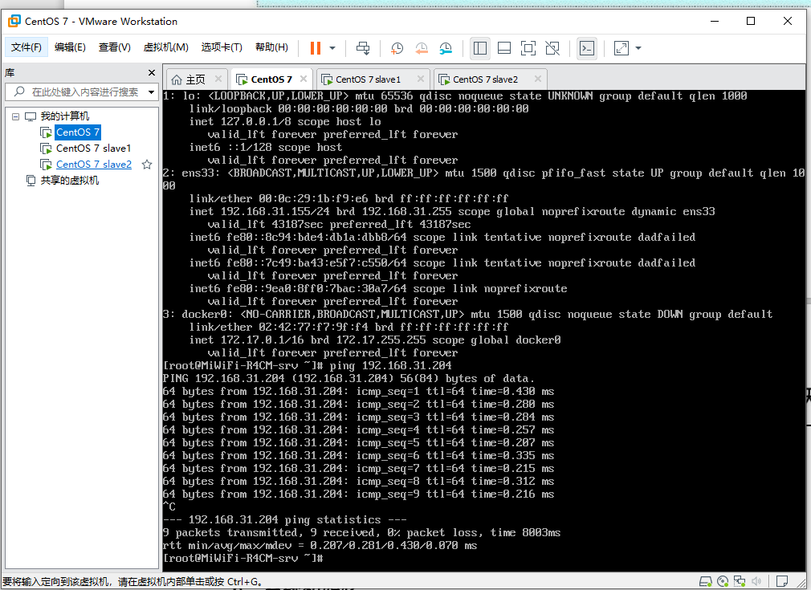
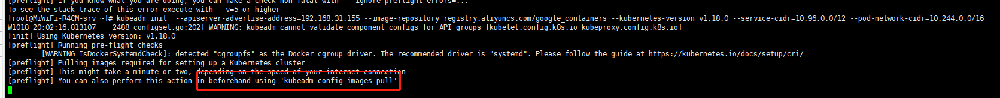
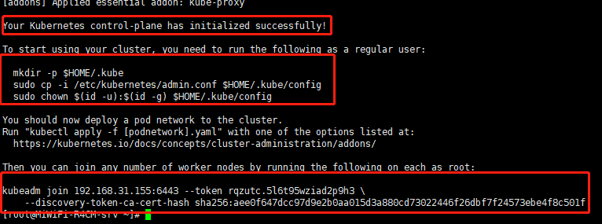
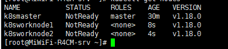
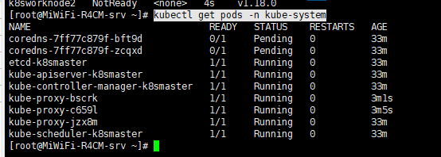
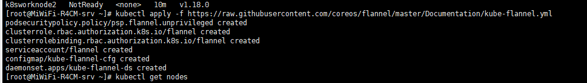
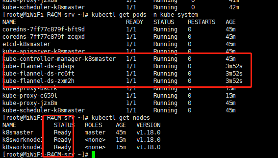
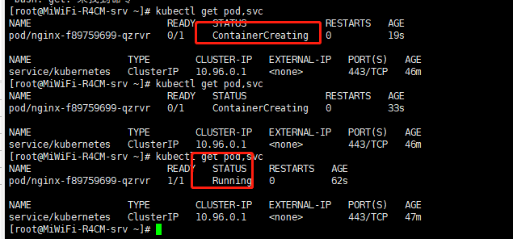
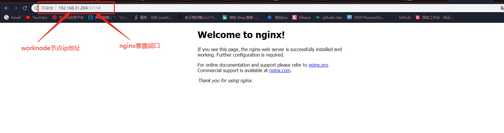

# 搭建Kubernetes环境

## 环境准备

准备一个或多台机器

安装Centos

集群中所有机器之间网络互通

可以访问外网，拉取镜像




## 系统初始化

```shell
# 关闭防火墙
$ systemctl stop firewalld 
$ systemctl disable firewalld

# 关闭 selinux
$ sed -i 's/enforcing/disabled/' /etc/selinux/config # 永久 
$ setenforce 0 # 临时

#关闭 swap
$ swapoff -a # 临时 
$ vim /etc/fstab # 永久

# 修改主机名
$ hostnamectl set-hostname <hostname>

#在 master 添加 hosts：
cat >> /etc/hosts << EOF 
192.168.31.155 k8smaster 
192.168.31.204 k8sworknode1 
192.168.31.226 k8sworknode2 
EOF

#将桥接的 IPv4 流量传递到 iptables 的链
cat > /etc/sysctl.d/k8s.conf << EOF 
net.bridge.bridge-nf-call-ip6tables = 1
net.bridge.bridge-nf-call-iptables = 1 
EOF
sysctl --system

# 时间同步
$ yum install ntpdate -y 
$ ntpdate time.windows.com
```


## Dokker kubelet kubeadm kubectl安装


```shell

# 添加yum源
cat > /etc/yum.repos.d/kubernetes.repo << EOF 
[kubernetes] 
name=Kubernetes
baseurl=https://mirrors.aliyun.com/kubernetes/yum/repos/kubernetes-el7-x86_64 
enabled=1 
gpgcheck=0 
repo_gpgcheck=0 
gpgkey=https://mirrors.aliyun.com/kubernetes/yum/doc/yum-key.gpg https://mirrors.aliyun.com/kubernetes/yum/doc/rpm-package-key.gpg 
EOF

# 安装 kubeadm，kubelet 和 kubectl
$ yum install -y kubelet-1.18.0 kubeadm-1.18.0 kubectl-1.18.0
$ systemctl enable kubelet
```


## **部署** **Kubernetes Master**

在Master节点执行

注意Master节点至少要2核CPU

```shell
$ kubeadm init  --apiserver-advertise-address=192.168.31.155 --image-repository registry.aliyuncs.com/google_containers --kubernetes-version v1.18.0 --service-cidr=10.96.0.0/12 --pod-network-cidr=10.244.0.0/16
```



## 加入Kubernetes  WorkNode

**执行提示的脚本**

显示下图表示安装成功



```shell

mkdir -p $HOME/.kube
  sudo cp -i /etc/kubernetes/admin.conf $HOME/.kube/config
  sudo chown $(id -u):$(id -g) $HOME/.kube/config
# 查看节点信息
kubectl get nodes
# 在worknode节点执行，加入到master kebunetes 集群中
kubeadm join 192.168.31.155:6443 --token rqzutc.5l6t95wziad2p9h3 \
    --discovery-token-ca-cert-hash sha256:aee0f647dcc97d9e2b0aa015d3a880cd73022446f26dbf7f24573ebe4f8c501f

```



查看pods节点运行状态

```shell
kubectl get pods -n kube-system
```



 **安装** **Pod** **网络插件（****CNI****）

```sehll
kubectl apply -f https://raw.githubusercontent.com/coreos/flannel/master/Documentation/kube-flannel.yml
```





master以及worknode节点都进入ready状态

## 测试Kebunetes 集群

在 Kubernetes 集群中创建一个 pod，验证是否正常运行

```shell
# 创建一个nginx pod
$ kubectl create deployment nginx --image=nginx 
# 暴露nginx端口
$ kubectl expose deployment nginx --port=80 --type=NodePort 
# 查看pod状态
$ kubectl get pod,svc
```




测试 访问地址：http://NodeIP:Port



## 删除Pod

```shell
kubectl delete deployment nginx
```

# 总结

