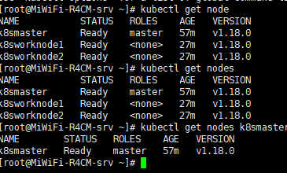
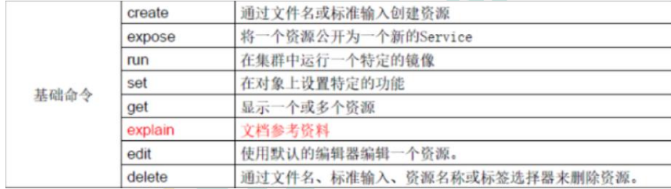
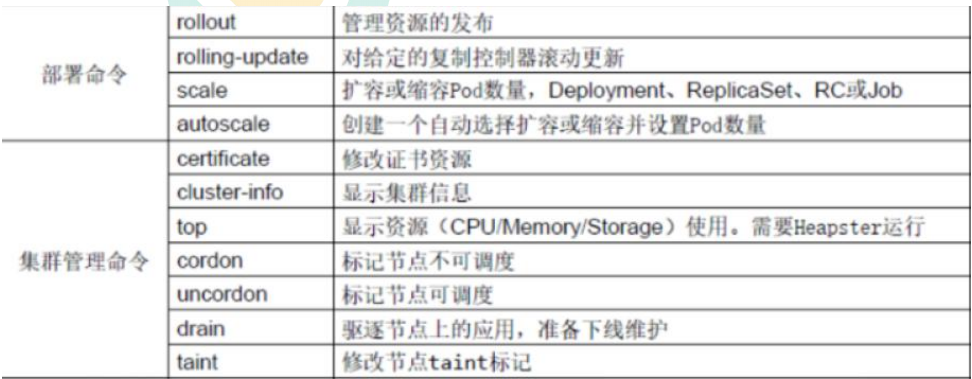
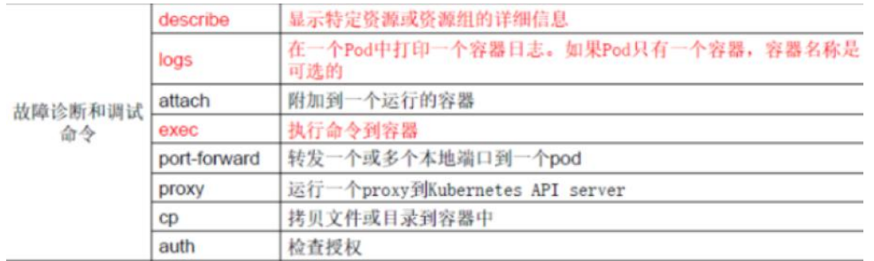
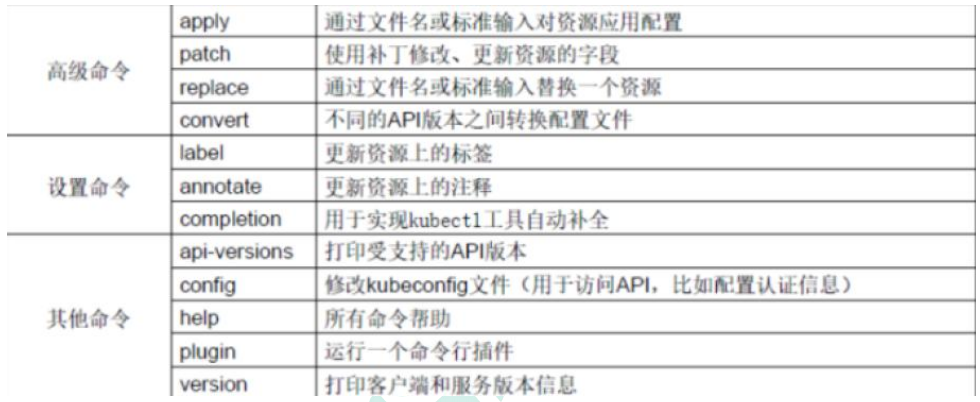
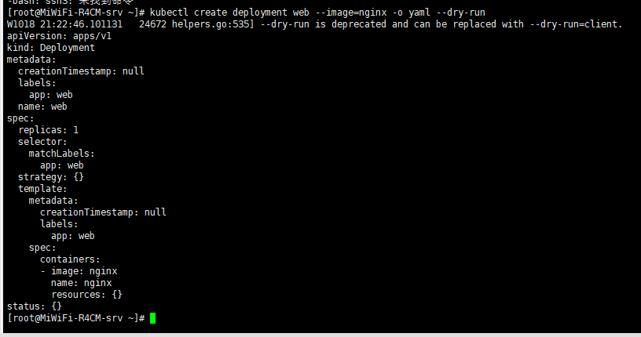
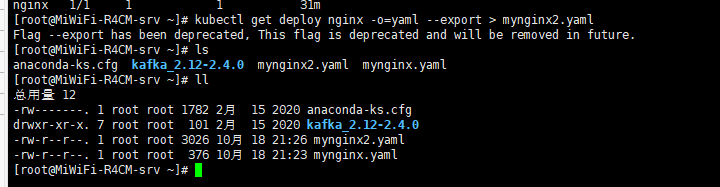

# Kubenetes 命令行工具及资源编排

## Kubenetes集群命令行工具 kubectl

kubectl语法


（1）comand：指定要对资源执行的操作，例如 create、get、describe 和 delete 

（2）TYPE：指定资源类型，资源类型是大小写敏感的，开发者能够以单数、复数和缩略的 

形式

（3）**NAME**：指定资源的名称，名称也大小写敏感的。如果省略名称，则会显示所有的资源

**（4）flags**：指定可选的参数。例如，可用-s 或者–server 参数指定 Kubernetes API 

server 的地址和端口

```shell
kubectl get node
kubectl get nodes
kubectl get nodes k8smaster
```





kubectl --help 获取kubectl命令帮助


## **kubectl 子命令使用分类**

**（1）基础命令**



**（2）部署和集群管理命令** 



**（3）故障和调试命令**



**（4）其他命令**




## 资源编排

kubenetes资源编排使用yaml文件实现资源编排

### 如何快速编写yaml文件

- 使用kubectl create 命令生成

```shell
kubectl create deployment web --image=nginx -o yaml --dry-run
# 生成到 mynginx.yaml 文件中
kubectl create deployment web --image=nginx -o yaml --dry-run > mynginx.yaml
apiVersion: apps/v1
kind: Deployment
metadata:
  creationTimestamp: null
  labels:
    app: web
  name: web
spec:
  replicas: 1
  selector:
    matchLabels:
      app: web
  strategy: {}
  template:
    metadata:
      creationTimestamp: null
      labels:
        app: web
    spec:
      containers:
      - image: nginx
        name: nginx
        resources: {}
status: {}
```




- 使用kubectl get 导出yaml文件

  ```shell
  # 查看创建的资源
  kubectl get deploy
  # 导出yaml文件
  kubectl get deploy nginx -o=yaml --export > mynginx2.yaml
  ```

  

