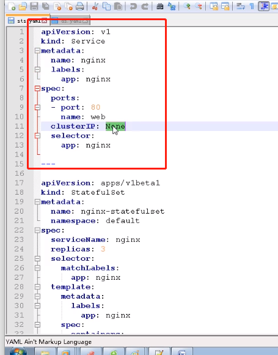
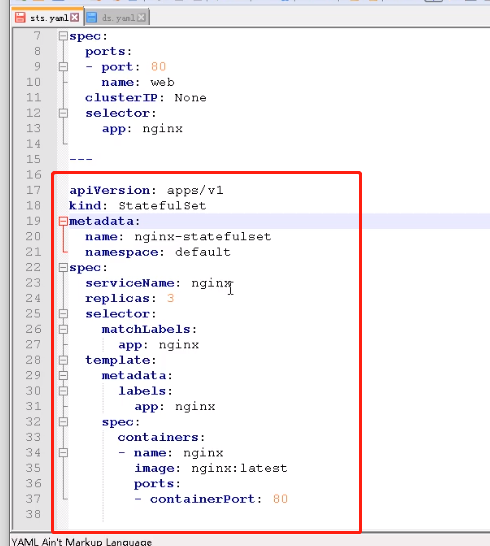
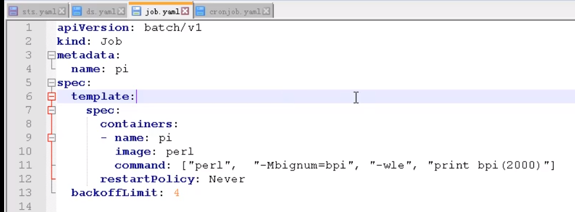
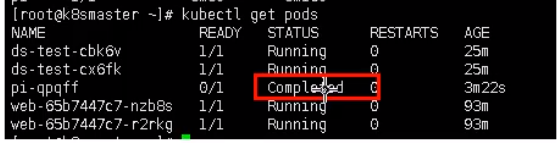
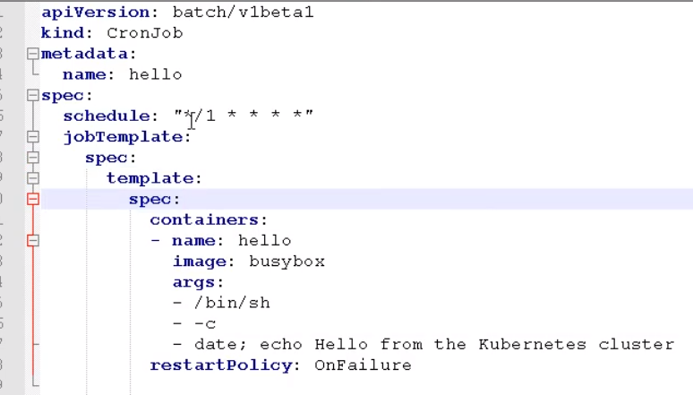

# Kubenetes Contrller

​	

## 什么是Controller

在集群上管理和运行容器的对象


## Pod与Controller的关系

- Pod通过Controller实现应用的运维，比如伸缩，滚动升级

- Pod和Controller通过label标签建立关系

## Deployment应用场景

- 部署无状态应用

- 管理Pod和ReplicaSet（副本数量）

- 部署，滚动升级等功能


## 使用Deployment部署应用

一般通过yaml文件进行部署


## Deployment 应用的升级回滚和弹性升级

应用升级

修改yaml文件的image版本信息

使用deployment进行应用升级

```shell
kubectl set image deployment web nginx=nginx:1.15
```

### 升级过程

- 下载新版本的镜像，旧服务继续进行服务
- 下载完成后，替换原有的旧服务


查看升级状态

```shell
kubectl rollout status deployment web
```


### 回滚

查看历史版本

```shell
kubectl rollout history deployment web
```

还原至上一个版本

```shell
kubectl rollout undo deployment web
```

回滚到指定版本

```shell
kubectl rollout history deployment web --to-reversion=2
```


### 弹性伸缩

创建10个副本

```shell
kubectl scale deployment web --replicas=10
```


## 部署有状态应用

**Delployment部署的都是无状态应用**

无状态

- 认为Pod都一样
- 没有顺序要求
- 不用考虑在哪个node运行
- 随意继续伸缩和扩展

有状态

- 每个pod都是独立的
- 唯一的网络标识符，持久存储
- 有序比如主从部署


使用SatefulSet部署有状态应用

创建一个无头应用（clusterIP ： None）






**有状态的应用会根据主机名和一定规则生成一个唯一的域名用于区分**

格式：主机名称.service名称.名称空间.svc.cluster.local


## 部署守护进程 DaemonSet

yaml文件 

kind ： DaemonSet

## 部署Job 一次性任务

yaml文件

kind：Job



一次性任务启动pod后只会执行一次，然后就会关闭，状态会变为completed 而不是running




## cronjob部署定时任务

kind：CronJob

