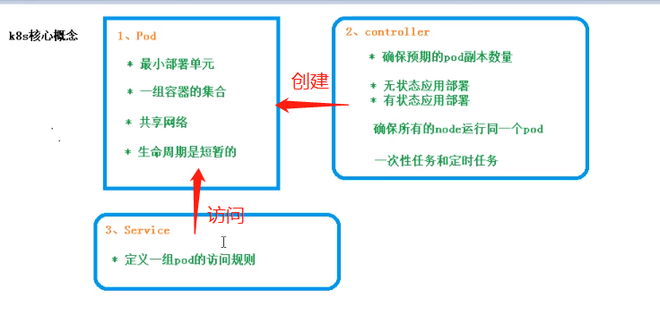
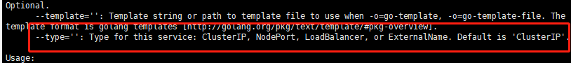
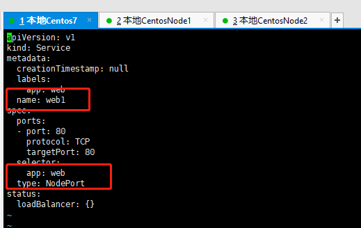
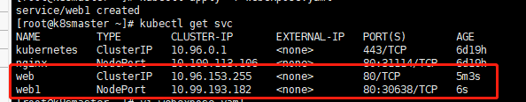

# Kubenetes Service



Service 是 Kubernetes 最核心概念，通过创建 Service,可以为一组具有相同功能的容器应 

用提供一个统一的入口地 址，并且将请求负载分发到后端的各个容器应用上。

Service yaml文件

```yaml
apiVersion: v1
kind: Service
metadata:
  creationTimestamp: null
  labels:
    app: web
  name: web
spec:
  ports:
  - port: 80
    protocol: TCP
    targetPort: 80
  selector:
    app: web
  type: NodePort
status:
  loadBalancer: {}

```


## Service意义

- 防止Pod失联（当Pod被重新调度时，ip地址会发生变化，不能直接访问Pod，而需要通过访问Service）
- 定义一组Pod访问策略（负载均衡）


## Service类型



1、ClusterIP

集群内部调用


2、NodePort

对外服务访问


3、LoadBalance

对外访问应用使用，公有云


修改Service类型






一般服务部署在内网，获取云服务器上，进行服务访问的时候，不能直接让请求到容器应用上，或者直接到pods中，那么如何访问呢？

- nginx反向代理，在一台外网服务器上部署一个nginx服务器，配置反向代理，转发到我们的k8s集群上，然后再访问具体的容器应用。
- k8s Service 的LoadBalance 通过公有云实现的负载均衡控制器，进行访问 （？？不太懂）


## 删除Service

```shell
kubectl delete svc nginx
```

