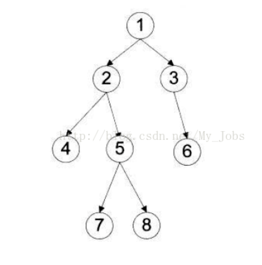

## q94二叉树的中序遍历

题目：

给定一个二叉树，返回它的中序 遍历。

示例:

输入: [1,null,2,3]
   1
    \
     2
    /
   3

输出: [1,3,2]
进阶: 递归算法很简单，你可以通过迭代算法完成吗？


## 二叉树的遍历

前序遍历：根结点 ---> 左子树 ---> 右子树

中序遍历：左子树---> 根结点 ---> 右子树

后序遍历：左子树 ---> 右子树 ---> 根结点

层次遍历：只需按层次遍历即可



前序遍历：1  2  4  5  7  8  3  6 

中序遍历：4  2  7  5  8  1  3  6

后序遍历：4  7  8  5  2  6  3  1

层次遍历：1  2  3  4  5  6  7  8


BFS Breadth First Search 广度优先搜索

常见的BFS 层次遍历，实现方式一般是队列

DFS Depth First Search 深度优先搜索

常见的DFS 是先序遍历、中序遍历、后序遍历；实现方式一般是递归或者栈

数的遍历


BFS 进行层次遍历 结果

A  B C D  E F  G  H I

DFS 结果 根据前序、中序、后序结果不一样

 A B  C E  F  D G H  I


### 解法一(递归)

**官方解析：**https://leetcode-cn.com/problems/binary-tree-inorder-traversal/solution/er-cha-shu-de-zhong-xu-bian-li-by-leetcode/


**关键要点：**

中序遍历是先找到所有左子树的值，所有递归时先获取到TreeNode.left，当没有左子树的时候，再添加根节点的值，然后递归遍历右子树（在右子树中同样要先找左子树）

```java
package com.he.哈希表.q94二叉树的中序遍历;

import com.he.common.TreeNode;

import java.util.ArrayList;
import java.util.List;

/**
 *给定一个二叉树，返回它的中序 遍历。
 * 中序遍历  左子树->根节点->右子树
 *
 * 示例:
 *
 * 输入: [1,null,2,3]
 *    1
 *     \
 *      2
 *     /
 *    3
 *
 * 输出: [1,3,2]
 * 进阶: 递归算法很简单，你可以通过迭代算法完成吗？
 *
 *
 */
public class Solution {

    public static void main(String[] args) {
        //构建二叉树
        TreeNode treeNode1 = new TreeNode(1);
        TreeNode treeNode2 = new TreeNode(2);
        TreeNode treeNode3 = new TreeNode(3);
        treeNode1.setLeft(null);
        treeNode1.setRight(treeNode2);
        treeNode2.setLeft(treeNode3);
        treeNode2.setRight(null);
        treeNode3.setLeft(null);
        treeNode3.setRight(null);
        List<Integer> result = inorderTraversal(treeNode1);
        System.out.println(result);
    }
    private static List<Integer> inorderTraversal(TreeNode root) {
        List<Integer> result = new ArrayList<Integer>();
        helper(root,result);
        return result;
    }

    private static void helper(TreeNode root,List<Integer> list){
        if(root.getLeft() != null){
            helper(root.getLeft(),list);
        }
        //如果没有左子树，说明自己就是叶子节点，将自己的value加进去
        list.add(root.getVal());
        if(root.getRight()!=null){
            helper(root.getRight(),list);
        }
    }

}


```


### 解法二（利用栈）


```java
package com.he.哈希表.q94二叉树的中序遍历;


import com.he.common.TreeNode;

import java.util.ArrayList;
import java.util.List;
import java.util.Stack;

public class Solution2 {

    public static void main(String[] args) {
        //构建二叉树
        TreeNode treeNode1 = new TreeNode(1);
        TreeNode treeNode2 = new TreeNode(2);
        TreeNode treeNode3 = new TreeNode(3);
        TreeNode treeNode4 = new TreeNode(4);
        treeNode1.setLeft(null);
        treeNode1.setRight(treeNode2);
        treeNode2.setLeft(treeNode3);
        treeNode2.setRight(treeNode4);
        //treeNode2.setRight(null);
        treeNode3.setLeft(null);
        treeNode3.setRight(null);
        List<Integer> result = inorderTraversal(treeNode1);
        System.out.println(result);
    }

    /*
    采用栈的方式中序遍历
     */
    private static List< Integer > inorderTraversal(TreeNode root) {
        List<Integer> result = new ArrayList<Integer>();
        Stack<TreeNode> treeNodeStack = new Stack<TreeNode>();
        TreeNode current = root;
        while (current != null || !treeNodeStack.empty()){
            //一直遍历，直到没有左子树
            while (current != null){
                treeNodeStack.push(current);
                current = current.getLeft();
            }
            //没有左子树时，弹出栈中第一个元素，为最左的叶子节点
            current = treeNodeStack.pop();
            result.add(current.getVal());
            //这个时候这个节点已经没有左子树，如果有右子树，继续上面的逻辑，找到这个右子树的所有左子树压入栈中
            current = current.getRight();
        }
        return result;
    }

}
```


### 扩展（前序遍历和后序遍历）

**解析**：https://leetcode-cn.com/problems/binary-tree-inorder-traversal/solution/die-dai-fa-by-jason-2/

```java
 /*
    采用栈的方式前序遍历
     */
    private static List< Integer > beforeInorderTraversal(TreeNode root) {
        List<Integer> result = new ArrayList<Integer>();
        Stack<TreeNode> treeNodeStack = new Stack<TreeNode>();
        TreeNode current = root;
        while (current!=null || !treeNodeStack.empty()){
            while (current!=null){
                result.add(current.getVal());
                treeNodeStack.push(current.getRight());
                current = current.getLeft();
            }
            current = treeNodeStack.pop();
        }
        return result;
    }

    /*
    采用栈的方式后序遍历
    后续遍历可以跟前序相对称，然后取逆序（根-左-右）对称后（根-右-左）逆序后为（左-右-根）
     */
    private static List< Integer > afterInorderTraversal(TreeNode root) {
        List<Integer> result = new ArrayList<Integer>();
        Stack<TreeNode> treeNodeStack = new Stack<TreeNode>();
        TreeNode current = root;
        while (current!=null || !treeNodeStack.empty()){
            while (current!=null){
                result.add(current.getVal());
                treeNodeStack.push(current.getLeft());
                current = current.getRight();
            }
            current = treeNodeStack.pop();
        }
        //逆序返回
        Collections.reverse(result);
        return result;
    }
```


