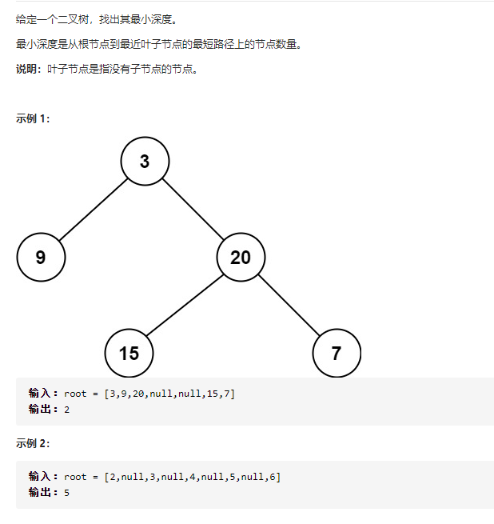

### Q111二叉树最小深度



## 解法一

递归

```java
public class Solution {

    public static void main(String[] args) {
        TreeNode root = new TreeNode(1);
        root.left = new TreeNode(2);
        root.left.left = new TreeNode(3);
        root.right = new TreeNode(4);
        int i = minDepth(root);
        System.out.println(i);
    }
    private static int minDepth(TreeNode root) {
        if(root == null){
            return 0;
        }
        int left = minDepth(root.left);
        int right = minDepth(root.right);
        // 当左边或者右边深度为0时，说明没有左子树或右子树，那么就把其中一边的深度加1返回
        // 如果左右子树都不为空，那么返回最小的深度再加1
        return (left == 0 || right ==0) ? left + right +1 : 1 + Math.min(left,right);
    }

      //Definition for a binary tree node.
      public static class TreeNode {
          int val;
          TreeNode left;
          TreeNode right;
          TreeNode() {}
          TreeNode(int val) { this.val = val; }
          TreeNode(int val, TreeNode left, TreeNode right) {
              this.val = val;
              this.left = left;
              this.right = right;
          }
      }

}
```

