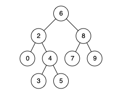

# [235. 二叉搜索树的最近公共祖先](https://leetcode-cn.com/problems/lowest-common-ancestor-of-a-binary-search-tree/)

给定一个二叉搜索树, 找到该树中两个指定节点的最近公共祖先。**（二叉搜索树-根节点大于左子树，小于右子树的一棵树）**

百度百科中最近公共祖先的定义为：“对于有根树 T 的两个结点 p、q，最近公共祖先表示为一个结点 x，满足 x 是 p、q 的祖先且 x 的深度尽可能大（一个节点也可以是它自己的祖先）。”

例如，给定如下二叉搜索树:  root = [6,2,8,0,4,7,9,null,null,3,5]




示例 1:

输入: root = [6,2,8,0,4,7,9,null,null,3,5], p = 2, q = 8
输出: 6 
解释: 节点 2 和节点 8 的最近公共祖先是 6。
示例 2:

输入: root = [6,2,8,0,4,7,9,null,null,3,5], p = 2, q = 4
输出: 2
解释: 节点 2 和节点 4 的最近公共祖先是 2, 因为根据定义最近公共祖先节点可以为节点本身。


## 解法一

利用二叉搜索树的性质

1、如果p，q在root的两侧，那么root一定是最近公共祖先。

2、如果都小于根节点，那么一定在根节点的左子树，将左节点设置为root，继续判断

3、如果都大于根节点，那么一定在根节点的右子树，将右节点设置为root，继续判断

```java
 public static TreeNode lowestCommonAncestor2(TreeNode root, TreeNode p, TreeNode q) {

        TreeNode ancestor = root;
        while (true){
            if(ancestor.val > p.val && ancestor.val > q.val){
                ancestor = ancestor.left;
            }else if(ancestor.val < p.val && ancestor.val < q.val){
                ancestor = ancestor.right;
            }else{
                break;
            }
        }
        return ancestor;
    }
```

