# Vim模式

## 可视模式


v ： 对字符进行操作

V ： 对行进行操作

ctrl + v ： 块模式

**对多行进行同时编辑**

进行块模式后，按下shift+i进行编辑模式，然后输入内容（注意只会在第一行显示），输入完成后点击两次esc即可


# Liunx用户管理及密码管理


```shel
useradd hening
```


查看是否有用户使用

```shell
id + 用户名
```

## 家目录

root用户的家目录在 **/root**下，具有所有的权限

自建用户的家目录在 **/root/用户名**下


**同时在 /etc/passwd中 /etc/shadow也会有用户相关信息**


## 对用户设置密码

```
passwd 用户名
```

hening / 123456

修改自己的密码

```
passwd 直接回车
```


## 删除用户

userdel  直接删除用户 但是保留用户家目录

-r  包括家目录删除 ，彻底删除用户

## 修改用户

usermod 用户名

usermod -d 路径  修改用户的家路径

usermod -g 修改用户所属组

## 更改用户密码过期时间

chage 命令

## 组管理命令

groupadd 新建用户组

groupdel 删除用户组

## 用户切换

su命令 临时切换用户

su - heing

su - root 

Hening1997


sudo ： **赋予其他用户，可以执行管理员的命令**，避免其他用户执行命令时需要输入root的密码，保护系统的安全。

## 查看命令在哪里

which 命令

```
which shutdown
```


## 配置文件介绍

/etc/passwd 文件介绍 

一共有常用的七个字段，意思分别是

**用户名：是否需要密码：用户ID：组ID：注释：家目录：命令解释器**


/etc/shadow 文件   保护用户及密码信息


 /etc/group  用户组配置文件

**组名称：是否需要密码：组id：其他组设置（用户名）**


**postfix属于两个组**


**postfix 属于两个组**


# 文件权限


第一位：类型

后面三位：表示用户（创建文件的用户）有该文件的权限

再后三位：表示用户组有什么权限

再后三位：表示其他用户有什么权限

## 文件类型


## 文件权限表示


## 文件目录的权限表示


## 修改权限命令

**chmod  修改文件、目录权限**

使用方法：chmod u=rwx  /text

参数：u 修改用户权限

​			g 修改组权限

​			o 修改其他用户权限

​			a 给所有设置权限，相当于u+g+o

符号：+ 增加权限

 		  — 删除权限

​			= 赋予权限

**数字表示法**


第一个数字：u权限

第二个数字：g权限

第三个数字 ：o权限

**chown 修改属主，属组**

**chgrp  单独修改属组**


```
修改属主：chown 用户名 文件夹名/文件名
修改属组：chown :组名  文件名/文件夹名
```


# 文本操作篇

### 正则表达式

元字符

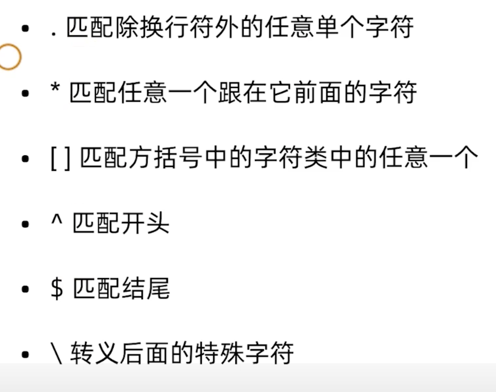

在liunx中通过 **grep** 进行查找

**扩展元字符**

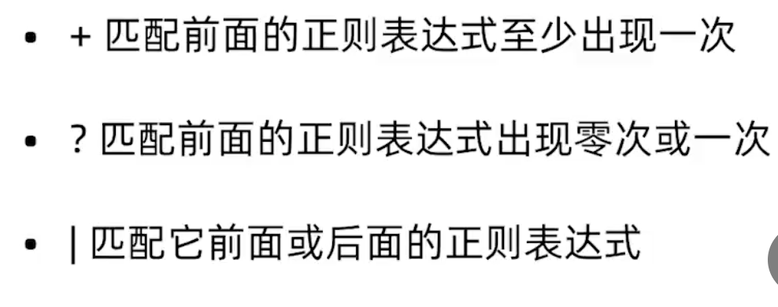


### 文件查找命令find

```shell
find . -regex ".*go"
```


### sed  awk 行编辑器

**sed一般用于对文件内容进行替换**

-e : 接多个替换指令

-i：替换后写到原文件中（默认替换后输出到命令行，文件不变），也可以使用> 输出重定向到新的文件

**在替换old 和new 中，可以使用正则表达式进行匹配**

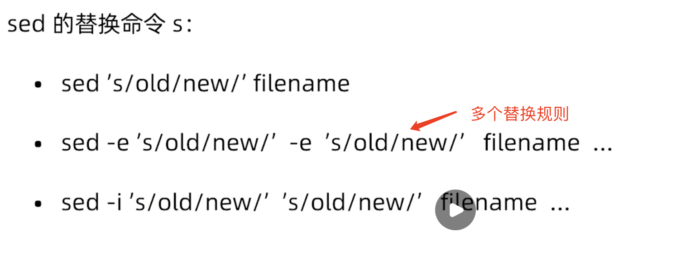

#### sed加强版

**全局替换**

sed 's/old/new/g'

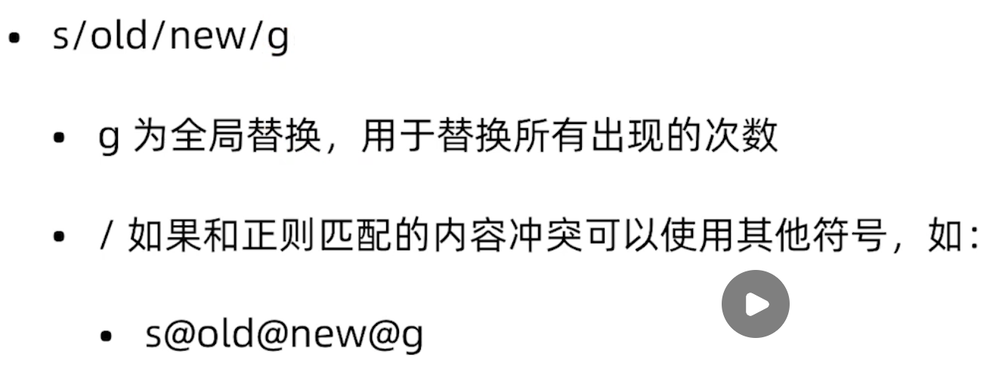

**只替换匹配出现的第二次**

sed 's/old/new/2'

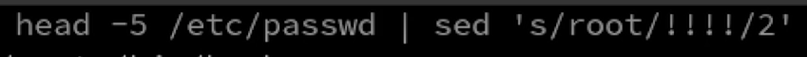

**标志位**


**awk一般用于对文本内容进行统计，按照需要的格式进行输出**

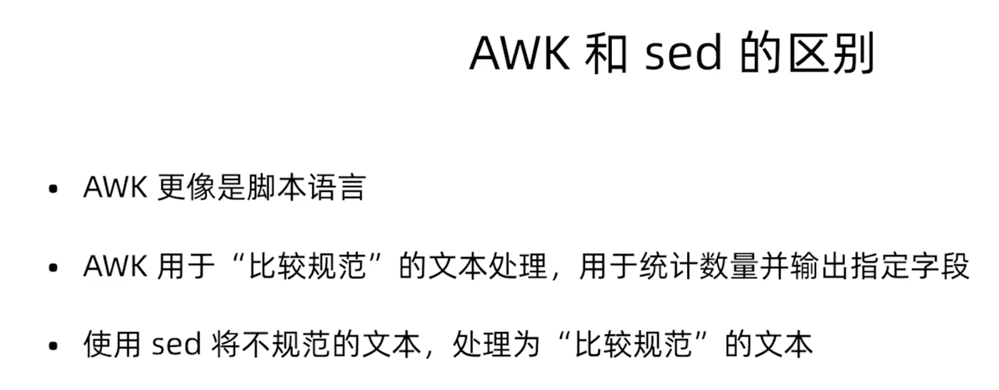

#### awk 字段引用和分离

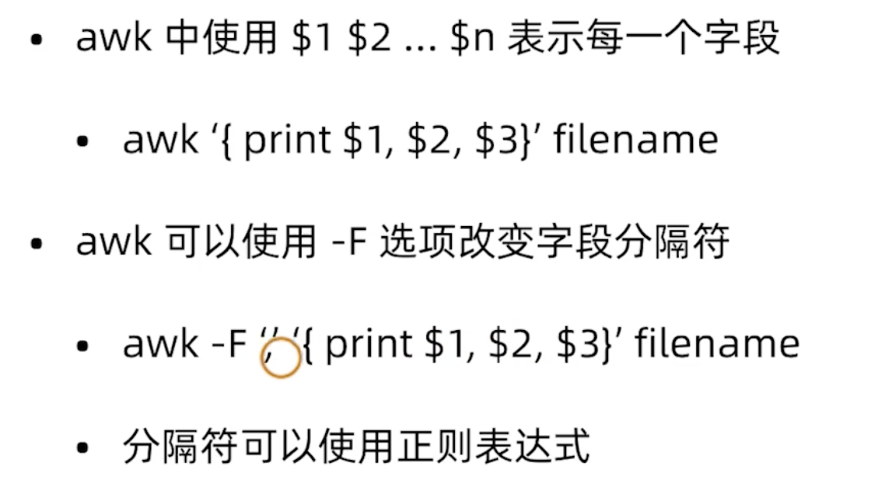

**打印匹配到的一整行数据**

打印menu开头的一整行数据  

$0：表示一整行数据

```shell
awk '/^menu/{ print $0 }'
```

**自定义分隔符**

$2:标识以单引号为分隔符，输出第二个字段

```shell
awk "’" '/^menu/{ print $2}'
```

**显示匹配的行号**

x++ ：自增，并打印出来

```shell
awk "’" '/^menu/{ print x++, $2}'
```

#### awk运算符

系统变量

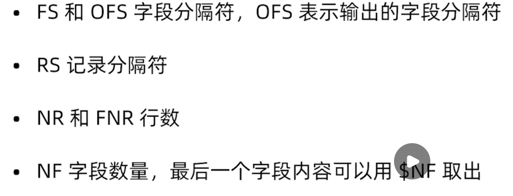

NR 和 FNR 都表示行号，如果是对一个文件操作，那么没有区别。

如果是对多个文件进行操作，那么NFR对每个文件生效，新的文件行号会从1重新开始计数

NF：{print NF} 打印每一行的字段个数

$NF:{print $NF} 打印最后一个字段的内容，而不是个数

### awk关系运算符

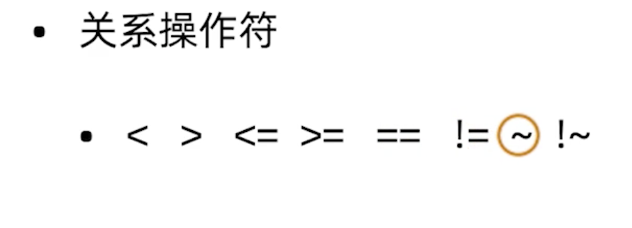

~： 表示匹配，匹配正则表达式


#### awk条件 循环语句

条件语句

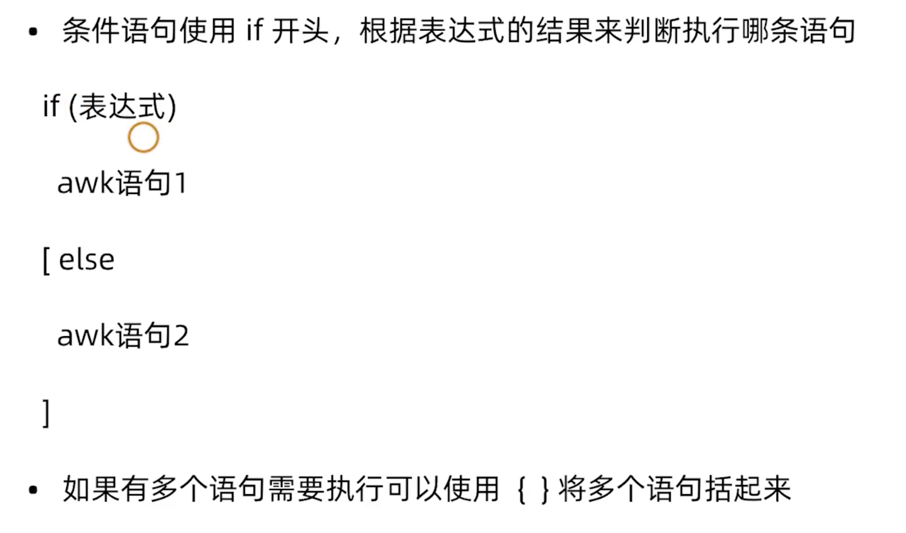

**循环语句**

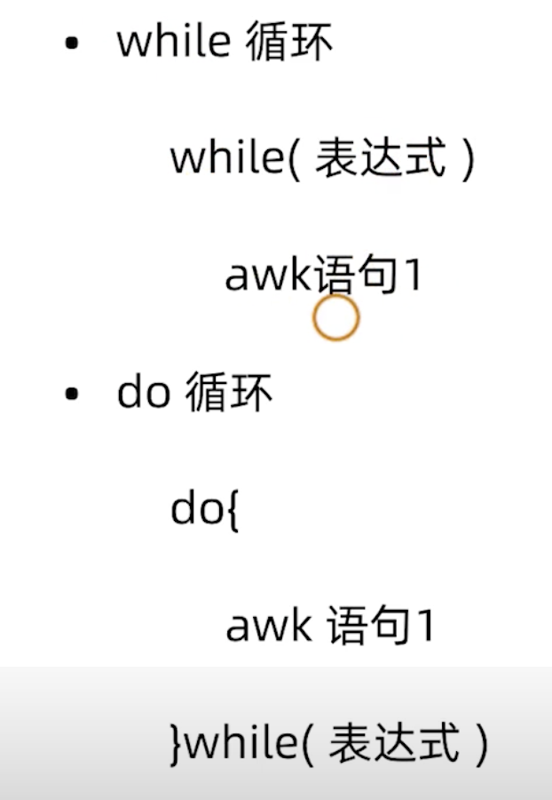

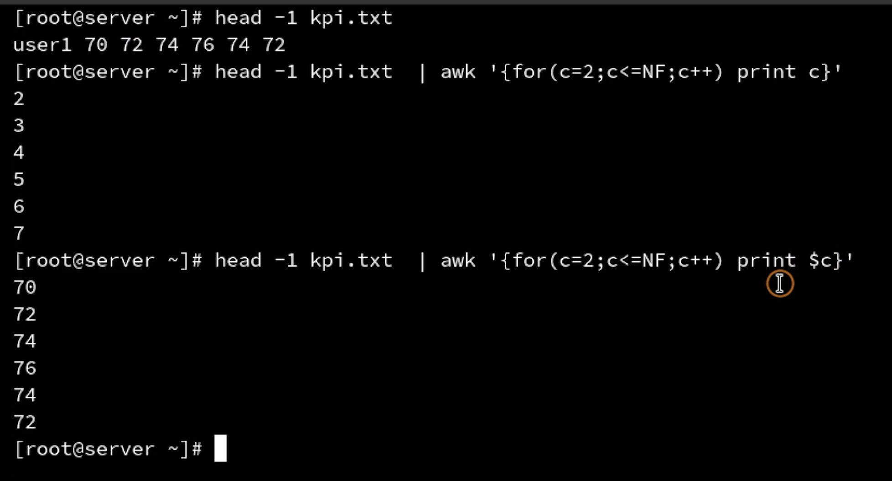

#### awk数组功能

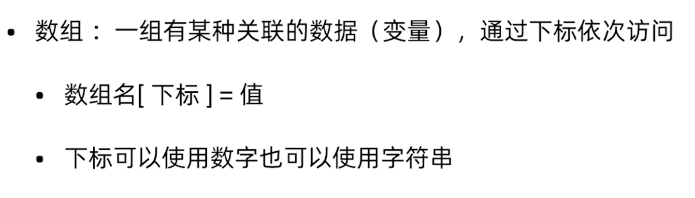

数组遍历

```java
for （变量  in 数组 ）
  数组名[变量]
```

删除数组

delete 数组名

delete 数组名[下标]


#### awk命令写入脚本

awk命令可以保存到.awk 文件中，然后进行加载

```shell
awk -f avg.awk 文件名
```


#### awk 命令行参数数组

- ARGC   使用awk读入.awk文件时，传入的参数个数
- ARGV    使用awk读入.awk文件时，每一个参数的值，是一个数组，使用**ARGV[下标]** 访问

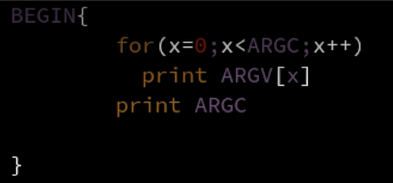

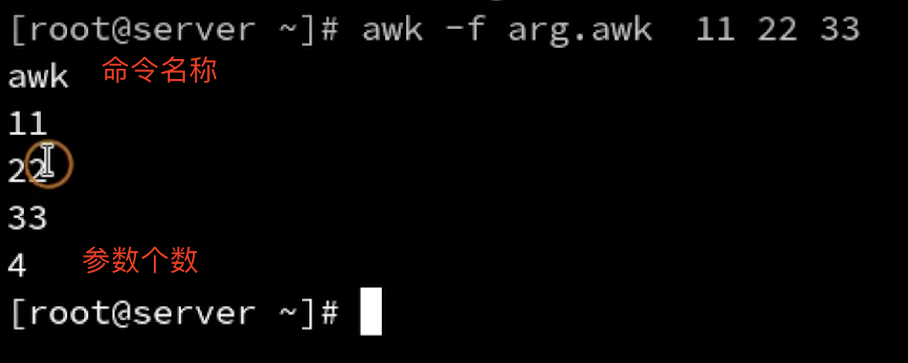


