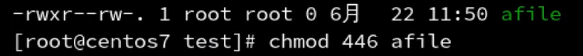

# Vim模式

## 可视模式


v ： 对字符进行操作

V ： 对行进行操作

ctrl + v ： 块模式

**对多行进行同时编辑**

进行块模式后，按下shift+i进行编辑模式，然后输入内容（注意只会在第一行显示），输入完成后点击两次esc即可


# Liunx用户管理及密码管理


```shel
useradd hening
```


查看是否有用户使用

```shell
id + 用户名
```

## 家目录

root用户的家目录在 **/root**下，具有所有的权限

自建用户的家目录在 **/root/用户名**下


**同时在 /etc/passwd中 /etc/shadow也会有用户相关信息**


## 对用户设置密码

```
passwd 用户名
```

hening / 123456

修改自己的密码

```
passwd 直接回车
```


## 删除用户

userdel  直接删除用户 但是保留用户家目录

-r  包括家目录删除 ，彻底删除用户

## 修改用户

usermod 用户名

usermod -d 路径  修改用户的家路径

usermod -g 修改用户所属组

## 更改用户密码过期时间

chage 命令

## 组管理命令

groupadd 新建用户组

groupdel 删除用户组

## 用户切换

su命令 临时切换用户

su - heing

su - root 

Hening1997


sudo ： **赋予其他用户，可以执行管理员的命令**，避免其他用户执行命令时需要输入root的密码，保护系统的安全。

## 查看命令在哪里

which 命令

```
which shutdown
```


## 配置文件介绍

/etc/passwd 文件介绍 

一共有常用的七个字段，意思分别是

**用户名：是否需要密码：用户ID：组ID：注释：家目录：命令解释器**


/etc/shadow 文件   保护用户及密码信息


 /etc/group  用户组配置文件

**组名称：是否需要密码：组id：其他组设置（用户名）**


**postfix属于两个组**


**postfix 属于两个组**


# 文件权限


第一位：类型

后面三位：表示用户（创建文件的用户）有该文件的权限

再后三位：表示用户组有什么权限

再后三位：表示其他用户有什么权限

## 文件类型


## 文件权限表示


## 文件目录的权限表示


## 修改权限命令

**chmod  修改文件、目录权限**

使用方法：chmod u=rwx  /text

参数：u 修改用户权限

​			g 修改组权限

​			o 修改其他用户权限

​			a 给所有设置权限，相当于u+g+o

符号：+ 增加权限

 		  — 删除权限

​			= 赋予权限

**数字表示法**



第一个数字：u权限

第二个数字：g权限

第三个数字 ：o权限

**chown 修改属主，属组**

**chgrp  单独修改属组**


```
修改属主：chown 用户名 文件夹名/文件名
修改属组：chown :组名  文件名/文件夹名
```


# 文本操作篇

