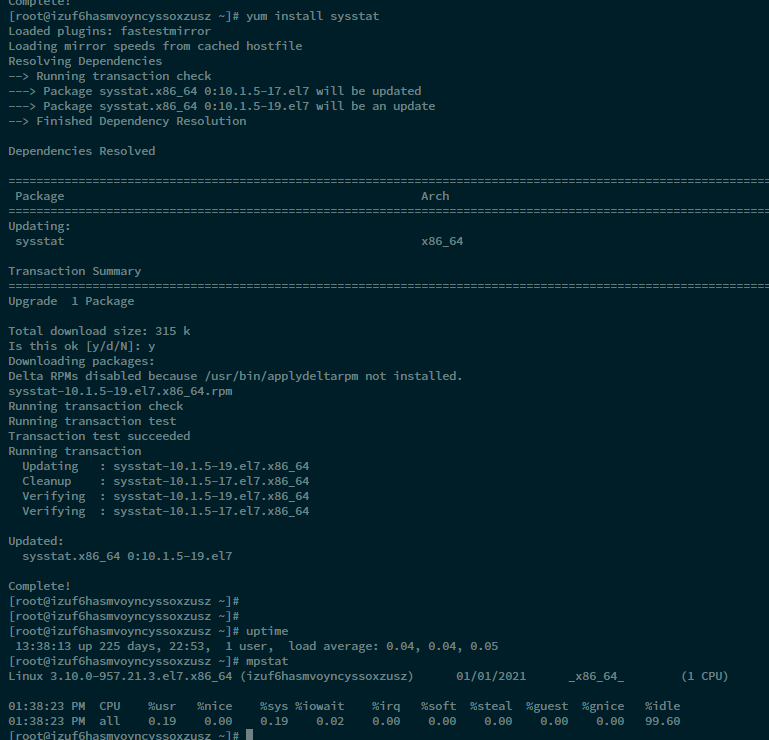

# 什么是平均负载（Load Average）


简单来说，平均负载是指单位时间内，系统处于可运行状态和不可中断状态的平均进程数，也就是平均活跃进程数，它和 CPU 使用率并没有直接关系

所谓可运行状态的进程，是指正在使用 CPU 或者正在等待 CPU 的进程，也就是我们常用 ps 命令看到的，处于 R 状态（Running 或 Runnable）的进程。不可中断状态的进程则是正处于内核态关键流程中的进程，并且这些流程是不可打断的，比如最常见的是等待硬件设备的 I/O 响应，也就是我们在 ps 命令中看到的 D 状态（Uninterruptible Sleep，也称为 Disk Sleep）的进程。


**平均负载是指单位时间内，处于可运行状态和不可中断状态的进程数。所以，它不仅包括了正在使用 CPU 的进程，还包括等待 CPU 和等待 I/O 的进程。**

而 CPU 使用率，是单位时间内 CPU 繁忙情况的统计，跟平均负载并不一定完全对应。比如：

- CPU 密集型进程，使用大量 CPU 会导致平均负载升高，此时这两者是一致的；
- I/O 密集型进程，等待 I/O 也会导致平均负载升高，但 CPU 使用率不一定很高；
- 大量等待 CPU 的进程调度也会导致平均负载升高，此时的 CPU 使用率也会比较高。


## 预先安装 stress 和 sysstat 包

Centos 直接只用yum管理包

```
yum install stress 
yum install sysstat 
```

stress 是一个 Linux 系统压力测试工具，这里我们用作异常进程模拟平均负载升高的场景。

而 sysstat 包含了常用的 Linux 性能工具，用来监控和分析系统的性能。

我们的案例会用到这个包的两个命令 mpstat 和 pidstat。

**mpstat** 是一个常用的多核 CPU 性能分析工具，用来实时查看每个 CPU 的性能指标，以及所有 CPU 的平均指标。

**pidstat** 是一个常用的进程性能分析工具，用来实时查看进程的 CPU、内存、I/O 以及上下文切换等性能指标。




## 尝试用命令

```
// -d 参数表示高亮显示变化的区域  查看平均负载
watch -d uptime

# -P ALL 表示监控所有CPU，后面数字5表示间隔5秒后输出一组数据
$ mpstat -P ALL 5

# 查看那个进程导致的cpu消耗 间隔5秒后输出一组数据
$ pidstat -u 5 1
```

