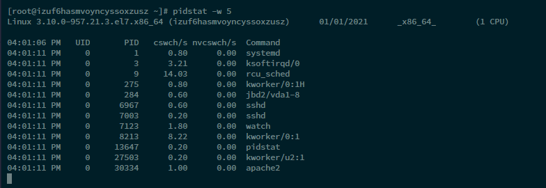

# 上下文切换到底是什么意思

https://time.geekbang.org/column/article/69859


## 查看系统上下文切换问题

**查看系统总体的上下文切换信息**

```
# 每隔1秒输出1组数据（需要Ctrl+C才结束）
$ vmstat 1
```


参数信息：

- cs（context switch）是每秒上下文切换的次数。
- in（interrupt）则是每秒中断的次数。
- r（Running or Runnable）是就绪队列的长度，也就是正在运行和等待 CPU 的进程数。
- b（Blocked）则是处于不可中断睡眠状态的进程数


**查看每个进程的上下文切换信息**

```
# 每隔5秒输出1组数据
$ pidstat -w 5
```



**一个是 cswch ，表示每秒自愿上下文切换（voluntary context switches）的次数，另一个则是 nvcswch ，表示每秒非自愿上下文切换（non voluntary context switches）的次数**

所谓自愿上下文切换，是指进程无法获取所需资源，导致的上下文切换。

**比如说， I/O、内存等系统资源不足时，就会发生自愿上下文切换。而非自愿上下文切换，则是指进程由于时间片已到等原因，被系统强制调度，进而发生的上下文切换。**

**比如说，大量进程都在争抢 CPU 时，就容易发生非自愿上下文切换。**

参数信息：

cswch ： 自愿上下文切换

nvcswch：非自愿上下文切换


**查看每个线程的上下文切换信息**

```
// 参数t 表示查看每个线程
pidstat -wt 5
```


## 上下文切换次数多少是不正常的？？

这个数值其实取决于系统本身的 CPU 性能。在我看来，如果系统的上下文切换次数比较稳定，那么从数百到一万以内，都应该算是正常的。但当上下文切换次数超过一万次，或者切换次数出现数量级的增长时，就很可能已经出现了性能问题。

这时，你还需要根据上下文切换的类型，再做具体分析。比方说：

- 自愿上下文切换变多了，说明进程都在等待资源，有可能发生了 I/O 等其他问题；
- 非自愿上下文切换变多了，说明进程都在被强制调度，也就是都在争抢 CPU，说明 CPU 的确成了瓶颈；
- 中断次数变多了，说明 CPU 被中断处理程序占用，还需要通过查看 /proc/interrupts 文件来分析具体的中断类型。

