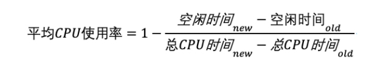
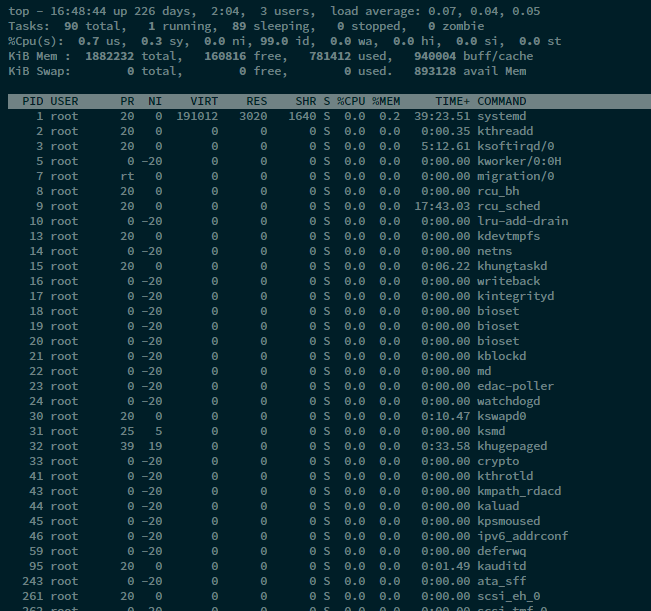
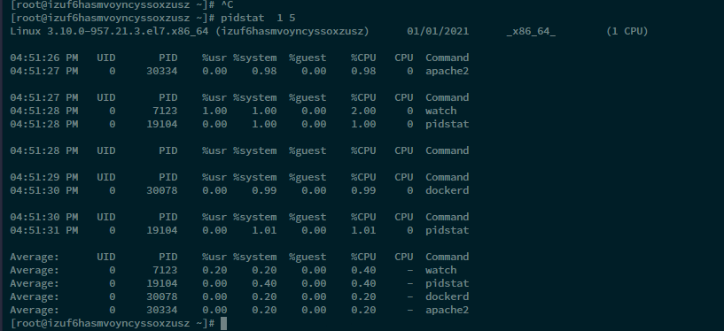

# CPU使用率达到100 应该怎么办？

## CPU使用率

CPU 使用率是单位时间内 CPU 使用情况的统计，以百分比的方式展示

我们通常所说的 CPU 使用率，就是除了空闲时间外的其他时间占总 CPU 时间的百分比，用公式来表示就是


一般去一段时间内的差值进行比较



## 查看CPU使用率

- top 显示了系统总体的 CPU 和内存使用情况，以及各个进程的资源使用情况。（默认3s刷新一次）

- ps 则只显示了每个进程的资源使用情况。





每个进程都有一个 %CPU 列，**表示进程的 CPU 使用率。它是用户态和内核态 CPU 使用率的总和，包括进程用户空间使用的 CPU、通过系统调用执行的内核空间 CPU 、以及在就绪队列等待运行的 CPU**。在虚拟化环境中，它还包括了运行虚拟机占用的 CPU


使用top只能看见总体的CPU使用率，无法看到每个进程，线程的CPU使用率


## 使用pidstat查看CPU使用率

```
// 间隔1s输出一组，一共输出5组
pidstat  1 5
```



Average表示平均值

参数信息

- 用户态 CPU 使用率 （%usr）；
- 内核态 CPU 使用率（%system）；
- 运行虚拟机 CPU 使用率（%guest）；
- 等待 CPU 使用率（%wait）；
- 以及总的 CPU 使用率（%CPU）


## 案例


## 小结

CPU 使用率是最直观和最常用的系统性能指标，更是我们在排查性能问题时，通常会关注的第一个指标。所以我们更要熟悉它的含义，尤其要弄清楚用户（%user）、Nice（%nice）、系统（%system） 、等待 I/O（%iowait） 、中断（%irq）以及软中断（%softirq）这几种不同 CPU 的使用率

- 用户 CPU 和 Nice CPU 高，说明用户态进程占用了较多的 CPU，所以应该着重排查进程的性能问题。
- 系统 CPU 高，说明内核态占用了较多的 CPU，所以应该着重排查内核线程或者系统调用的性能问题。
- I/O 等待 CPU 高，说明等待 I/O 的时间比较长，所以应该着重排查系统存储是不是出现了 I/O 问题。
- 软中断和硬中断高，说明软中断或硬中断的处理程序占用了较多的 CPU，所以应该着重排查内核中的中断服务程序。


## 系统的 CPU 使用率很高，但为啥却找不到高 CPU 的应用

我们知道，系统的 CPU 使用率，不仅包括进程用户态和内核态的运行，还包括中断处理、等待 I/O 以及内核线程等。所以，当你发现系统的 CPU 使用率很高的时候，不一定能找到相对应的高 CPU 使用率的进程。

https://time.geekbang.org/column/article/70822

碰到常规问题无法解释的 CPU 使用率情况时，首先要想到有可能是短时应用导致的问题，比如有可能是下面这两种情况。

- **第一，应用里直接调用了其他二进制程序，这些程序通常运行时间比较短，通过 top 等工具也不容易发现。**
- **第二，应用本身在不停地崩溃重启，而启动过程的资源初始化，很可能会占用相当多的 CPU。**