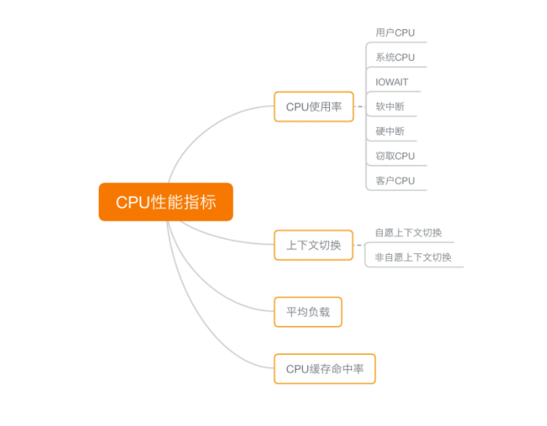

# CPU性能优化思路

https://time.geekbang.org/column/article/73151

## CPU优化方法论

优化前想清楚三点

- 首先，既然要做性能优化，那要怎么判断它是不是有效呢？特别是优化后，到底能提升多少性能呢
- 第二，性能问题通常不是独立的，如果有多个性能问题同时发生，你应该先优化哪一个呢？
- 第三，提升性能的方法并不是唯一的，当有多种方法可以选择时，你会选用哪一种呢？是不是总选那个最大程度提升性能的方法就行了呢？

## 如何判断CPU瓶颈在哪里

CPU性能指标对照图

根据指标找工具对照表

根据工具查指标

## 如何快速分析出CPU性能瓶颈

在实际生产环境中，我们通常都希望尽可能快地定位系统的瓶颈，然后尽可能快地优化性能，也就是要又快又准地解决性能问题

虽然 CPU 的性能指标比较多，但要知道，既然都是描述系统的 CPU 性能，它们就不会是完全孤立的，很多指标间都有一定的关联。想弄清楚性能指标的关联性，就要通晓每种性能指标的工作原理

**缩小排查范围，我通常会先运行几个支持指标较多的工具，如 top、vmstat 和 pidstat**

这三个命令，几乎包含了所有重要的 CPU 性能指标，比如：

- 从 top 的输出可以得到各种 CPU 使用率以及僵尸进程和平均负载等信息。
- 从 vmstat 的输出可以得到上下文切换次数、中断次数、运行状态和不可中断状态的进程数。
- 从 pidstat 的输出可以得到进程的用户 CPU 使用率、系统 CPU 使用率、以及自愿上下文切换和非自愿上下文切换情况。

三个命令的指标对照表，发现有很多相似和关联的地方

