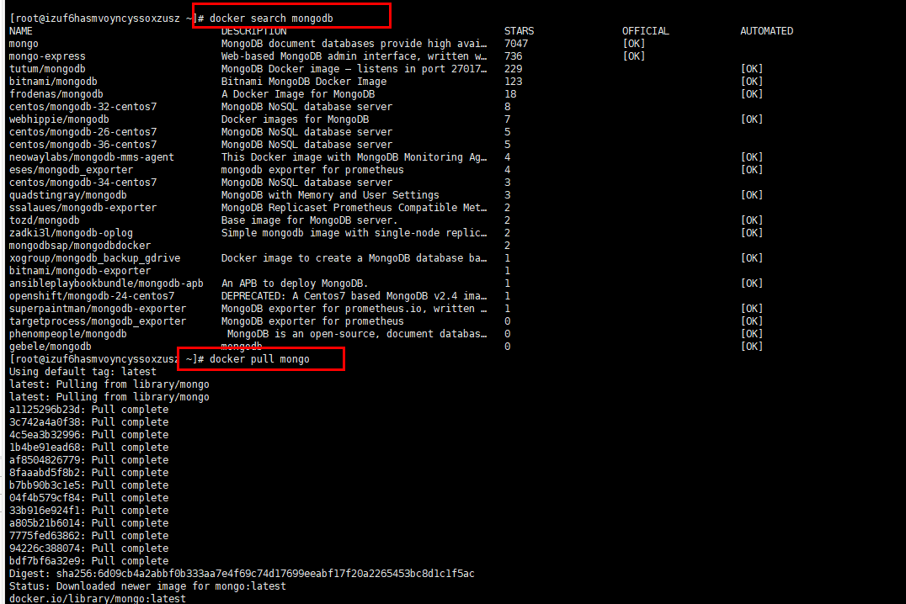
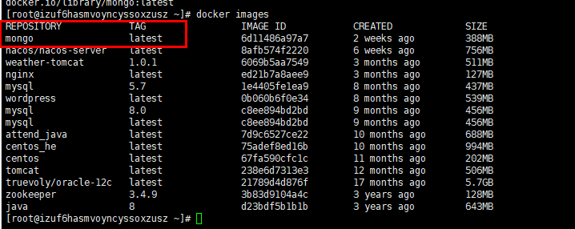
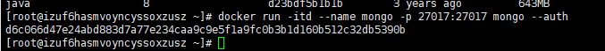
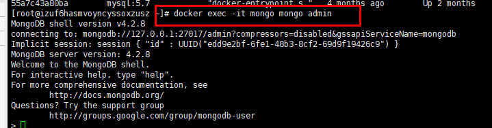
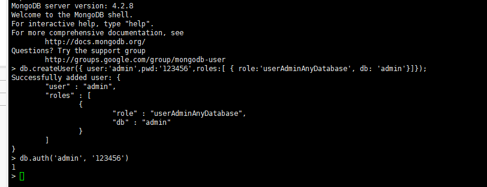

# Docker 安装Mongo

## 下载Mongo

```shell
docker search mongodb
docker pull mongo
```




```
docker images
```



## 运行容器

```
docker run -itd --name mongo -p 27017:27017 mongo --auth
--auth 表示需要密码才能访问容器服务。
```





## 进入容器 进行连接

```
$ docker exec -it mongo mongo admin
# 创建一个名为 admin，密码为 123456 的用户。
>  db.createUser({ user:'admin',pwd:'123456',roles:[ { role:'userAdminAnyDatabase', db: 'admin'}]});
# 尝试使用上面创建的用户信息进行连接。
> db.auth('admin', '123456')
```




