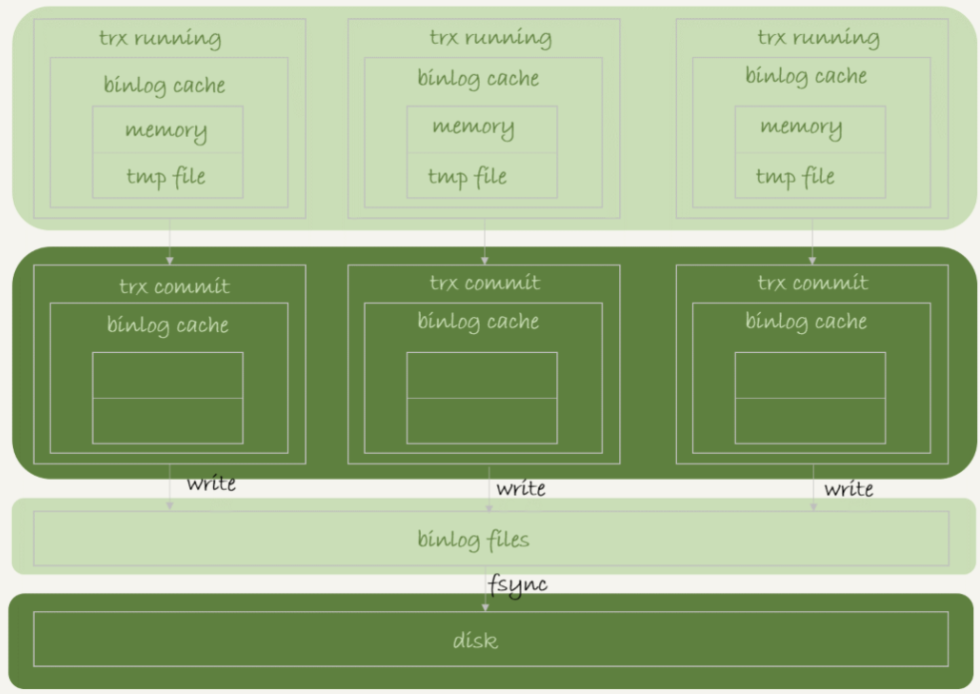
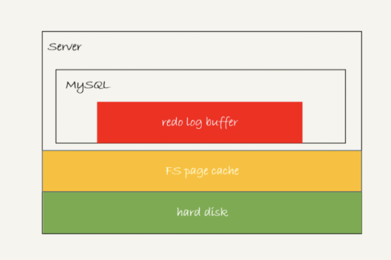

# Mysql如何保证数据不丢失

需要保证redo log binlog 持久化到磁盘，那么mysql异常重启数据也能恢复。

**需要保证redo log 和 binlog写入磁盘的过程**

## binlog的写入机制

执行事务 ->产生日志写入 binlog cache -> 事务commit ->写入binlog文件中

系统给 binlog cache 分配了一片内存，每个线程一个，参数 binlog_cache_size 用于控制单个线程内 binlog cache 所占内存的大小。如果超过了这个参数规定的大小，就要暂存到磁盘。

事务commit将日志**write**到binlog file中（写到page cache 文件系统中，但是还没有持久化到磁盘）

调用**fsync**，持久化到磁盘，fsync才会占用磁盘**IOPS**

write 和 fsync 的时机，是由参数 sync_binlog 控制的：

- sync_binlog=0 的时候，表示每次提交事务都只 write，不 fsync；
- sync_binlog=1 的时候，表示每次提交事务都会执行 fsync；
- sync_binlog=N(N>1) 的时候，表示每次提交事务都 write，但累积 N 个事务后才 fsync。(**有丢失数据的风险**)

## redo log写入机制

前面学到些redo log ，会先写入  redo log buffer中。**其中redo log存在三种不同的状态**

- redo log buffer：mysql单个进程中，内存中

- page cache：写到磁盘中（write），还没有调用fsync，在操作系统的文件系统中

- hard disk：持久化到磁盘中

写入buffer及page cache都很快，fsync到磁盘速度慢，所有产生了**写入策略**

InnoDB 提供了 **innodb_flush_log_at_trx_commit** 参数，它有三种可能取值：

- 设置为 0 的时候，表示每次事务提交时都只是把 redo log 留在 redo log buffer 中 ;
- 设置为 1 的时候，表示每次事务提交时都将 redo log 直接持久化到磁盘；
- 设置为 2 的时候，表示每次事务提交时都只是把 redo log 写到 page cache。

InnoDB 有一个后台线程，每隔 1 秒，就会把 redo log buffer 中的日志，调用 write 写到文件系统的 page cache，然后调用 fsync 持久化到磁盘。

### 未提交的事务，redo log也可能落盘

1、redo log buffer 占用的空间即将达到 innodb_log_buffer_size 一半的时候，后台线程会主动写盘

2、并行的事务提交的时候，顺带将这个事务的 redo log buffer 持久化到磁盘

## 组提交

### 日志序列号

日志逻辑序列号（log sequence number，LSN）的概念。LSN 是单调递增的，用来对应 redo log 的一个个写入点。每次写入长度为 length 的 redo log， LSN 的值就会加上 length

1、当第一个事务tx1开始时，它是这个组的leader。

2、当tx1要写盘的时候，期间来了两个事务tx2，tx3

3、因此tx1 redo log写盘的时候，tx2、tx3的redo log会被写入磁盘

**因此一个组中如果提交的成员越多，那么效果越好，节省磁盘的IOPS效果越好，同理如果fsync调用的越晚，那么组成员就越多。**

### 提升组提交效果

设置 **binlog_group_commit_sync_delay** 和 **binlog_group_commit_sync_no_delay_count** 来实现

- binlog_group_commit_sync_delay 参数，表示延迟多少微秒后才调用 fsync;
- binlog_group_commit_sync_no_delay_count 参数，表示累积多少次以后才调用 fsync。

这两个条件是或的关系，也就是说只要有一个满足条件就会调用 fsync。

## 总结

如果 MySQL 出现了性能瓶颈，而且瓶颈在 IO 上，可以通过哪些方法来提升性能呢？

- 设置 **binlog_group_commit_sync_delay** 和 **binlog_group_commit_sync_no_delay_count** 参数，减少 binlog 的写盘次数。这个方法是基于“额外的故意等待”来实现的，因此可能会增加语句的响应时间，但没有丢失数据的风险。
- 将 sync_binlog 设置为大于 1 的值（比较常见是 100~1000）。这样做的风险是，主机掉电时会丢 binlog 日志。
- 将 innodb_flush_log_at_trx_commit 设置为 2。这样做的风险是，主机掉电的时候会丢数据。

## 思考

**什么时候会将显示数据库设置为‘双非1’的情况？**以此来提升数据库的性能，双非1 指的是 **innodb_flush_logs_at_trx_commit** 参数设置redo log  & **sync_binlog**  设置binlog

- 业务高峰期。一般如果有预知的高峰期，DBA 会有预案，把主库设置成“非双 1”。
- 备库延迟，为了让备库尽快赶上主库。提到了这个场景。
- 用备份恢复主库的副本，应用 binlog 的过程，这个跟上一种场景类似。
- 批量导入数据的时候。

**如果一个事务产生的binlog 超过了 max_binglog_size 会一直rotate吗？**

一个事务产生的binlog不会分开，会存在一个文件中，所以会看见超过max_size 的binlog文件

