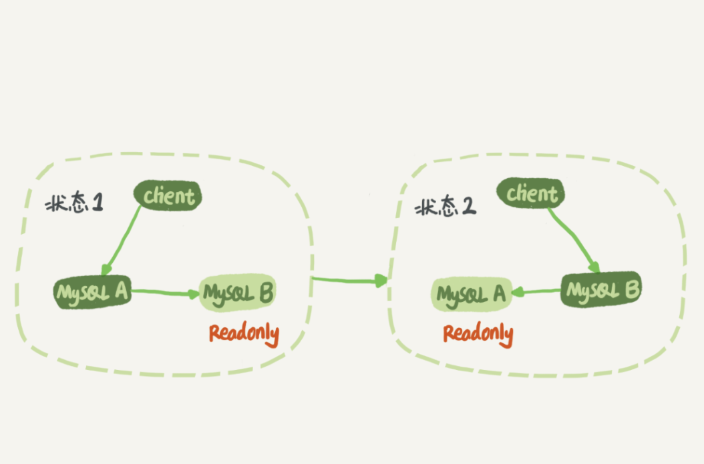
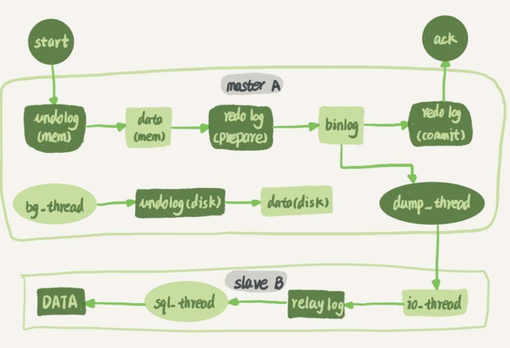
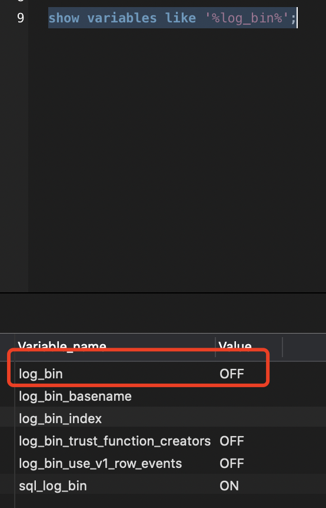
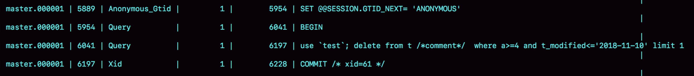
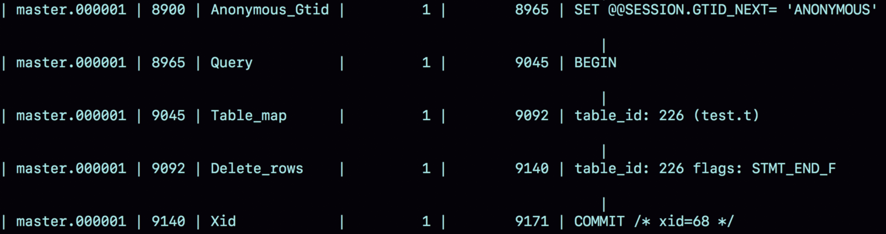
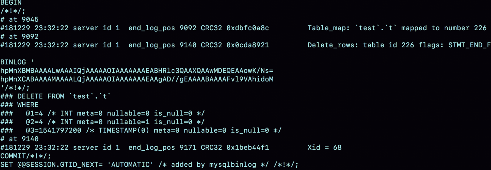
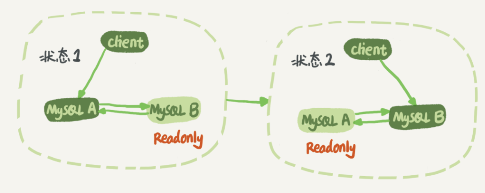

# Mysql 如何保证主备一致性

## Mysql 主备基本原理



状态1：客户端的读写都直接访问节点 A，而节点 B 是 A 的备库，只是将 A 的更新都同步过来，到本地执行。这样可以保持节点 B 和 A 的数据是相同的

状态2：客户端读写访问的都是节点 B，而节点 A 是 B 的备库。

**设置为readonly的原因：**

- 有时候一些运营类的查询语句会被放到备库上去查，设置为只读可以防止误操作；
- 防止切换逻辑有 bug，比如切换过程中出现双写，造成主备不一致；
- 可以用 readonly 状态，来判断节点的角色。

## 同步原理

主库接收到客户端的更新请求后，执行内部事务的更新逻辑，同时写 binlog & redo log，当redo log 进行commit后，才会返回成功给客户端



- 在备库 B 上通过 change master 命令，设置主库 A 的 IP、端口、用户名、密码，以及要从哪个位置开始请求 binlog，这个位置包含文件名和日志偏移量。
- 在备库 B 上执行 start slave 命令，这时候备库会启动两个线程，就是图中的 io_thread 和 sql_thread。其中 io_thread 负责与主库建立连接。
- 主库 A 校验完用户名、密码后，开始按照备库 B 传过来的位置，从本地读取 binlog，发给 B。
- 备库 B 拿到 binlog 后，写到本地文件，称为中转日志（relay log）。
- sql_thread 读取中转日志，解析出日志里的命令，并执行


## binlog的格式对比

```sql
//查看是否启用日志
show variables like 'log_bin';
// 
```



查看binlog

```sql
show binlog events in 'master.000001';
```

### statement格式（记录sql语句）

XID：XID是用来联系bin log和redo log的。比如redo log里面有一个事务是prepare状态，但是不知道是不是commit状态，那就可以用XID去bin log里面查询该事务到底有没有提交。有提交则是commit状态，若没有提交则回滚该事务。



**备注**

这是因为 delete 带 limit 是有风险的，可能会出现主备不一致情况。

如果 delete 语句使用的是索引 a，那么会根据索引 a 找到第一个满足条件的行，也就是说删除的是 a=4 这一行；

但如果使用的是索引 t_modified，那么删除的就是 t_modified='2018-11-09’也就是 a=5 这一行。

### row格式（记录sql更改记录）

Table_map event，用于说明接下来要操作的表是 test 库的表 t;

Delete_rows event，用于定义删除的行为。



借助mysqlbinlog工具查看row模式下的详细信息

```sql
mysqlbinlog -vv（显示详细参数） data/master.000001 --start-position=8900（binlog中记录的开始行数）;
```



- server id 1，表示这个事务是在 server_id=1 的这个库上执行的
- 每个 event 都有 CRC32 的值
- 每个表都有一个对应的 Table_map event、都会 map 到一个单独的数字，用于区分对不同表的操作
- 使用了 -vv 参数是为了把内容都解析出来，所以从结果里面可以看到各个字段的值（ 如@1=4，@2=4）
- Xid event，用于表示事务被正确地提交

### mixed格式（混合模式，mysql自动判断写那种格式）

statement 会导致主库同步不一致问题，row模式会导致日志占用空间太大的问题（**比如删除10w行数据，row模式会记录10w条数据的信息，占用太大且消耗IO资源，影响执行速度**）

所有有了折中的方式，由mysql自动判断是否会引起主备不一致的情况，来使用不同的binlog  模式


## 设置成Row模式的好处

**现在一般都会要求设置为row模式**

使用update、insert、delete语句后，使用row模式存储，能够方便的恢复数据。

恢复数据的场景还是比较常见的。一般使用工具进行恢复：**Flashback**


### row模式设置时间

在使用主备同步时，如果有如下sql

```sql
mysql> insert into t values(10,10, now());
```

那么row模式会设置一个上下文变量，保存在主库的 **now()函数时间**，保证不管这个binlog什么时间同步到备库，数据的值都是一致的。


**因此直接解析日志，只拿出sql语句执行可能是存在风险的，需要判断上下文语境进行恢复。（或者将解析结果整个发给 MySQL 执行）如下所示：**

```sql
mysqlbinlog master.000001  --start-position=2738 --stop-position=2973 | mysql -h127.0.0.1 -P13000 -u$user -p$pwd;
```


## 循环复制问题

### 双M结构

指的是两个Mysql 客户端互为主备



**存在的问题：**

业务逻辑在节点 A 上更新了一条语句，然后再把生成的 binlog 发给节点 B，节点 B 执行完这条更新语句后也会生成 binlog。（我建议你把参数 log_slave_updates 设置为 on，表示备库执行 relay log 后生成 binlog）

如果节点 A 同时是节点 B 的备库，相当于又把节点 B 新生成的 binlog 拿过来执行了一次，然后节点 A 和 B 间，会不断地循环执行这个更新语句，也就是循环复制

**解决方案：**

- 规定两个库的 server id 必须不同，如果相同，则它们之间不能设定为主备关系；
- 一个备库接到 binlog 并在重放的过程中，生成与原 binlog 的 server id 相同的新的 binlog；
- 每个库在收到从自己的主库发过来的日志后，先判断 server id，如果跟自己的相同，表示这个日志是自己生成的，就直接丢弃这个日志。


