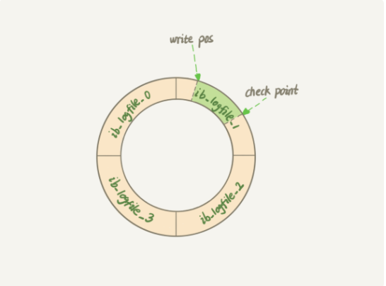

# 一条SQL更新语句是如何执行的？

更新语句和查询语句执行流程一直，都会先经过连接器、分析器、优化器、执行器、存储引擎等步骤。

不同的是：

在查询缓存时，会将这个表上相关的缓存全部清空，这就是不推荐使用查询缓存的原因。

分析器会通过update关键字，知道这是一条更新语句。

还有不一样的就是，更新操作还涉及两个重要的日志模块。redo log（重做日志）和 binlog（归档日志）

##  redo log  & bin log 相关参考

### 关键点

- redo log buffer  & bin log buffer  都有对应的设置（一般采用双1设置，每次事务提交都刷盘）设置刷盘时机，用户空间无法直接刷入磁盘，都是调用系统内核方法刷入磁盘缓存，然后由系统调用fsync真正刷入磁盘中。（redo log有可能被其他事务顺便写入磁盘中）
- redo log 会被覆盖，循环写，用于崩溃恢复，bin log追加写，可设置文件大小，用于主从同步、数据恢复
- redo log 记录了数据页的变更，数据由什么样变为了什么样，binlog 分为三种格式
- redo log 是innodb独有，bin log 是server层提供，不同引擎都能使用

https://segmentfault.com/a/1190000023827696

## redo log（记录这个页 “做了什么改动”）

在Mysql中更新存在一个问题，如果每一次的更新操作都需要写进磁盘，然后磁盘也要找到对应的那条记录，然后再更新，整个过程 IO 成本、查找成本都很高。为了解决这个问题，MySQL 的设计者就用了类似酒店掌柜粉板的思路来提升更新效率。（先将客人的赊账、还账记录到黑板上，在客栈打烊后在将记录核对到账本上）。

而粉板和账本配合的整个过程，其实就是 MySQL 里经常说到的 WAL 技术，WAL 的全称是 Write-Ahead Logging，**它的关键点就是先写日志，再写磁盘，**也就是先写粉板，等不忙的时候再写账本。

具体来说，当有一条记录需要更新的时候，InnoDB 引擎就会先把记录写到 redo log（粉板）里面，并更新内存，这个时候更新就算完成了。同时，InnoDB 引擎会在适当的时候，将这个操作记录更新到磁盘里面，而这个更新往往是在系统比较空闲的时候做。

但如果某天赊账的特别多，粉板写满了，又怎么办呢？这个时候掌柜只好放下手中的活儿，把粉板中的一部分赊账记录更新到账本中，然后把这些记录从粉板上擦掉，为记新账腾出空间。

Mysql也同样类似，InnoDB 的 redo log 是固定大小的，比如可以配置为一组 4 个文件，每个文件的大小是 1GB，那么这块“粉板”总共就可以记录 4GB 的操作。从头开始写，写到末尾就又回到开头循环写。

如果write pos 追上了check point位置，那么就必须先清理一部分记录，给write pos留一些位置。

有了 redo log，InnoDB 就可以保证即使数据库发生异常重启，之前提交的记录都不会丢失，这个能力称为 crash-safe。

## binlog（statement 格式记sql语句， row格式记录行的内容，记两条，更新前和更新后都有）

**redo log 是 InnoDB 引擎特有的日志（其他引擎没有）**，而 Server 层也有自己的日志，称为 binlog（归档日志）

binlog与 redo log的不同点

- redo log 是 InnoDB 引擎特有的；binlog 是 MySQL 的 Server 层实现的，所有引擎都可以使用。
- redo log 是物理日志，记录的是“在某个数据页上做了什么修改”；binlog 是逻辑日志，记录的是这个语句的原始逻辑，比如“给 ID=2 这一行的 c 字段加 1 ”。
- redo log 是循环写的，空间固定会用完；binlog 是可以追加写入的。“追加写”是指 binlog 文件写到一定大小后会切换到下一个，并不会覆盖以前的日志。

执行update语句时，两个日志的不同操作。

**图中浅色框表示是在 InnoDB （redo log）内部执行的，深色框表示是在执行器中（binlog）执行的。**

## 两阶段提交

上图的后面三个步骤，称为两阶段提交，Innodb写入redolog，此时处理prepare阶段，Server写入binlog，然后innodb再将redolog更改为commit状态。

**两阶段提交是跨系统维持数据逻辑一致性时常用的一个方案，即使你不做数据库内核开发，日常开发中也有可能会用到。**

**为什么需要两阶段提交呢？目的是保证在数据恢复时能够保证数据的一致性**

如何将数据恢复到某一天的某一时刻？

- 找到离这个时间点最近的一个全量备份，将这个备份恢复到数据库
- 从这个备份时间点开始找到需要恢复时间点的binlog，然后进行恢复

**两阶段提交其实就是保证一个事务，保证不会出现一个中间态，及redolog写了，但是binlog还没写。**

**备注：**

并不是说只有恢复数据库时才需要使用到binlog，再执行扩容，需要一个从库时，也需要binlog进行同步。

## binlog和redolog的区别

- redo log是在InnoDB存储引擎层产生，而binlog是MySQL数据库的上层产生的，并且二进制日志不仅仅针对INNODB存储引擎，MySQL数据库中的任何存储引擎对于数据库的更改都会产生二进制日志。
- binlog是逻辑日志，redolog是物理日志
- 写入时间点不同，binlog日志只在事务提交完成后进行一次写入。而innodb存储引擎的redolog重做日志在事务进行中不断地被写入，并日志不是随事务提交的顺序进行写入的
- binlog不是循环使用的，一个日志文件写满，那么切换下一个文件继续写。redolog是循环使用的，会进行覆盖
- binlog一般用于数据恢复，主从数据搭建。redolog一般用于异常宕机或者介质故障后的数据恢复使用。

