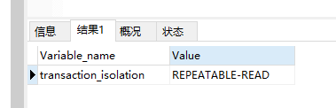
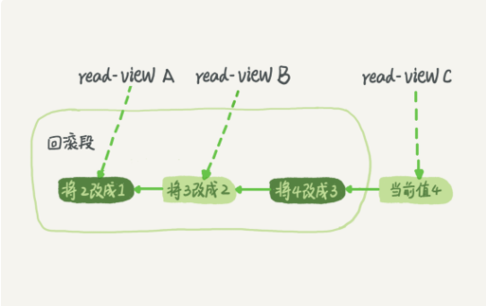

# 事务隔离

## 事务

事务就是要保证一组数据库操作，要么全部成功，要么全部失败。Innodb支持，MyiSAm不支持。

事务四大特性**：ACID（Atomicity、Consistency、Isolation、Durability，即原子性、一致性、隔离性、持久性）**

多个事务同时执行时，可能出现的问题：**脏读（dirty read）、不可重复读（non-repeatable read）、幻读（phantom read）**

### 隔离级别

- 读未提交是指，一个事务还没提交时，它做的变更就能被别的事务看到。
- 读提交是指，一个事务提交之后，它做的变更才会被其他事务看到。
- 可重复读是指，一个事务执行过程中看到的数据，总是跟这个事务在启动时看到的数据是一致的。当然在可重复读隔离级别下，未提交变更对其他事务也是不可见的。
- 串行化，顾名思义是对于同一行记录，“写”会加“写锁”，“读”会加“读锁”。当出现读写锁冲突的时候，后访问的事务必须等前一个事务执行完成，才能继续执行。


### 查看隔离级别

默认是RR  可重复读（Oracel默认级别是RC，读已提交）

```sql
show variables like 'transaction_isolation';
```




## 事务隔离的实现

**数据库里面会创建一个视图，访问的时候以视图的逻辑结果为准。在“可重复读”隔离级别下，这个视图是在事务启动时创建的，整个事务存在期间都用这个视图。在“读提交”隔离级别下，这个视图是在每个 SQL 语句开始执行的时候创建的。这里需要注意的是，“读未提交”隔离级别下直接返回记录上的最新值，没有视图概念；而“串行化”隔离级别下直接用加锁的方式来避免并行访问。**


### 具体实现

**在 MySQL 中，实际上每条记录在更新的时候都会同时记录一条回滚操作。记录上的最新值，通过回滚操作，都可以得到前一个状态的值。**

假设一个值从 1 被按顺序改成了 2、3、4，在回滚日志里面就会有类似下面的记录。



**不同时刻启动的事务对应不同的read-view。**同一条记录在数据库存在多个版本，这就是多版本控制（MVCC）

对于 read-view A，要得到 1，就必须将当前值依次执行图中所有的回滚操作得到。

**回滚日志什么时候删除呢？**

在不需要的时候才删除。也就是说，系统会判断，当没有事务再需要用到这些回滚日志时，回滚日志会被删除。什么时候才不需要了呢？就是当系统里没有比这个回滚日志更早的 read-view 的时候。

但是这也会导致一个问题，如果系统中存在长事务，那么意味着系统里面会存在很老的事务视图。由于这些事务随时可能访问数据库里面的任何数据，所以这个事务提交之前，数据库里面它可能用到的回滚记录都必须保留，这就会导致大量占用存储空间。


## 事务启动方式

- 显式启动事务语句， begin 或 start transaction。配套的提交语句是 commit，回滚语句是 rollback。
- set autocommit=0，这个命令会将这个线程的自动提交关掉。意味着如果你只执行一个 select 语句，这个事务就启动了，而且并不会自动提交。这个事务持续存在直到你主动执行 commit 或 rollback 语句，或者断开连接。

在 autocommit 为 1 的情况下，用 begin 显式启动的事务，如果执行 commit 则提交事务。如果执行 commit work and chain，则是提交事务并自动启动下一个事务，这样也省去了再次执行 begin 语句的开销。


## 小结

1、务的特性：原子性、一致性、隔离性、持久性
2、多事务同时执行的时候，可能会出现的问题：脏读、不可重复读、幻读
3、事务隔离级别：读未提交、读提交、可重复读、串行化
4、不同事务隔离级别的区别：
读未提交：一个事务还未提交，它所做的变更就可以被别的事务看到
读提交：一个事务提交之后，它所做的变更才可以被别的事务看到
可重复读：一个事务执行过程中看到的数据是一致的。未提交的更改对其他事务是不可见的
串行化：对应一个记录会加读写锁，出现冲突的时候，后访问的事务必须等前一个事务执行完成才能继续执行
5、配置方法：启动参数transaction-isolation
6、事务隔离的实现：每条记录在更新的时候都会同时记录一条回滚操作。同一条记录在系统中可以存在多个版本，这就是数据库的多版本并发控制（MVCC）。
7、回滚日志什么时候删除？系统会判断当没有事务需要用到这些回滚日志的时候，回滚日志会被删除。
8、什么时候不需要了？当系统里么有比这个回滚日志更早的read-view的时候。
9、为什么尽量不要使用长事务。长事务意味着系统里面会存在很老的事务视图，在这个事务提交之前，回滚记录都要保留，这会导致大量占用存储空间。除此之外，长事务还占用锁资源，可能会拖垮库。
10、事务启动方式：一、显式启动事务语句，begin或者start transaction,提交commit，回滚rollback；二、set autocommit=0，该命令会把这个线程的自动提交关掉。这样只要执行一个select语句，事务就启动，并不会自动提交，直到主动执行commit或rollback或断开连接。
11、建议使用方法一，如果考虑多一次交互问题，可以使用commit work and chain语法。在autocommit=1的情况下用begin显式启动事务，如果执行commit则提交事务。如果执行commit work and chain则提交事务并自动启动下一个事务。


