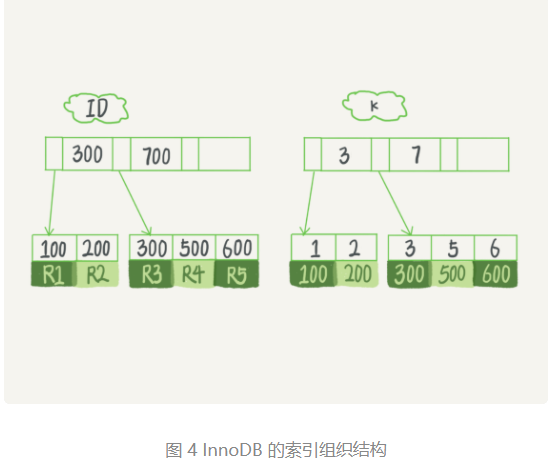
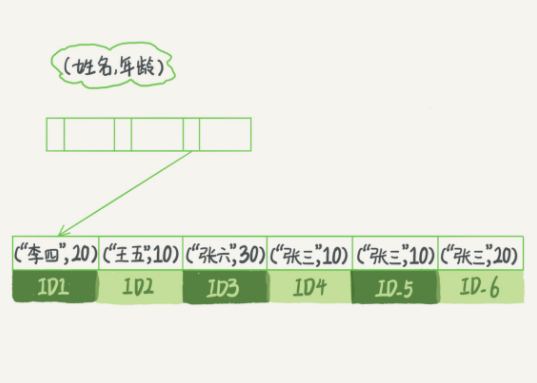
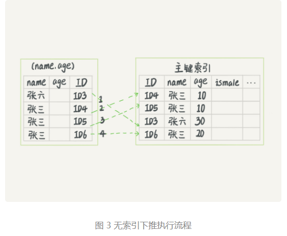
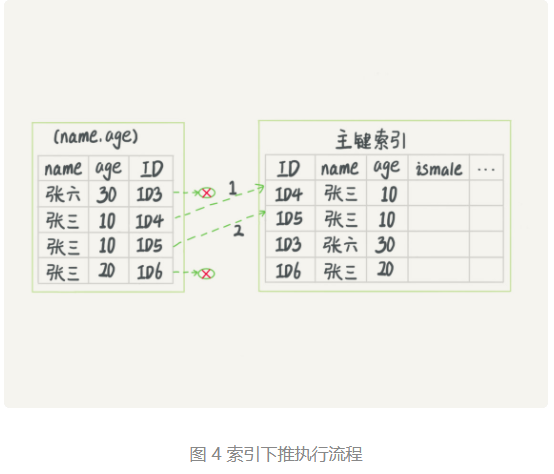

# 索引

## 索引模型

常见的索引数据结构有 Hash表、顺序数组、树搜索

Hash表优点在于查找插入很快，但是不适合进行范围查询

顺序数组优点在于范围查询、等值查询都很优秀，但是在插入删除时比较麻烦（适用于做静态数据存储引擎，适用于不变的数据）

树搜索是目前比较常用的索引数据结构


## InnoDB索引结构



根据叶子节点的内容，索引类型分为主键索引和非主键索引。

- 主键索引的叶子节点存的是整行数据。在 InnoDB 里，主键索引也被称为聚簇索引（clustered index）。
- 非主键索引的叶子节点内容是主键的值。在 InnoDB 里，非主键索引也被称为二级索引（secondary index）。

## 覆盖索引

在这个查询里面，索引 k 已经“覆盖了”我们的查询需求，我们称为覆盖索引。

**由于覆盖索引可以减少树的搜索次数，显著提升查询性能，所以使用覆盖索引是一个常用的性能优化手段**


## 最左前缀匹配



可以看到，索引项是按照索引定义里面出现的字段顺序排序的。

查询语句中如果使用了这些索引并且顺序排列，那么就可以走到这些索引。如果只用到了 第二个索引（age），那么是不会走这个索引的。

**建立索引时，需要考虑是否调整一下字段顺序，就可以少维护一个索引了，那么这个是一个可以优先考虑的方案。**


## 索引下推

在查询条件中存在多个字段时，在Mysql5.6之前，会根据查询的第一个条件筛选的值一个个去回表判断是否满足，索引下推会在索引遍历过程中，对索引中包含的字段进行优先判断，直接过滤掉不满足条件的记录，减少回表次数

如下图所示：

**无索引下推，每一条记录都会回表查询。**



索引下推，在回表之前在二级索引中过滤掉了部分不满足条件的数据，减少回表次数



## 思考题

在innodb中，创建了一个表，会维护表的数据及索引的数据，在表数据被删除后，但是它的索引数据还在，会导致还是占用空间。

重建索引时可以使用这个语句

```sql
alter table T engine=InnoDB;
```

