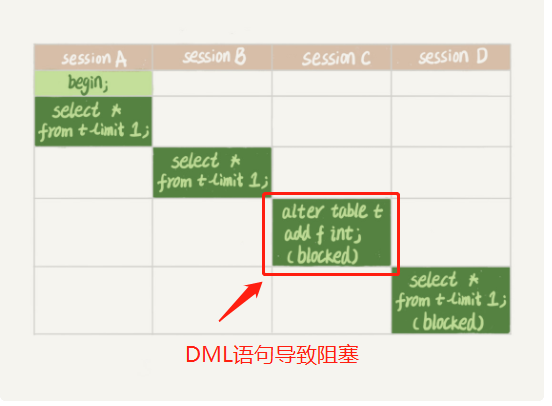
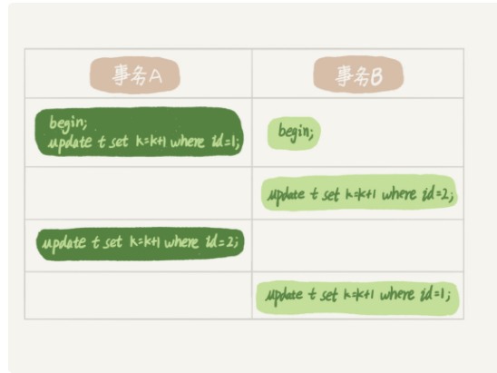

# Mysql锁

根据粒度可以分为全局锁、表锁、行锁


## 全局锁

全局锁就是对整个数据库实例加锁。MySQL 提供了一个加全局读锁的方法，命令是 **Flush tables with read lock** (FTWRL)。当你需要让整个库处于只读状态的时候，可以使用这个命令，之后其他线程的以下语句会被阻塞：数据更新语句（数据的增删改）、数据定义语句（包括建表、修改表结构等）和更新类事务的提交语句。

### 应用场景

全局锁的典型使用场景是，做全库逻辑备份。也就是把整库每个表都 select 出来存成文本。

**造成的问题**

- 如果你在主库上备份，那么在备份期间都不能执行更新，业务基本上就得停摆；
- 如果你在从库上备份，那么备份期间从库不能执行主库同步过来的 binlog，会导致主从延迟。


## 表锁

MySQL 里面表级别的锁有两种：一种是表锁，一种是元数据锁（meta data lock，MDL)。

**表锁的语法是 lock tables … read/write**

需要注意，lock tables 语法除了会限制别的线程的读写外，也限定了本线程接下来的操作对象

### MDL（metadata lock)

MDL用于控制DDL和DML的并发冲突。

MDL 不需要显式使用，在访问一个表的时候会被自动加上。

**如果一个事务中执行了DDL语句但是没有进行提交，这个时候执行一个DML语句，那么会由于MDL锁进行阻塞，从而导致之后的所有的DDL语句也会被阻塞，直到第一个事务提交之后，MDL锁才会被释放。**




**因此 再给一个表增加字段时，要注意是否此时有事务还没有提交，否则会一直占着MDL锁**。在 MySQL 的 information_schema 库的 innodb_trx 表中，你可以查到当前执行中的事务。如果你要做 DDL 变更的表刚好有长事务在执行，要考虑先暂停 DDL，或者 kill 掉这个长事务。


## 间隙锁

当我们用范围条件检索数据，并请求共享或排他锁时，InnoDB会给符合条件的已有数据记录的索引项加锁；对于键值在条件范围内但并不存在的记录，叫做"间隙(GAP)"。InnoDB也会对这个"间隙"加锁，这种锁机制就是所谓的间隙锁(Next-Key锁)。

```sql
Transaction-A
mysql> update innodb_lock set k=66 where id >=6;
Query OK, 1 row affected (0.63 sec)
mysql> commit;

Transaction-B
// Transaction-A 对id >= 6的范围加了间隙锁
mysql> insert into innodb_lock (id,k,v) values(7,'7','7000');
Query OK, 1 row affected (18.99 sec)
```


## 行锁

顾名思义，行锁就是针对数据表中行记录的锁。这很好理解，比如事务 A 更新了一行，而这时候事务 B 也要更新同一行，则必须等事务 A 的操作完成后才能进行更新。

### 两阶段锁


**这个问题的结论取决于事务 A 在执行完两条 update 语句后，持有哪些锁，以及在什么时候释放。你可以验证一下：实际上事务 B 的 update 语句会被阻塞，直到事务 A 执行 commit 之后，事务 B 才能继续执行**

**在 InnoDB 事务中，行锁是在需要的时候才加上的，但并不是不需要了就立刻释放，而是要等到事务结束时才释放。这个就是两阶段锁协议。**

所以在需要更新数据的时候**如果你的事务中需要锁多个行，要把最可能造成锁冲突、最可能影响并发度的锁尽量往后放**

栗子：

https://time.geekbang.org/column/article/70215


### 死锁与死锁检测

当并发系统中不同线程出现循环资源依赖，涉及的线程都在等待别的线程释放资源时，就会导致这几个线程都进入无限等待的状态，称为死锁



如何解决死锁呢，主要有两种策略

- 一种策略是，直接进入等待，直到超时。这个超时时间可以通过参数 innodb_lock_wait_timeout 来设置。
- 另一种策略是，发起死锁检测，发现死锁后，主动回滚死锁链条中的某一个事务，让其他事务得以继续执行。将**参数 innodb_deadlock_detect 设置为 on（默认开启）**，表示开启这个逻辑。


如果有一个热点数据需要高并发更新，会导致大量的死锁检测，导致CPU资源消耗非常大，但是1s内执行的事务非常少，**死锁检测是非常耗费大量的 CPU 资源。**（当一个线程发起更新语句的时候并不是去检测所有的行持有的锁，只会检测自己相关的锁）

**那么如何解决热点数据的高并发更新问题呢?**

- 一种头痛医头的方法，就是如果你能确保这个业务一定不会出现死锁，可以临时把死锁检测关掉 innodb_deadlock_detect 设置为 off（有风险）
- 另一个思路是控制并发度，**将热点数据纵向拆分，将一条数据拆分为10条数据，并发更新的时候，去更新10条中的一条，这么就会减少十分之一的锁冲突概率。**


