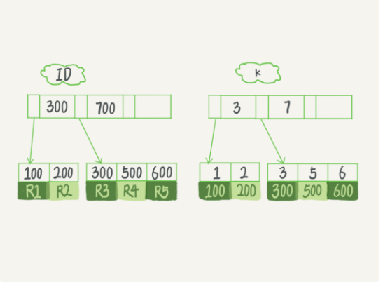

# 普通索引还是唯一索引

还是同样的例子如图所示



## 查询过程

执行下面sql语句时

```sql
select id from T where k=5
```

这个查询语句在索引树上查找的过程，先是通过 B+ 树从树根开始，按层搜索到叶子节点，也就是图中右下角的这个数据页，然后可以认为数据页内部通过二分法来定位记录。（**叶子节点存在是数据页，找到数据页还需要去内部通过页目录查找数据，数据页是双向链表连接，而行数据是单链表**）

如果k是普通索引：那么查找到满足条件的第一个记录 (5,500) 后，需要查找下一个记录，直到碰到第一个不满足 k=5 条件的记录。

如果k是唯一索引：由于索引定义了唯一性，查找到第一个满足条件的记录后，就会停止继续检索。

但是有Innodb是数据是按数据页为单位来读写的。也就是说，当需要读一条记录的时候，并不是将这个记录本身从磁盘读出来，而是以页为单位，将其整体读入内存。在 InnoDB 中，每个数据页的大小默认是 16KB。

当找到 k=5 的记录的时候，它所在的数据页就都在内存里了。那么，对于普通索引来说，要多做的那一次“查找和判断下一条记录”的操作，就只需要**一次指针寻找和一次计算**。这个消耗是微乎其微的，可以忽略。

当然，如果 k=5 这个记录刚好是这个数据页的最后一个记录，那么要取下一个记录，必须读取下一个数据页，这个操作会稍微复杂一些。但是平均下来，平均性能仍然是可以忽略的。


## 更新过程

**change buffer**

当需要更新一个数据页时，如果数据页在内存中就直接更新，而如果这个数据页还没有在内存中的话，在不影响数据一致性的前提下，InnoDB 会将这些更新操作缓存在 change buffer 中，这样就不需要从磁盘中读入这个数据页了。在下次查询需要访问这个数据页的时候，将数据页读入内存，然后执行 change buffer 中与这个页有关的操作。通过这种方式就能保证这个数据逻辑的正确性。

**需要说明的是，虽然名字叫作 change buffer，实际上它是可以持久化的数据。也就是说，change buffer 在内存中有拷贝，也会被写入到磁盘上。**

将change  buffer数据应用到原始数据页的操作叫做merge，**除了访问这个数据页会触发 merge 外，系统有后台线程会定期 merge。在数据库正常关闭（shutdown）的过程中，也会执行 merge 操作。**

将更新操作先记录在 change buffer，减少读磁盘，语句的执行速度会得到明显的提升。而且，数据读入内存是需要占用 buffer pool 的，所以这种方式还能够避免占用内存，提高内存利用率。


**唯一索引的更新就不能使用 change buffer**，实际上也只有普通索引可以使用。因为唯一索引需要判断当前数据是否在数据页中已经存在，就必须把数据从数据从磁盘加载到内存中。


插入剧时也分为两种常见：

1、这个记录要更新的目标页在内存中

- 对于唯一索引来说，找到 3 和 5 之间的位置，判断到没有冲突，插入这个值，语句执行结束；
- 对于普通索引来说，找到 3 和 5 之间的位置，插入这个值，语句执行结束

2、这个记录要更新的目标页不在内存中（唯一索引就会更加耗时）

- 对于唯一索引来说，需要将数据页读入内存，判断到没有冲突，插入这个值，语句执行结束；
- 对于普通索引来说，则是将更新记录在 change buffer，语句执行就结束了。

**如果是实际项目中，发现库内存命中率突然从 99% 降低到了 75%，整个系统处于阻塞状态，更新语句全部堵住。那么有可能是更改了索引导致，将普通索引更改为了唯一索引。**


## change buffer 使用场景

change buffer 只限于用在普通索引的场景下，而不适用于唯一索引。唯一索引需要判断数据是否唯一，需要加载数据页到内存进行判断。

**change buffer适合写多读少场景，不适合写了后马上读的场景（马上读就会触发加载数据页 进行merge）**

马上读的场景可以关闭change buffer 。大部分场景都可以提升性能。


## 索引选择

在业务常见明确的场景下，尽量选择普通索引，可以利用change buffer提高效率。

https://time.geekbang.org/column/article/70848